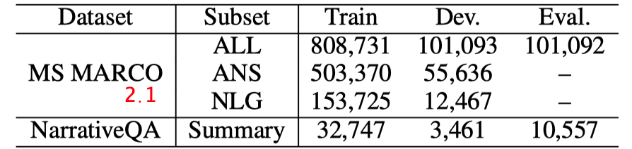
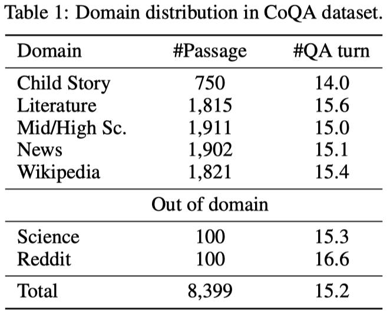
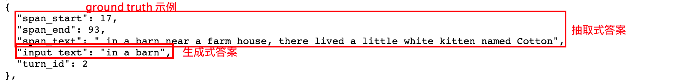
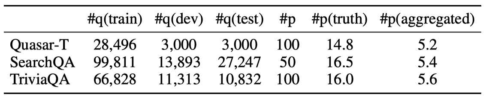
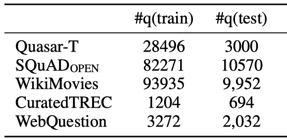
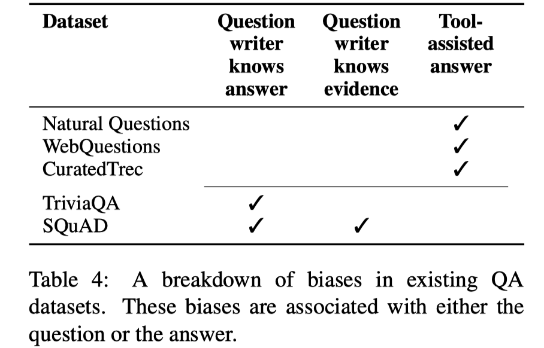
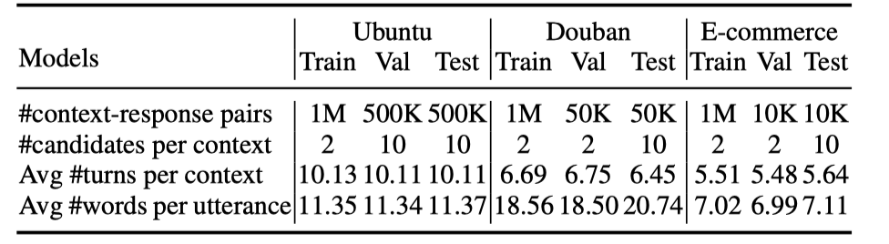
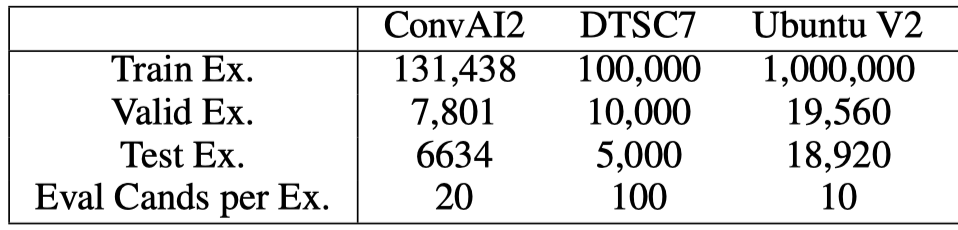
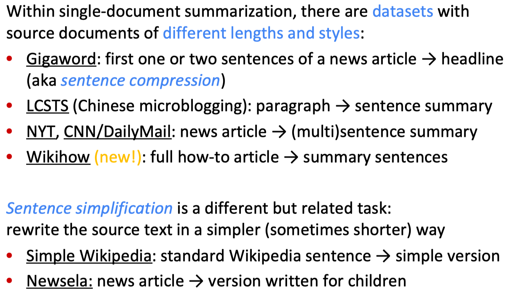

>  写在前面的话：
> 
>  1）本文的内容主要摘自平时看的论文并整理得到，如要引用，请一定查明原文来源。
> 
>  2）整理本文的目的主要是想在做实验需要找数据集时能够大体上快速定位到个别数据集，再做进一步深入调研。（希望对大家有帮助😁）
> 
>  3）所有内容并没有经过一一查证，如有错误和补充之处，可随时提出，我纠正整合到原贴。

###QA

- **WikiQA**：Yi Yang, Wen-tau Yih, and Christopher Meek. 2015. WikiQA: a challenge dataset for open-domain question answering. In EMNLP.

  > 下载地址：https://www.microsoft.com/en-us/download/details.aspx?id=52419
  >
  > 数据集简介：Open-domian factoid QA dataset in which all answers were collected from the Wikipedia. 0/1标签。 
  >
  
- **TRECQA**：Mengqiu Wang, Noah A Smith, and Teruko Mitamura. 2007. What is the Jeopardy model? A quasi-synchronous grammar for QA. In EMNLP-CoNLL

  > 下载地址：https://github.com/aseveryn/deep-qa
  >
  > 数据集简介：QA track (8-13) data of Text REtrieval Conference. Factoid question answering. 候选答案是单个句子。 0/1标签。 
  >
  
- **Yahoo! Answers**

  > 下载地址：https://webscope.sandbox.yahoo.com/catalog.php?datatype=l
  >
  > 数据集简介：有个大一点的和小一点的数据集，分别包括44万+和14万+从Yahoo!Answer网站收集到的question，每个question对应一个最佳答案和几个非最优的答案。（小一点的数据集是大数据集的子集，主要是根据question以‘How’开头过滤得到的）

- **FiQA：**

  > 下载地址：https://sites.google.com/view/fiqa/home
  >
  > 数据集简介：non-factoid QA dataset from the financial domain which has been recently released for WWW 2018 Challenges. The dataset is built by crawling Stackexchange, Reddit and StockTwits in which part of the questions are opinionated, targeting mined opinions and their respective entities, aspects, sentiment polarity and opinion holder.
  
- **InsuranceQA**：Feng, Minwei, Xiang, Bing, Glass, Michael, Wang, Lidan, and Zhou, Bowen. Applying deep learning to answer selection: A study and an open task. IEEE Automatic Speech Recognition and Understanding Workshop (ASRU), 2015.

  > 数据集简介：Non-factoid QA dataset from the insurance domain. Question may have multiple correct answers and normally the questions are much shorter than the answers. The average length of questions and answers in tokens are 7 and 95, respectively. For each question in the development and test sets, there is a set of 500 candidate answers.

### MRC

- **SQuAD**：（单段落上下文、抽取式QA）

  > 1.1版本数据集简介：contains over 100, 000 passage-question pairs。
  >
  > 2.0版本数据集简介：contains about 100, 000 answerable questions and over 50, 000 crowdsourced unanswerable questions towards Wikipedia paragraphs. Moreover, for each unanswerable question, a plausible answer span is annotated.
  >
  > 对抗数据集简介：each passage in **AddSent** contains several sentences that are similar to the question but not contradictory to the answer, while each passage in **AddOneSent** contains a human-approved random sentence that may be unrelated to the passage.

- **NewsQA**：Adam Trischler, Tong Wang, Xingdi Yuan, Justin Harris, Alessandro Sordoni, Philip Bachman, and Kaheer Suleman. 2017. NewsQA: A Machine Comprehension Dataset. （单段落、抽取式QA）

  > 数据集简介：The NewsQA dataset contains 100k answerable questions from a total of 120k questions.
  >
  > 下载地址：https://datasets.maluuba.com/NewsQA/

- **HotpotQA**：Zhilin Yang, Peng Qi, Saizheng Zhang, Yoshua Bengio, William W Cohen, Ruslan Salakhutdinov, and Christopher D Manning. 2018. HotpotQA: A dataset for diverse, explainable multi-hop question answering.（多段落、supporting sentence 和 answer span 的联合学习）

  > 数据集简介：112,779 questions are collected by crowdsourcing based on the first paragraphs in Wikipedia documents, 84% of which require multi-hop reasoning. The data are split into a training set (90,564 questions), a development set (7,405 questions) and a test set (7,405 questions). All questions in development and test sets are hard multi-hop cases.
  >
  > In the training set, for each question, an answer and paragraphs of 2 gold (useful) entities are provided, with multiple supporting facts, sentences containing key information for reasoning, marked out. There are also 8 unhelpful negative paragraphs for training. 
  >
  > During evaluation, only questions are offered and meanwhile supporting facts are required besides the answer.
  >
  > - distractor setting: a question-answering system reads 10 paragraphs to provide an answer to the question.
  > - fullwiki setting: a question-answering system must find the answer to a question in the scope of the entire Wikipedia. 
  >
  > 下载地址：https://hotpotqa.github.io/

- **WikiHop**：Johannes Welbl, Pontus Stenetorp, and Sebastian Riedel. 2018. Constructing datasets for multi-hop reading comprehension across documents. Transactions of the Association of Computational Linguistics （多段落、提供候选答案集合的MRC）

  > 数据集简介：The query of WikiHop is constructed with entities and relations from WikiData, while supporting documents are from WIKIREADING. A bipartite graph connecting entities and documents is first built and the answer for each query is located by traversal on this graph. Candidates that are type-consistent with the answer and share the same relation in query with the answer are included, resulting in a set of candidates. Thus, WIKIHOP is a multi-choice style reading comprehension data set。。。。。There are totally about 43K samples in training set, 5K samples in development set and 2.5K samples in test set.。。。。The task is to predict the correct answer given a query and multiple supporting documents.。。。。Each question is associated with an average of 13.7 supporting Wikipedia passages, each with 36.4 tokens on average.

- **ReCoRD**：Sheng Zhang, Xiaodong Liu, Jingjing Liu, Jianfeng Gao, Kevin Duh, and Benjamin Van Durme. 2018. Record: Bridging the gap between human and machine commonsense reading comprehension.（多段落、抽取式QA、需要常识推理、针对实体）

  > 数据集简介：Reading Comprehension with Commonsense Reasoning Dataset is a large-scale MRC dataset requiring commonsense reasoning. It consists of passage-question-answer tuples, collected from CNN and Daily Mail news articles. In each tuple, the passage is formed by the first few paragraphs of a news article, with named entities recognized and marked. The question is a sentence from the rest of the article, with a missing entity specified as the golden answer. The goal is to find the golden answer among the entities marked in the passage, which can be deemed as an extractive MRC task.
  
- **MARCO Q&A + Natural Language Generation**：（多段落、生成式QA）

  > 数据集简介：MS-MARCO dataset defines the task as answering a question from multiple passages and the words in the answer are not necessary in the passages. There are several related passages for each question in the MS-MARCO dataset. In addition to annotating the answer, MS-MARCO also annotates which passage is correct.
  >
  > The questions are user queries issued to the Bing search engine and the contextual passages are from real web documents. The data has been split into a training set (153,725 QA pairs), a dev set (12,467 QA pairs) and a test set (101,092 questions with unpublished answers).
  >
  
- **NarrativeQA**：（单跳、生成式的QA）

### Conversational MRC

- **CoQA**：Siva Reddy, Danqi Chen, and Christopher D. Manning. CoQA: A conversational question answering challenge. TACL, 2019. （单段落）

  > 数据集简介：It consists of 127k questions with answers collected from 8k conversations over text passages. It covers seven diverse domains (five of them are in-domain and two are out-of-domain). The out-of-domain passages only appear in the test set. The average number of question answering turns is more than 15 per passage.  CoQA contains text passages from diverse domains, conversational questions and answers developed for each passage, as well as rationales (i.e., text spans extracted from given passages) to support answers.
  >
  > 
  >
  > 

- **QuAC**：Eunsol Choi, He He, Mohit Iyyer, Mark Yatskar, Wen-tau Yih, Yejin Choi, Percy Liang, and Luke Zettlemoyer. QuAC : Question answering in context. In EMNLP, 2018.

- **QBLink**：Ahmed Elgohary, Chen Zhao, and Jordan Boyd-Graber. A dataset and baselines for sequential open-domain question answering. In Proceedings of the 2018 Conference on Empirical Methods in Natural Language Processing, pp. 1077–1083, 2018. （找不到在哪儿看的了 🤦‍♂️）

### Open-domain QA

- **Quasar-T**：Bhuwan Dhingra, Kathryn Mazaitis, and William W Cohen. QUASAR: Datasets for question answering by search and reading. arXiv preprint arXiv:1707.03904, 2017b.

  > 数据集简介：The data set makes use of the “Lucene index” on the ClueWeb09 corpus. For each question, 100 unique sentence-level passages were collected. These supporting passages are given in an order ranked（带有float相关度） by a search engine. Supporting passage的平均长度为24。答案是一个answer span，且可能出现在多个supporting passage中（#p(truth)=14.8）。。每个supporting passage除了提供了内容，还提供了float类型的相关性分值。
  >
  > 下载地址：https://github.com/bdhingra/quasar

- **SearchQA**：Matthew Dunn, Levent Sagun, Mike Higgins, Ugur Guney, Volkan Cirik, and Kyunghyun Cho. SearchQA: A new q&a dataset augmented with context from a search engine. arXiv preprint arXiv:1704.05179, 2017.

  > 数据集简介：A dataset of complex questions extracted from Jeopardy! and uses Google to collect about 50 web page snippets as passages for each question. Each snippet is 37.3±11.7 tokens long on average.
  >
  > 下载地址：https://github.com/nyu-dl/SearchQA
  
- **TriviaQA**：Mandar Joshi, Eunsol Choi, Daniel S. Weld, and Luke Zettlemoyer. Triviaqa: A large scale distantly supervised challenge dataset for reading comprehension. In Proceedings of the Annual Meeting of the Association for Computational Linguistics, 2017.

  > 数据集简介：collected trivia questions coming from 14 trivia and quiz-league websites, and makes use of the Bing Web search API to collect the top 50 webpages most related to the questions.
  >
  > 先收集问答对，再收集证据文本。Gathered 95k question-answer pairs from trivia and quiz-league websites and collected textual evidence which contained the answer from either Web search results or Wikipedia pages corresponding to the entities which are mentioned in the question. Totally collected 650k (passage, question, answer) triples in total. The passages used in this dataset are mostly long documents, the average document length is 2,895 words. 。。。但这种半自动的数据集构造方式也存在缺陷，there is no guarantee that the passage really provides the answer to the question and this influences the quality of the training data.
  >
  > 数据集版本：1）TriviaQA_wiki：每个问答对对应一个多个Wikipedia article，相当于不是开放域的。
  >
  > 1）TriviaQA_unfilter：开放域的，使用 Bing Web search API to collect the top 50 webpages
  >
  > 下载地址：http://nlp.cs.washington.edu/triviaqa/
  >
  > http://nlp.cs.washington.edu/triviaqa/data/triviaqa-unfiltered.tar.gz

- **SQuAD-open**

- **SQuAD-document**

- **WebQuestions**：Jonathan Berant, Andrew Chou, Roy Frostig, and Percy Liang. 2013. Semantic parsing on freebase from question-answer pairs. In Proceedings of the 2013 Conference on Empirical Methods in Natural Language Processing.

  > 数据集简介：This dataset is built to answer questions from the Freebase KB. It was created by crawling questions through the GOOGLE SUGGEST API, and then obtaining answers using Amazon Mechanical Turk。 含3K左右个train question，和2K左右个test question。只含问答对，不含passage。
  >
  > https://github.com/brmson/dataset-factoid-webquestions

- **Natural Questions**：Tom Kwiatkowski, Jennimaria Palomaki, Olivia Redfield, Michael Collins, Ankur Parikh, Chris Alberti, Danielle Epstein, Illia Polosukhin, Jacob Devlin, Kenton Lee, et al. 2019. Natural questions: a benchmark for question answering research.

  > 数据集简介：a dataset of questions from web queries, each of which is accompanied by a Wikipedia article that contains the answer.

- **CuratedTREC**：Petr Baudiˇs and Jan Sediv`y. 2015. Modeling of the question answering task in the YodaQA system.

  > 数据集简介：Contains a total of 2,180 questions extracted from the datasets from TREC 1999, 2000, 2001 and 2002. All the answers are written in regular expressions.  只含问答对，不含passage。
  >
  > 下载：https://github.com/brmson/dataset-factoid-curated.
  >
  > https://github.com/brmson/dataset-factoid-curated/tree/master/trec

- **WikiMovies**：Alexander Miller, Adam Fisch, Jesse Dodge, AmirHossein Karimi, Antoine Bordes, and Jason Weston. 2016. Key-value memory networks for directly reading documents. In Proceedings of the 2016 Conference on Empirical Methods in Natural Language Processing.

  > 数据集简介：只含问答对，不含对应的正例passage。 一共（Full版本）consists of 200K questions about movies, along with 18K Wikipedia articles for extracting the answers. 每个Wikipedia articles关于一个电影，可能会比较长。The dataset includes a list of entities: movie titles, actor names, genres etc. Answers to all the questions are in the entity list.
  >
  > Wikipedia版本去掉了一些难以单独用Wikipedia文章回答的问题，contains 96k question-answer pairs in the domain of movies。
  >
  > 
  >
  > 下载：http://fb.ai/babi

- **HotpotQA**：Zhilin Yang, Peng Qi, Saizheng Zhang, Yoshua Bengio, William W Cohen, Ruslan Salakhutdinov, and Christopher D Manning. 2018. HotpotQA: A dataset for diverse, explainable multi-hop question answering.（多段落、supporting sentence 和 answer span 的联合学习）

  > 数据集简介：112,779 questions are collected by crowdsourcing based on the first paragraphs in Wikipedia documents, 84% of which require multi-hop reasoning. The data are split into a training set (90,564 questions), a development set (7,405 questions) and a test set (7,405 questions). All questions in development and test sets are hard multi-hop cases.
  >
  > In the training set, for each question, an answer and paragraphs of 2 gold (useful) entities are provided, with multiple supporting facts, sentences containing key information for reasoning, marked out. There are also 8 unhelpful negative paragraphs for training. 
  >
  > During evaluation, only questions are offered and meanwhile supporting facts are required besides the answer.
  >
  > - distractor setting: a question-answering system reads 10 paragraphs to provide an answer to the question.
  > - fullwiki setting: a question-answering system must find the answer to a question in the scope of the entire Wikipedia. 
  >
  > 下载地址：https://hotpotqa.github.io/

### Dialogue

- **UDC**（Ubuntu Dialog Corpus）：R. Lowe, N. Pow, I. Serban, and J. Pineau. 2015. The Ubuntu Dialogue Corpus: A Large Dataset for Research in Unstructured Multi-Turn Dialogue Systems. CoRR abs/1506.08909 (2015).  （基于检索的）

  > 数据集简介：multi-turn technical support conversation data collected from the chat logs of the Freenode Internet Relay Chat (IRC) network. It consists of 1 million context-response pairs for training, 0.5 million pairs for validation and 0.5 million pairs for testing. In all the three sets, positive responses are human responses, while negative ones are randomly sampled. The ratio of the positive and the negative is 1:1 in the training set, and 1:9 in both the validation set and the test set.
  >
  > 下载地址：https://www.dropbox.com/s/2fdn26rj6h9bpvl/ubuntu%20data.zip?dl=0 （一个处理后的版本，numbers, urls and paths are replaced by special placeholders）
  
- **Douban**：Yu Wu, Wei Wu, Chen Xing, Ming Zhou, and Zhoujun Li. 2017. Sequential matching network: A new architecture for multi-turn response selection in retrieval-based chatbots. In Proceedings of the 55th Annual Meeting of the Association for Computational Linguistics.  （基于检索的）

  > 数据集简介：consists of multiturn Chinese conversations collected from Douban group. There are 1 million context-response pairs for training, 50 thousand pairs for validation, and 6, 670 pairs for testing. In the training set and the validation set, the last turn of each conversation is taken as a positive response and a negative response is randomly sampled. For each context in the test set, 10 response candidates are retrieved from an index and their appropriateness regarding to the context is annotated by human labelers.
  
- **E-commerce Dialogue Corpus**：Zhuosheng Zhang, Jiangtong Li, Pengfei Zhu, Hai Zhao, and Gongshen Liu. 2018b. Modeling multiturn conversation with deep utterance aggregation. In Proceedings of the 27th International Conference on Computational Linguistics,  （基于检索的）

  > 数据集简介：The data consists of multi-turn realworld conversations between customers and customer service staff in Taobao. It contains 1 million context-response pairs for training, and 10 thousand pairs for validation and test. Positive responses in this data are real human responses, and negative candidates are automatically constructed by ranking the response corpus based on conversation history augmented messages using Apache Lucene. The ratio of the positive and the negative is 1:1 in training and validation, and 1:9 in test.

- **JDC**：（京东发布的比赛数据集）

  > 数据集简介：consists of 515,686 conversational context-response pairs published by the JD contest.
  >
  > 下载地址：https://www.jddc.jd.com

- **Neurips ConvAI2**：Saizheng Zhang, Emily Dinan, Jack Urbanek, Arthur Szlam, Douwe Kiela, and Jason Weston. Personalizing dialogue agents: I have a dog, do you have pets too? In Proceedings of the 56th Annual Meeting of the Association for Computational Linguistics.

  > 数据集简介：based on the Persona-Chat dataset. For each response, the model has to pick the correct annotated utterance from a set of 20 choices, where the remaining 19 were other randomly chosen utterances from the evaluation set. Note that in a final system however, one would retrieve from the entire training set of over 100k utterances.

- **DSTC7，Track1**：

  > 数据集简介：consists of conversations extracted from Ubuntu chat logs.

- **MSDialog**

  >数据集简介：MSDialog dataset is a labeled dialog dataset of question answering (QA) interactions between information seekers and providers from an online forum on Microsoft products. 
  >
  >该数据集包含一个无标签的总集合  和 有用户意图标签（12种意图）的子集合。
  >
  >无标签总集合的统计信息：
  >
  >
  >
  >
  >
  >The dataset contains more than 2,199 multi-turn QA dialogs with 10,020 utterances that are annotated with user intent on the utterance level. 平均每个表达有1.83个标签。
  >
  >
  >
  >
  >
  >下载地址：https://ciir.cs.umass.edu/downloads/msdialog
  >
  
- **bAbI dialog**：Antoine Bordes and Jason Weston. 2016.Learning end-to-end goal-oriented dialog. CoRR.

- **Persona Chat**：Saizheng Zhang, Emily Dinan, Jack Urbanek, Arthur Szlam, Douwe Kiela, and Jason Weston. 2018. Personalizing dialogue agents: I have a dog, do you have pets too?

  > 数据集简介：an open domain dataset with multi-turn chit-chat conversations between turkers who are each assigned a “persona” at random. It comprises of 10.9k dialogs with an average of 14.8 turns per dialog.

- **Dailydialog**：Yanran Li, Hui Su, Xiaoyu Shen, Wenjie Li, Ziqiang Cao, and Shuzi Niu. 2017. Dailydialog: A manually labelled multi-turn dialogue dataset.

  > 数据集简介：an open domain dataset which consists of dialogs that resemble day-to-day conversations across multiple topics. It comprises of 13k dialogs with an average of 7.9 turns per dialog.

- **MutualFriends**：H. He, A. Balakrishnan, M. Eric, and P. Liang. 2017. Learning Symmetric Collaborative Dialogue Agents with Dynamic Knowledge Graph Embeddings.

  > 数据集简介：a multi-turn goal-oriented dataset where two agents must discover which friend of theirs is mutual based on the friends’ attributes. It contains 11k dialogs with an average of 11.41 utterances per dialog.
  
- **MultiWOZ**：Paweł Budzianowski, Tsung-Hsien Wen, Bo-Hsiang Tseng, I˜nigo Casanueva, Stefan Ultes, Osman Ramadan, and Milica Gaˇsi´c. 2018. Multiwoz-a large-scale multi-domain wizard-of-oz dataset for task-oriented dialogue modelling. （基于检索的）

  > 数据集简介：MultiWOZ contains task-oriented conversations between a tourist and a Wizard-of-Oz.   MultiWOZ contains 8422 dialogs for training, 1000 for validation and 1000 for testing. There are 20 candidate responses for each dialog context.

### IR

- **Robust**

- **ClueWeb**

- **AOL search log**：Greg Pass, Abdur Chowdhury, and Cayley Torgeson. A picture of search. In InfoScale, volume 152, pp. 1, 2006.

  > 数据集简介：The queries in this dataset were sampled between 1 March, 2006 and 31 May, 2006. In total there are 16,946,938 queries submitted by 657,426 unique users.
  >
  > 别人对该数据集的处理方法：
  >
  > We removed all non-alphanumeric characters from the queries, applied word segmentation and lowercasing. We define a session by a 30-minute window of inactive time, and filtered sessions by their lengths (minimum 2, maximum 10). We only kept the most frequent |V | = 100k words and mapped all other words to an <unk> token when constructing the vocabulary. We randomly selected 1,032,459 sessions for training, 129,053 sessions for development and 91,108 sessions for testing, with no overlapping.

- **Wikipedia Article Search**：Ledell Yu Wu, Adam Fisch, Sumit Chopra, Keith Adams, Antoine Bordes, and Jason Weston. Starspace: Embed all the things! In Thirty-Second AAAI Conference on Artificial Intelligence, 2018.

  > 数据集简介：Using the 2016-12-21 dump of English Wikipedia (∼5M articles), the task is given a sentence from an article as a search query, find the article it came from. Evaluation ranks the true article (minus the sentence) against 10,000 other articles using retrieval metrics.
  >
  > 

### 语义匹配

- **SICK（Sentences Involving Compositional Knowledge）**

  > 数据集简介：the similarity degree is denoted by a real number in the range of [1, 5]. SICK comprises 9,927 sentence pairs with 4,500/500/4,927 instances for training/dev/test sets.
  >
  > 下载地址：http://clic.cimec.unitn.it/composes/sick.html

- **STS-B**

  > 数据集简介：新闻标题、视频及图片标题等句子对的相似度判断（ 五分类）
  >
  > GLUE里面的。

### NLI

- **SciTail**：Tushar Khot, Ashish Sabharwal, and Peter Clark. 2018. SciTail: A textual entailment dataset from science question answering. In AAAI. 

  > 数据集简介：The task involves assessing whether a given premise entails a given hypothesis. The hypotheses in SciTail are created from science questions while the corresponding answer candidates and premises come from relevant web sentences retrieved from a large corpus.

- **QNLI**

  > 数据集简介：是由SQuAD数据处理得到的，对于question-passage pair，将其拆分成多个question-sentence pair，判断sentence中是否含有答案（二分类）。
  >
  > GLUE里面的。

- **RTE**

  > 数据集简介：由RTE1、RTE2、RTE3、RTE5组成（二分类）
  >
  > GLUE里面的。

- **SNLI、MNLI**

### Paraphrase Identification

- **MSRP**（Microsoft Research Paraphrase corpus）：Bill Dolan, Chris Quirk, and Chris Brockett. 2004. Unsupervised construction of large paraphrase corpora: exploiting massively parallel news sources. In COLING.

  > 数据集简介：constructed from a large corpus of temporally and topically clustered news articles. 
  >
  > The training set contains 2753 true and 1323 false paraphrase pairs; the test set contains 1147 and 578 pairs，no development set is provided. 
  >
  > 0/1标签

- **Wiki Answer**（问题复述数据集）：Anthony Fader, Luke S. Zettlemoyer, and Oren Etzioni. 2013. Paraphrase-driven learning for open question answering. In Proceedings of the 51st Annual Meeting of the Association for Computational Linguistics.

  > 数据集简介：WikiAnswers 是一个英语自然语言问题数据集，从WikiAnswers 网站上抓取的相同问题的不同表述形式，包括 250 万个不同问题和 1800 万个问题复述对。。。每个问题包括多个复述问题。
  >
  > 下载地址：http://dataju.cn/Dataju/publishing/accessContentPublishingDescription/1135

- **PARAGRAM**：一个针对PI任务预训练的词向量

  > 下载地址：http://ttic.uchicago.edu/wieting/
  >
  > 数据集简介：25-dimensional word vectors that are developed for paraphrase tasks.

- **QQP**

### Knowledge base

- **subset of Freebase (FB5M 2 )**

  > 下载地址：https://research.facebook.com/researchers/1543934539189348
  >
  > 数据集简介：includes 4,904,397 entities, 7,523 relations, and 22,441,880 facts.

- **ConceptNet**：Robert Speer, Joshua Chin, and Catherine Havasi. 2016. Conceptnet 5.5: An open multilingual graph of general knowledge. In AAAI Conference on Artificial Intelligence.

  > It is a semantic network representing words and phrases as well as the commonsense relationships between them.

### 情感分类

- **MR**：Pang, Bo and Lee, Lillian. Seeing stars: Exploiting class relationships for sentiment categorization with respect to rating scales.

  > 下载地址：https://www.cs.cornell.edu/people/pabo/movie-review-data/
  >
  > 正、负情绪。电影评论
  >
  
- **SST（Stanford Sentiment Treebank）**：Socher, Richard, Perelygin, Alex, Wu, Jean Y., Chuang, Jason, Manning, Christopher D., Ng, Andrew Y., and Potts, Christopher. Recursive deep models for semantic compositionality over a sentiment treebank.

  > SST-1：an extension of MR but with train/dev/test splits provided and fine-grained labels (very positive, positive, neutral, negative, very negative), re-labeled by Socher et al. It has 11855 sentences taken from the movie review site Rotten Tomatoes. 8544 sentences for training, 2210 sentences for test and 1101 sentences for validation. 每个样本是单个句子。
  >
  > 下载地址：http://nlp.stanford.edu/sentiment/ 
  >
  > SST-2：Same as SST-1 but with neutral reviews removed and binary labels.

- **IMDB**：Maas, Andrew L., Daly, Raymond E., Pham, Peter T., Huang, Dan, Ng, Andrew Y., and Potts, Christopher. Learning word vectors for sentiment analysis.

  > 数据集简介：The dataset consists of 100,000 movie reviews（25,000 labeled training instances, 25,000 labeled test instances and 50,000 unlabeled training instances）taken from IMDB。。每个样本包含多个句子。正、负两类标签。
  >
  > 下载地址：http://ai.Stanford.edu/amaas/data/sentiment/index.html

### 摘要

摘要的数据集：https://github.com/mathsyouth/awesome-text-summarization

###其他

**Stanford Parser**: http://nlp.stanford.edu/software/lex-parser.shtml

**stop word** list: http://snowball.tartarus.org/algorithms/english/stop.txt

