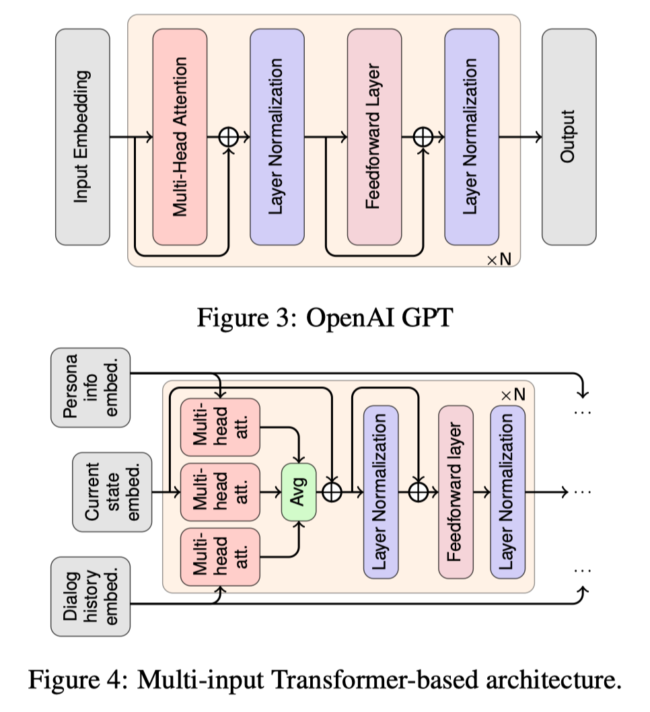
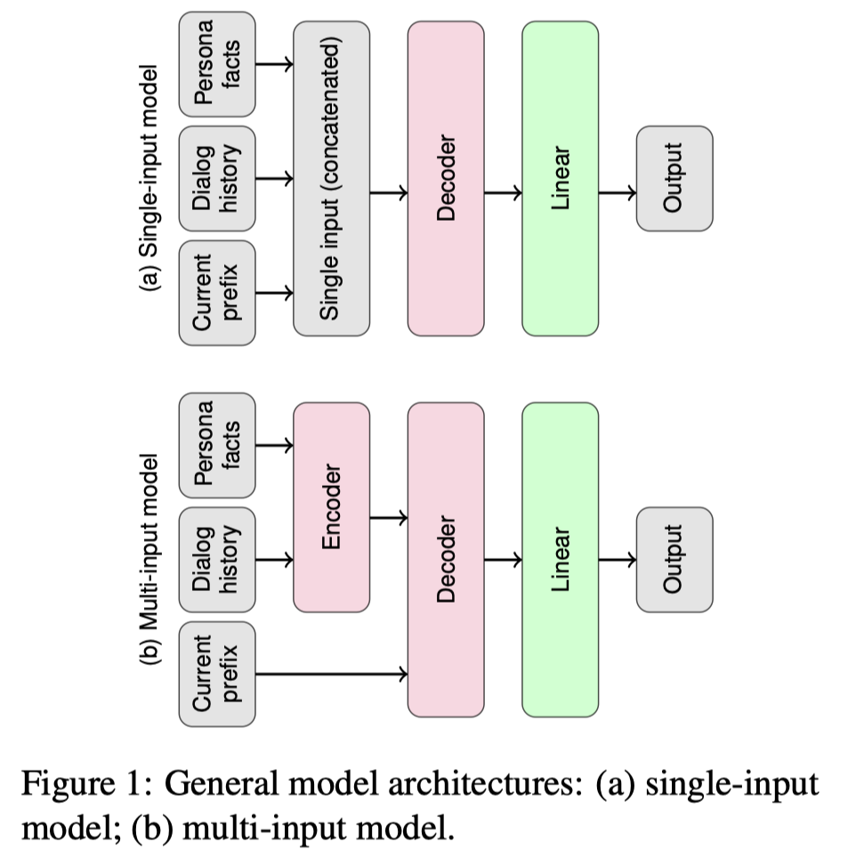
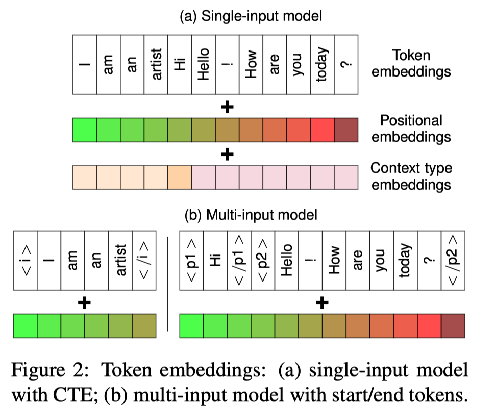
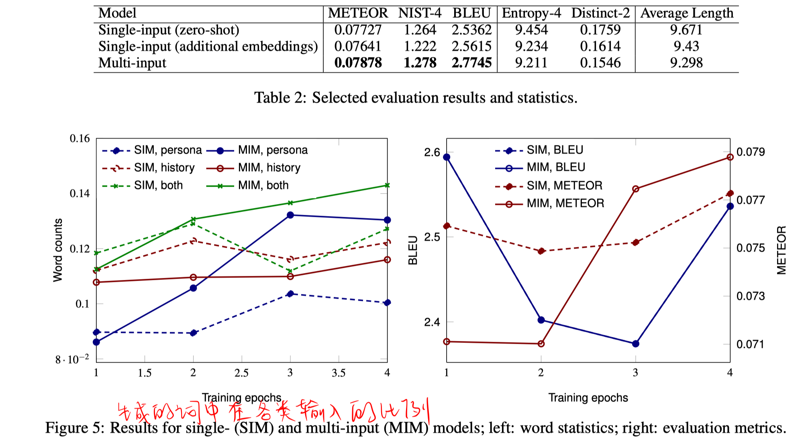

> > ACL2019，迁移学习，自然语言生成，分析类文章

## 背景

本文主要探索不同的预训练模型（不同的架构、不同的训练机制）对于自然语言生成任务的效果。

针对开放域的对话任务。在该任务中，通常存在多个输入，例如知识库、对话历史、已经生成的response序列。但预训练的模型通常是单输入的，因此需要考虑如何将单输入的预训练模型应用到多输入的下游任务。

本文使用两种一般的模式，将预训练语言模型应用到NLG任务：

- single-input设置：把所有输入拼接起来，，，，，
- multi-input设置：复制预训练的模型，形成encoder-decoder架构。

## 实验

**数据集**：PersonaChat

**预训练模型**：

OpenAI GPT（12层decoder-only Transformer）

**两种实验设置：**

**实验结果：**

- 图5的结果说明，不同的设置在利用不同类型的输入信息上是由差别的。

## 思考

1. 没有和其他的模型对比，只列出了自己的实验结果。。。。
2. 并没有比较不同的预训练模型。。。。