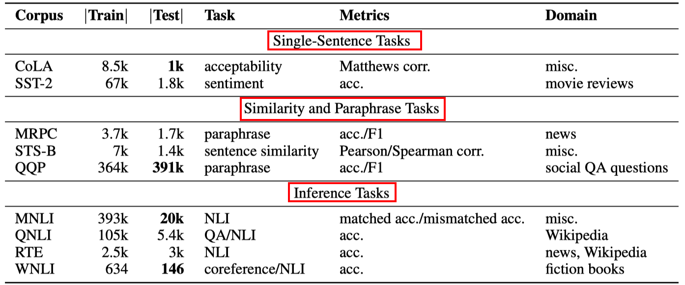
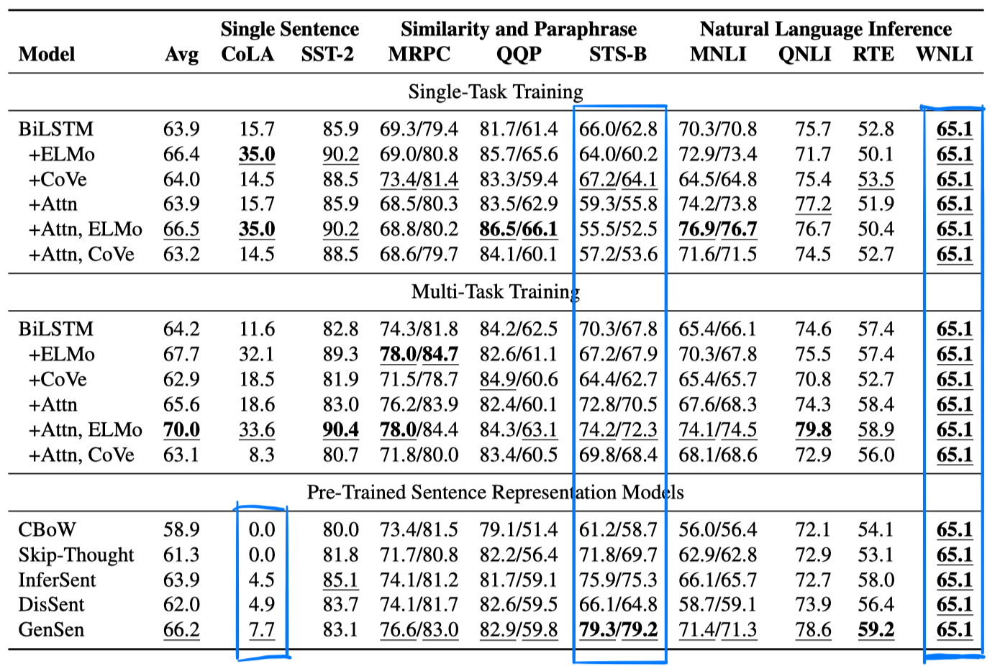

> > ICLR 2019，新数据集

GLUE: A MULTI-TASK BENCHMARK AND ANALYSIS PLATFORM FOR NATURAL LANGUAGE UNDERSTANDING

官网：https://gluebenchmark.com/

## 发布的任务：

>
>
>1. CoLA：判断句子是否合乎语法（二分类）
>2. SST-2：电影评论的情感记性判断（二分类）
>3. MRPC：新闻句子对的相似度判断（二分类）
>4. STS-B：新闻标题、视频及图片标题等句子对的相似度判断（ 五分类）
>5. QQP：CQA中的问题相似度判断（二分类）
>6. MNLI：（三分类）
>7. QNLI：是由SQuAD数据处理得到的，对于question-passage pair，将其拆分成多个question-sentence pair，判断sentence中是否含有答案（二分类）
>8. RTE：由RTE1、RTE2、RTE3、RTE5组成（二分类）
>9. WNLI：是由代词指称关系构造的数据集（二分类）

除了9个数据集外，还包括专家构造的诊断评估集，用来探测模型。

## 实验

代码：https://github.com/nyu-mll/GLUE-baselines、https://github.com/jsalt18-sentence-repl/jiant

实验方案：

>- 最简单的baseline：GloVe + BiLSTM + maxpooling 作为encoder，得到表达后通过具有单隐层的MLP分类器。对句子对任务，得到两个表达后，将[u;v;|u-v|;u*v]送入分类器。
>
>- Attention：Glove + 词交互矩阵 + BiLSTM + maxpooling 
>- ELMo：用ELMo取代Glove
>- CoVe：用CoVe与GloVe进行concat。

>- 单任务训练：
>- 多任务训练：在每轮训练中，根据各任务训练集数据量的比例为概率，随机采样一个任务进行训练。。。共享encoder，每个任务有自己的分类器。
>- 句子表示模型：使用CBOW、Skip-Thought、[InferSent](https://arxiv.org/pdf/1705.02364.pdf))、[DisSent](https://arxiv.org/pdf/1710.04334.pdf)、[GenSen](https://arxiv.org/pdf/1804.00079.pdf)

实验结果：（avg是所有任务评估结果的宏平均）

- 多任务训练比单任务训练得到的性能好
- Attention对单任务几乎不起作用或起反作用，但对多任务训练有很大帮助
- 使用ELMo代替其他embedding可以帮助提高，但在glove上加入cove效果不一定更好
- 预训练的句子表示模型性能：CBOW < skip-thought < InferSent < Gensen

- 目前的baseline知识很好地处理了强词汇信号，对于深层的逻辑结构仍处理不好。

