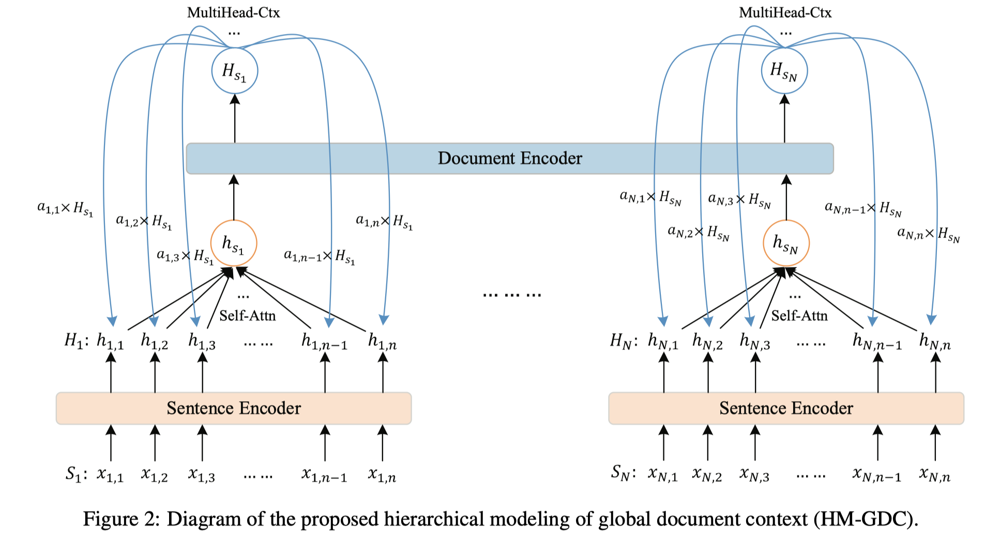
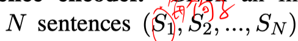
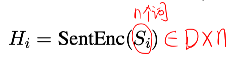
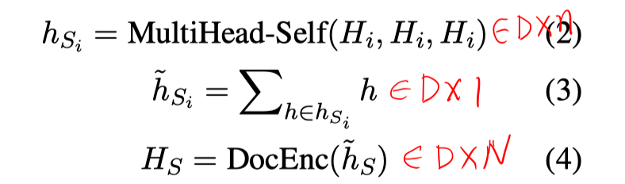
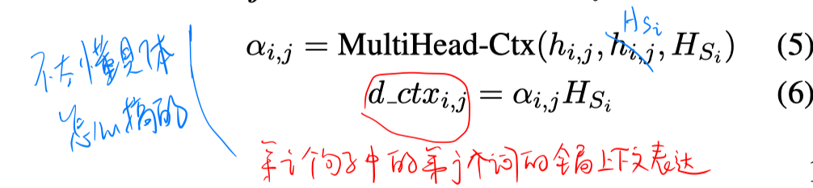
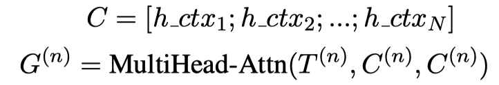
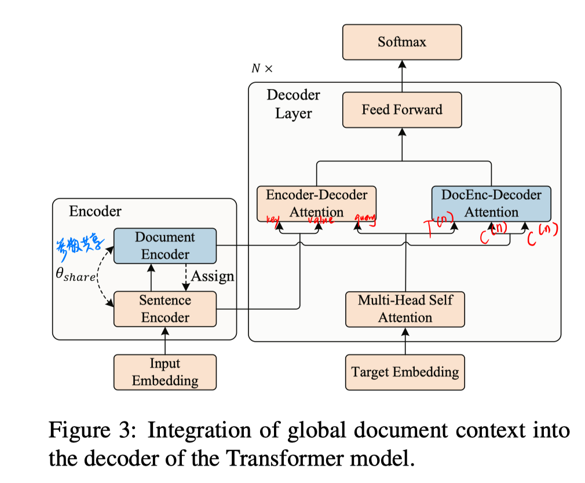
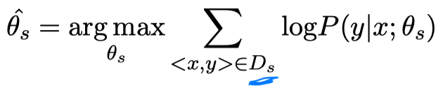
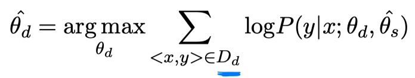
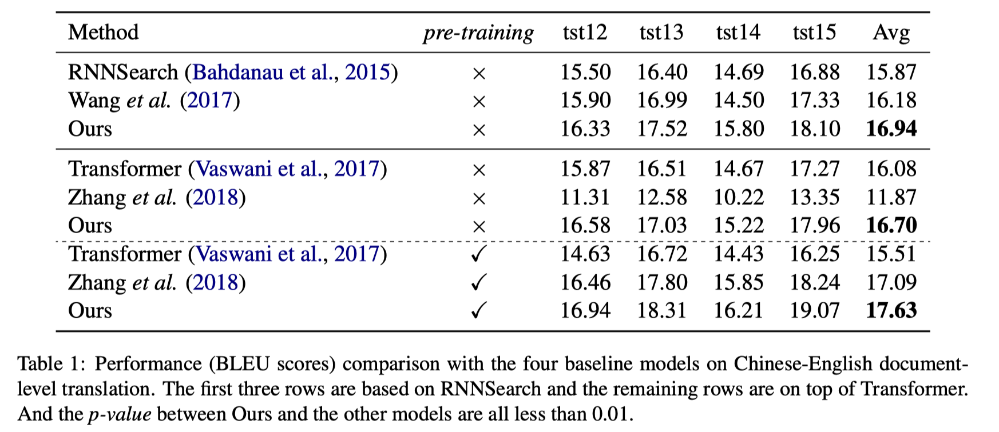

> > EMNLP2019

## 背景

本文考虑document-level的翻译做不好是因为无法很好地考虑全局上下文。

本文提出HM-GDC（hierarchical modeling of global document context）翻译模型：

- 采用分层的encoder模型（sentence-encoder + document-encoder）
- 显式地在词级别的上下文表示中加入融合了全局上下文的词表示
- 考虑到域内的平行语料不多，所以采用先预训练部分模块，再训练剩余模型（同时微调其他模块）

## 方法

##### 输入：

##### Encoder：

- sentence encoder：编码句子的内部表示

- document encoder：编码句子间的表示

- 在词的表示中融入 global context

  

##### Decoder：

## 训练

两阶段的训练：

- 预训练：大量的域外sentence-level的平行语料 $D_s$ 训练黄色模块

  

- 少量的域内document-level的平行语料 $D_d$ 训练蓝色模块，同时黄色模块一起微调

  

## 实验

## 思考

1. 除了使用两层的encoder，而且公式5和6，显式地将global context融入到词的表示中，帮助进行词级别翻译时的消歧。
2. 这样的分块训练方法在ICLR2020的《Low-Resource Knowledge-Grounded Dialogue Generation》中也出现过。