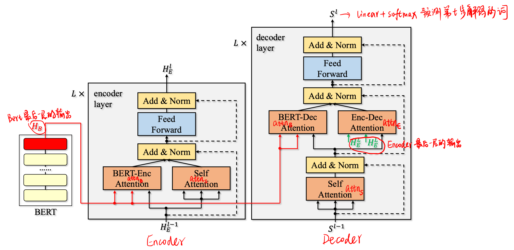
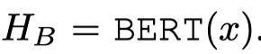
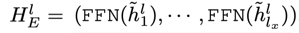
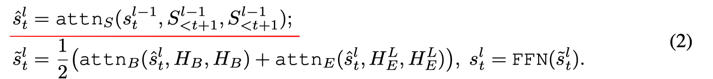
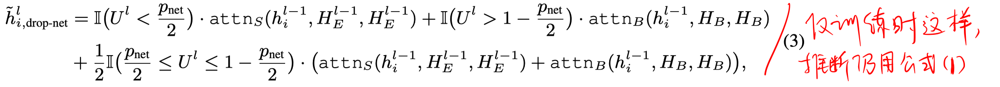
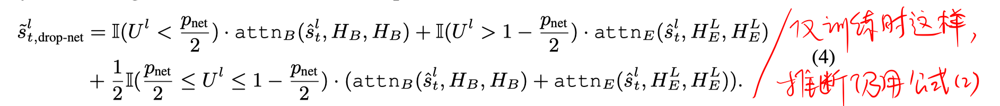
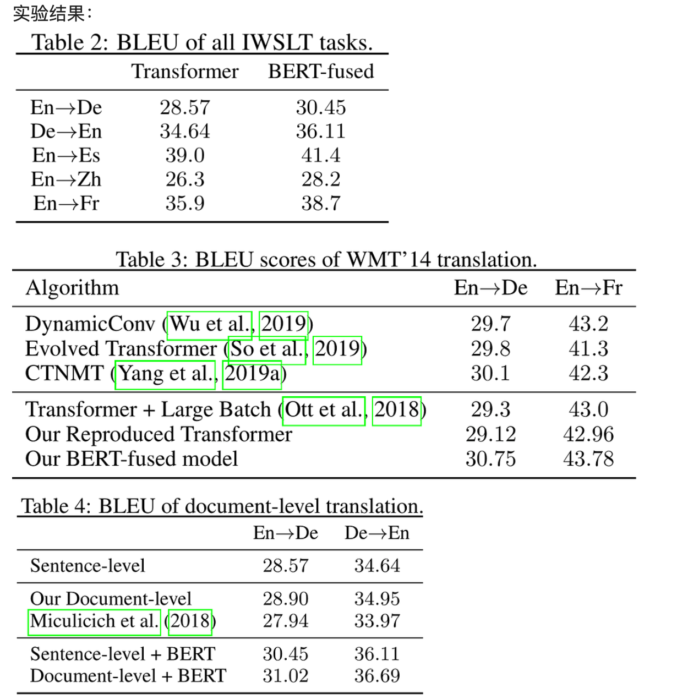
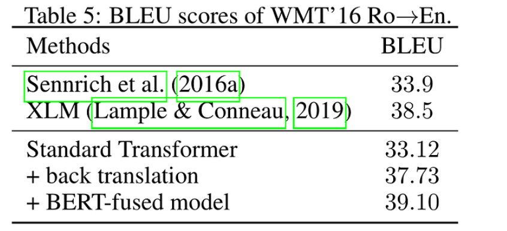
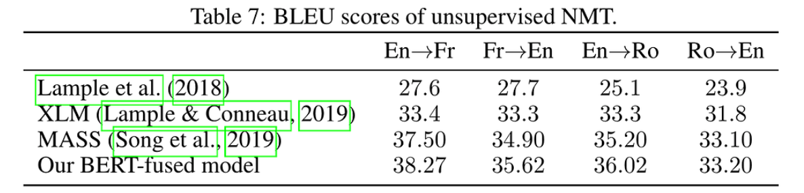
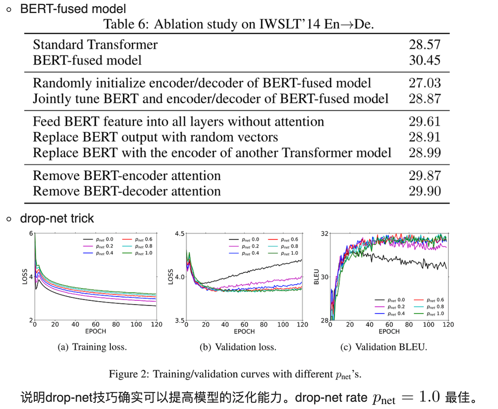

> > ICLR2020

源码：https://github.com/bert-nmt/bert-nmt

## 背景

一般而言，BERT在下游任务中常用作微调，而不是作为特征嵌入。但在NMT中，初步探索的实验发现，将BERT作为文本嵌入比用于微调更好。

本文提出了**BERT-fused model**：首先利用BERT提取输入序列的特征表示，然后通过注意力机制使BERT提取的特征表示和NMT编码器和解码器的每一层进行自适应地交互。而且提出drop-net trick起到正则化作用，防止过拟合。

## 方法

##### 整体模型

- BERT模块：（注意在训练时参数是固定的，不微调）

  

- Encoder

  

  

- decoder

  

##### Drop-Net trick

定义一个超参数drop-net rate $p_{net} \in [0,1]$

在训练过程中，每一层都有一个均匀采样的变量 $U^l \in [0,1]$

在训练过程中，公式1和2使用下述方式，但在推断阶段还是用公式1和2.

## 实验

##### 实验设置

先训练一个encoder-decoder的NMT模型，再用训练好的参数进行初始化。bert-encoder attention和bert-decoder attention部分的参数随机初始化。

##### 实验结果

1. 实验分为监督、半监督、无监督的NMT。

- 监督（包括低资源和高资源场景）

  数据集和模型配置：

  低资源场景：数据集IWSLT’14 English↔German (En↔De)（该数据集还用于文档级翻译实验）, English→Spanish (En→Es), IWSLT’17 English→French (En→Fr) , English→Chinese(En→Zh)（分别有160k、183k、236k、235k的双语句子对）。模型配置为transformer_iwslt_de_en（六层网络，embedding size为512，FFN layer dimension为1024）。

  高资源场景：数据集WMT’14 En→De和En→Fr(4.5M和36M)。合并newstest2012和newstest2013作为验证集，newstest2014作为测试集。模型配置为transformer_big（六层网络，embedding size为1024，FFN layer dimension为4096）。

  

- 半监督

  数据集：WMT’16 Romanian→English (Ro→En)，使用newsdev2016作为验证集，newstest2016作为测试集。

  

- 无监督

  数据集：En↔Fr 、En↔Ro

  

2. 消融实验

   

   

## Highlight

1. 从结果来看，还是有所提升的。尤其在低资源和无监督场景下。

