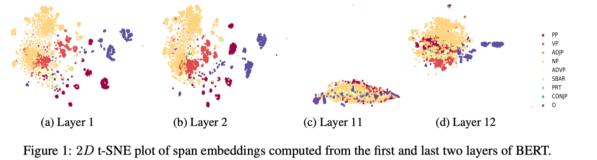
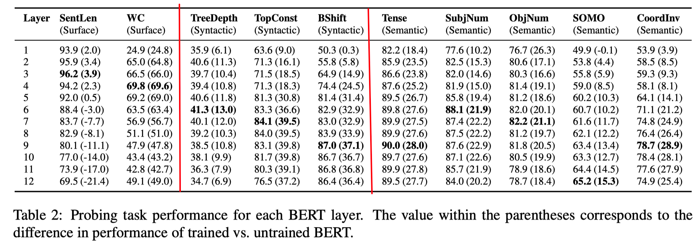
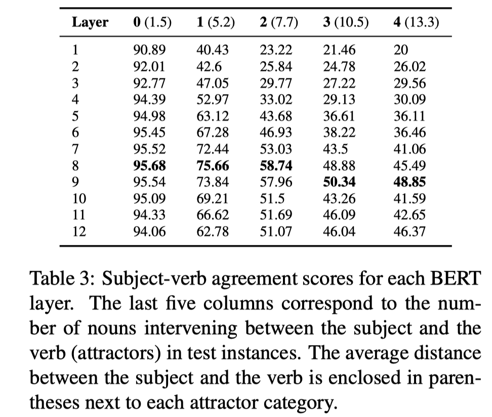
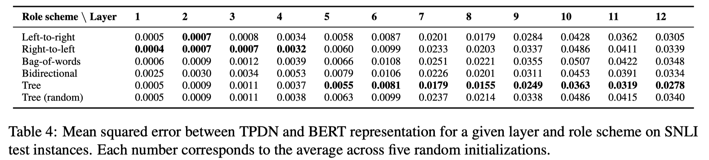

> > ACL2019，BERT的可解释性，实验性文章

源码：https://github.com/ganeshjawahar/interpret_bert

## 背景

使用的是bert-base-uncased模型。

## 实验1：phrasal syntax

##### 背景

之前的研究结果表明，基于LSTM的语言模型可以捕捉phrase-level的信息。但是BERT并不是用传统的语言模型进行训练的，所以不知道它是否也保持了这样的能力？以及如果有捕捉phrase-level的信息，是否在每一层都是这样？

##### 实验设置

选择 3000个被标记为chunk的span 和 500个被标记为非chunk的span。

对每个token sequence，取首次和尾词的输出表达，以及两者的差值和乘积，四部分concat起来。

##### 结论

- 很明显，在bert的低层是可以捕捉phrase-level的信息，但这些信息在更高层会逐渐被削弱。
- bert捕捉到的phrase-level的信息通常隐含了他们潜在的短语类别。

## 实验2：probing task

##### 实验设置

对bert的每层输出都使用10个probing task，分三个类别：

surface task：1）SenLen：句子长度；2）WC：词是否出现在句子中。

syntactic task：1）Bshift：对词序的敏感性；2）TreeDepth：句法树的深度；3）TopConst：句法树中最高level的成分

semantic task：1）Tense：时态；2）SubjNum/ObjNum：在主子句中主语和宾语的个数；3）SOMO：随意替换掉名词和动词的敏感性；4）CoordInv：随机置换子句连词的敏感性。

##### 结论

- bert可以捕捉层级性的语言学信息，低层是表面的信息，中层是句法信息，高层是语义信息。
- 未训练的bert在高层时，在SenLen task上超过了训练的bert，说明未训练的bert可以预测一些表面的特征，但经过训练后，模型主要捕捉更复杂的信息，在表面特征上的能力有所削弱。

## 实验3：Subject-Verb Agreement

##### 背景

subject-verb agreement是一个辅助任务，用来探测一个模型是否编码了句法结构。 （没太搞明白这个任务到底是要做什么？？）

##### 实验设置

##### 结论

- 结论和实验2相符，这样的句法特征需要在中层才能被捕捉。
- 当主语和动词之间的距离越长时，在第八层的结果比第七层好，说明更复杂的任务需要bert有更多层。

## 实验4：

##### 背景

本文使用Tensor Product Decomposition Networks（TPDN）来探究bert学到的表示是否具有组合的特征。

> 如果一个TPDN可以被训练地很好地近似一个模型学到的表示，则对应的role scheme很可能就是模型潜在学到的组合性。

##### 实验设置

对每一层，用5个不同的role scheme。

##### 结论

- 说明bert编码的是一个树状结构。

