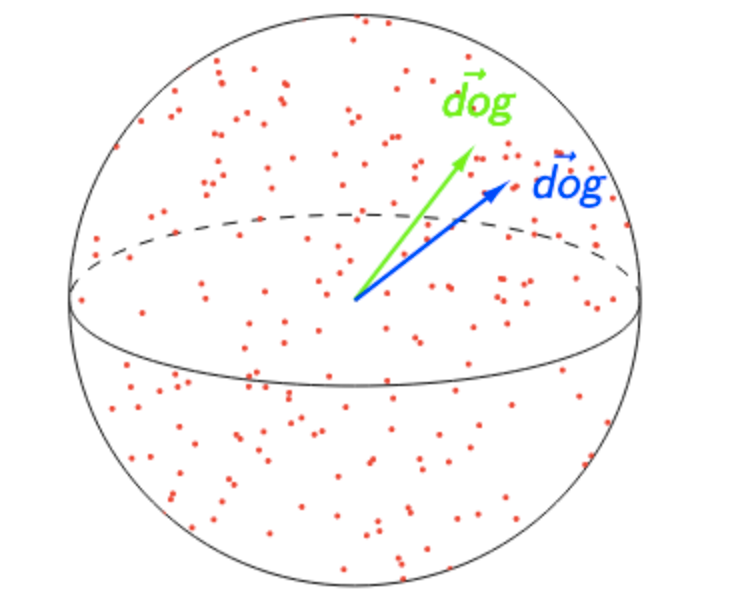
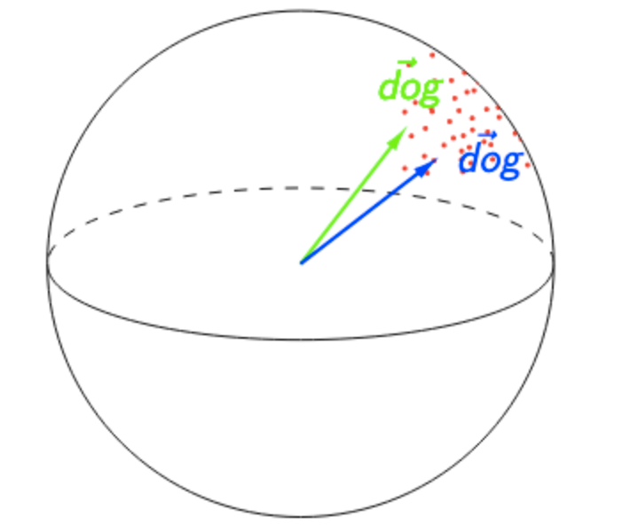
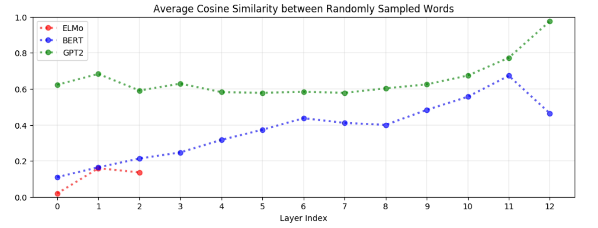
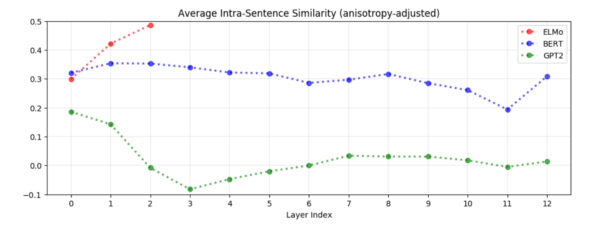
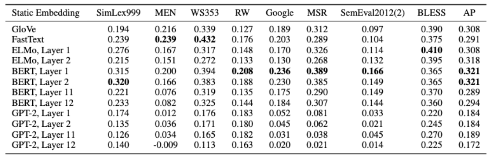

>>EMNLP2019

# 背景

如BERT，ELMo和GPT-2所描述的那样，将上下文整合到词嵌入中已被证明是NLP的分水岭。用上下文化的单词表示代替静态向量（例如word2vec）的方式，几乎已对每个NLP任务的都作出了重大改进。

但是这些情境化表示到底有多语境化呢？

考虑一下“mouse”一词。它具有多种词义，一种是指啮齿动物，另一种是指设备。这让我们产生一个思考，到底是BERT是否有效地创建了每个单词意义上的“mouse”表示形式？还是BERT创建无限多个“mouse”表示形式，每个表示形式都高度特定于其上下文？

本文对上述问题做了思考，并得出以下有趣的结论：

- 在BERT，ELMo和GPT-2的所有层中，所有单词的表示都是各向异性的：它们在嵌入空间中占据一个狭窄的圆锥体，而不是分布在整个空间中。
- 在所有三个模型中，上层比下层产生更多的特定于上下文的表示。但是，这些模型在单词维度的上下文之间却截然不同。
- 如果单词的上下文表示形式完全不是上下文，那么我们期望它们的100％的差异可以通过静态嵌入来解释。相反，我们发现不到5％的方差可以通过静态嵌入来解释。
- 我们可以通过在BERT的较低层中获取其上下文表示的第一主要成分，为每个单词创建一种新型的静态嵌入。以这种方式创建的静态嵌入在解决单词类比等基准测试中胜过GloVe和FastText！

回到我们的示例，这意味着BERT为单词“ mouse”创建了高度上下文相关的表示形式，而不是为每个单词含义创建一个表示形式。“mouse”的任何静态嵌入都将占其上下文表示形式中差异的很小。但是，如果我们选择的向量确实使方差最大化，那么将得到比GloVe或FastText提供的静态嵌入更好的静态嵌入！

### Anisotropy

在讨论上下文时，重要的是要考虑嵌入的各向同性（即，它们是否在各个方向上均匀分布）。

在以下两个图中，SelfSim('dog')= 0.95。左边的图像表明“狗”的背景不佳。它的表示不仅在出现它的所有上下文中几乎相同，而且表示空间的高各向同性表明0.95的自相似性异常高。右图显示了相反的含义：因为任何两个单词的余弦相似度都超过0.95，所以自相似度为0.95的“ dog”不再令人印象深刻。相对于其他词语，“dog”将被视为高度上下文化！

  

为了调整各向异性，我们为每个量度计算各向异性基线，并从相应的原始量度中减去每个基线。

但是是否有必要针对各向异性进行调整？
答案是显然的!
如下所示，BERT和GPT-2的上层是极度各向异性的，这表明高各向异性是上下文化过程所固有的（或至少是其结果）：

### Context-Specificity

- **诸如“ the”的停用词具有最低的自相似性（即，最特定于上下文的表示形式）**。一个单词出现的上下文的多样性（而不是其固有的多义性）是驱动其上下文表示形式变化的原因。这表明ELMo，BERT和GPT-2并非只是简单地为每个词义分配一个表示形式。否则只有很少的词义的词的表达就不会有太大的变化。

- **上下文特定性在ELMo，BERT和GPT-2中表现得截然不同。** 如下所示，在ELMo中，同一句子中的单词在上层更为相似。在BERT中，同一句子中的单词在较高层中彼此更不相似，但与两个随机单词相比，彼此更相似。相反，对于GPT-2，与随机采样的单词相比，同一句子中的单词表示形式彼此之间不再相似。这表明BERT和GPT-2的上下文关系比ELMo的上下文关系更加细微，因为他们似乎认识到在相同上下文中出现的单词不一定具有相似的含义。

  

### Static vs. Contextualized

- **单词的上下文表示形式中，方差不到5％的可以通过静态嵌入的方式来解释。** 如果一个单词的上下文表示完全不是上下文，那么我们希望它们的第一个主成分能解释100％的方差。相反，平均可以解释少于5％的方差。此时5％的阈值代表的最优情况，其中静态嵌入是第一个主要成分。例如，从理论上讲，没有保证GloVe向量类似于最大化所解释方差的静态嵌入。这表明BERT，ELMo和GPT-2并非简单地为每个单词分配一个嵌入：否则，所解释的差异比例会更高。

- **在许多静态嵌入基准测试中，BERT较低层中的上下文表示形式的主要组件均优于GloVe和FastText。** 通过这种方法将先前的发现进行推导，可以得出：如果我们通过简单地获取其上下文表示中的第一个主成分为每个单词创建一种新型的静态嵌入呢？事实证明，这种方法出奇地好。如果我们使用BERT较低层的表示形式，则这些主成分嵌入在涵盖语义相似性，类比求解和概念分类的基准任务上的性能要优于GloVe和FastText。

  对于所有这三个模型，从较低层创建的主成分嵌入比从较高层创建的主成分嵌入更有效。使用GPT-2创建的代码的性能明显要好于ELMo和BERT的代码。鉴于上层比下层更具上下文的特定性，并且鉴于GPT-2的表示具有更多上下文特定性，这表明较少上下文特定表示形式在这些任务上更有效。

  

### 结论

在ELMo，BERT和GPT-2中，上层比下层产生更多特定于上下文的表示形式。但是，这些模型将单词的上下文，彼此之间具有很大的差异性：在调整了各向异性之后，同一句子中单词之间的相似性在ELMo中最高，但在GPT-2中几乎不存在。

