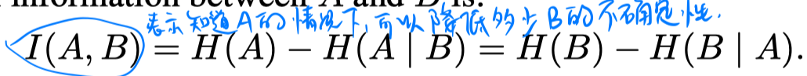
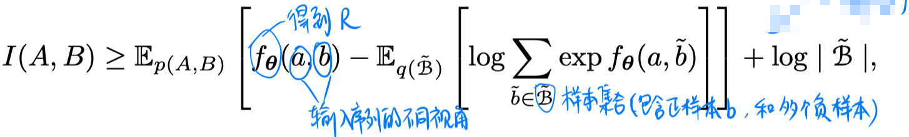
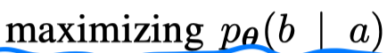
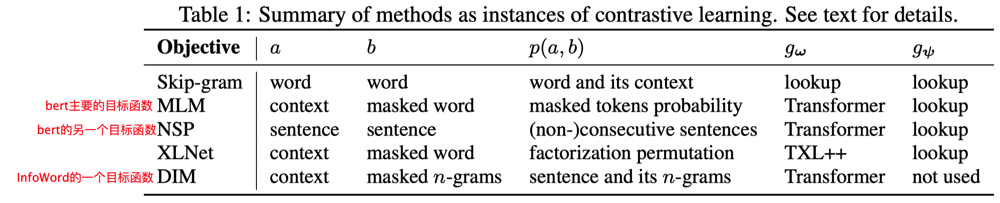
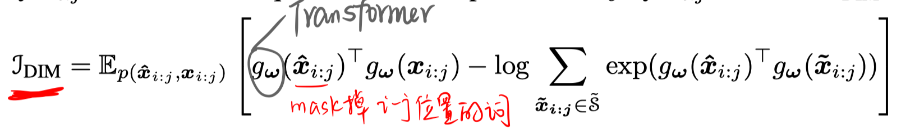
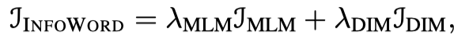
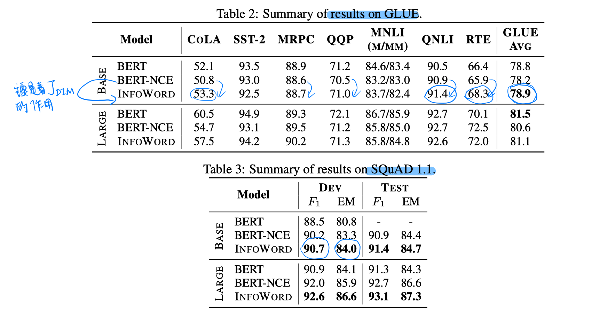
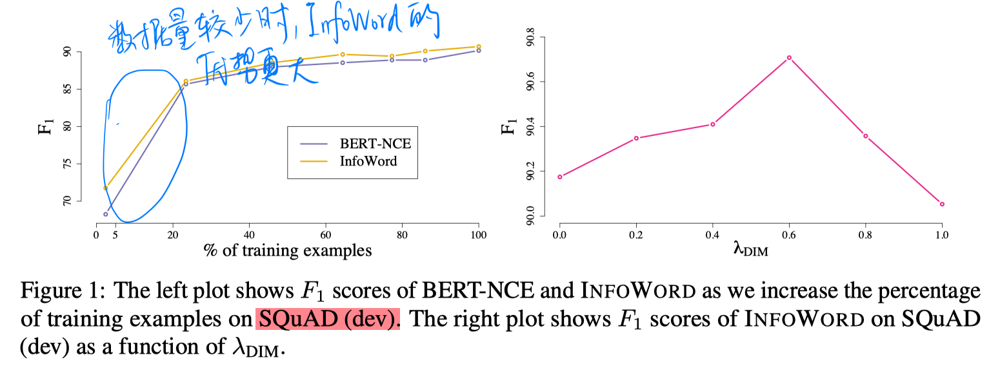

> > ICLR2020

## 背景

本文主要从互信息最大化的视角解释了以往的表示学习模型，并在统一的互信息最大化框架提出了**InfoWord模型**，用于进行表示学习。

## 相关工作

- 互信息最大化进行表示学习

  

  用互信息最大化进行表示学习，即 f 是进行表示学习的函数，A 和 B 是输入序列的不同视角，训练的目标就是max I(A,B)。。。由于直接优化互信息最大化不好实现，所以一般都转而优化互信息的下界。一个典型的下界是InfoNCE（Noise Contrastive Estimation）中提出的：

  

  即目标函数就变成了：

   

- 不同的表示学习模型其实都是在上述的统一框架下的不同实例。

## InfoWord 模型

本文提出的InfoWord模型包括两个目标函数：

- DIM

  

  $g_w(x)$ 表示将序列x通过encoder，取第一个词[CLS]处的表示。

- MLM

  

- 总目标函数

  

## 实验

1. 在GLUE 和 SQuAD上的结果

   

   > BERT-NCE:
   >
   > 

   - 从结果看，在GLUE上的提升很不明显。。。。在SQuAD上有一定提升。

2. 少样本学习实验

   

## 思考

以往的表示学习模型预测的都是单个词，本文考虑了更高阶的n-gram。从结果看，有一定效果。

