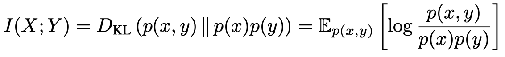
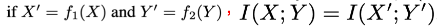

> > ICLR2020，分析类文章

## 背景

目前基于互信息最大化进行表示学习取得了很大的成功。

互信息的性质：1）当函数f1和f2是平滑可逆函数是，具有不变性；2）无法直接进行最大化，一般转而优化其下界。

本文提出，目前这些方法的成功不能只归因于MI的性质，还和feature extractor的架构，以及应用于MI estimator 的参数有关（本文的结果还显示，如果最大化更紧的下界，反而会得到更差的表示）。而且本文还建立了与深度度量学习（deep metric learning）之间的联系，这可能是这些方法成功的原因。

## 方法

## 实验

