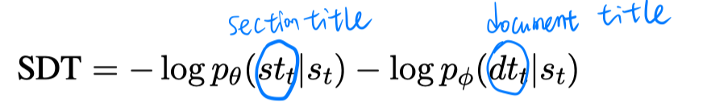
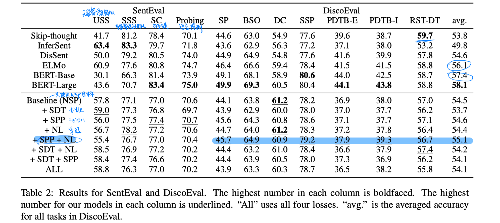
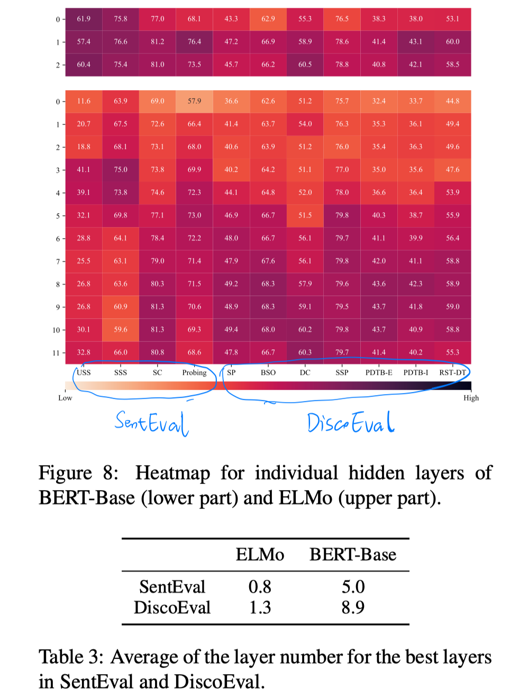

> > EMNLP2019

## 背景

- 本文提出了DiscoEval，包含一组任务来评估学习的句子表示是否包含篇章知识
- 本文在标准的预训练句子编码器的基础上，提出了一套多任务学习目标。

得出的实验结论：

- 本文提出的训练目标可以帮助模型在句子表示中学习到不同的特征。
- ELMo在SentEval中表现很好，但BERT在DiscoEval中表现更好。
- BERT和skip-thought vector表现更好，都是因为他们的目标函数中显式地和周围句子相关。
- 通过每一层的分析，BERT和EMLo的较低层在SentEval中表现更好，较高层在DiscoEval中表现更好。

## 评估任务

一共有七个任务，用逻辑回归做分类器。

- discourse relation（篇章关系）

  使用 RST-DT 数据集检测学到的全局篇章关系。（23类的分类）

  使用 PDTB 数据集检测学到的局部篇章关系。（PDTB-E是12类分类，PDTB-I是11类分类）

- sentence position

  实验设置：从文本中找5个连续的句子，把其中一个句子移到第一个位置，让模型去预测第一个句子的正确位置。

  在数据集构造时选择三个不同的域分别构造三个数据集：Wiki、ROC、arXiv

- binary sentence ordering

  实验设置：从文本中找2个连续的句子，二分类确定句子的位置。

  在数据集构造时选择三个不同的域分别构造三个数据集：Wiki、ROC、arXiv

- discourse coherence

  实验设置：负例构造是选择6个连续的句子，随机把其中一个句子替换成另一个篇章中的句子。二分类任务确定6个句子是否来自同一篇章。

  在数据集构造时选择2个不同的域分别构造2个数据集：Wiki、Ubuntu

- sentence section prediction

  实验设置：用来自PeerRead的数据集，随机采样来自论文摘要和论文中间部分的句子，二分类判断句子是否来自摘要部分。

## 多任务学习目标

- neighboring sentence prediction（NSP）

  

- nesting level（NL）

  

- sentence and paragraph position

  

- section and document title

  

## 实验

