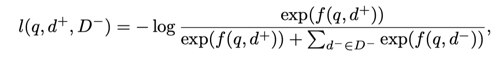
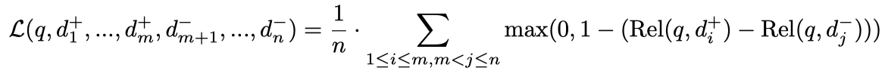

##### 疑问

1. 综述的核心点是什么？是**semantic ranking**，或者 neural model for semantic ranking？这决定了early model中需要包括哪些mothod。
2. 综述中所需要包括的work范围应该是什么？是论文中明确说专门为ranking阶段所提出的，或者是适合ranking的？例如，基于表示的neural reranking模型（DSSM等）是否应该被包括。
3. 整篇综述大概需要多长？  期刊20多页 = SigIR模板14页

semantic的定义       区分phrase的方法！！！

##### a survey on DL for semantic ranking (first stage retrieval)

##### a survey on neural methods for semantic ranking (first stage retrieval)

##### neural methods for semantic ranking: a  .. overview

------

- 引言

  - 第1段：Retrieval任务 的 两阶段模式：ranking关注什么，rerank关注什么

  - 第2段：之前比较关注rerank阶段：L2R 以及 neural model 在rerank中取得的显著效果（核心在于能够对semantic建模，深层理解文本）

  - 第3-4段：概述现代检索系统的ranking阶段使用的 symbolic-based methods（TFIDF、BM25），其不足在于vocabulary gap problem、loss word order，会导致错误传递和rerank阶段的瓶颈

    > 不足：1）vocabulary gap；2）loss word order

  - 第5段：按 时间线 梳理概述已有的一些解决方法

    为了缓解 term mismatch：query expansion、pseudo-relevance feedback 

    1990-2010：尝试捕捉潜在语义，term dependency model 、topic model、semantic hashing

    2013年后，embedding-based method、其他end-to-end neural IR model

    2016年，有专门的的工作提出neural model for the first stage ranking

    2018年之后，开始有一部分注意力转移到neural ranking

    最近两年（2019-2020）：开始有大量的工作

  - 倒数第6段：强调本survey的内容及边界、与其他survey的区别

    > 范围：非结构化文本的检索、ranking阶段 （其他的工作有retrieval-rerank的叫法），检索算法不是index方法
    >
    > 与其他survey的区别：

  - 本文贡献点

  - 章节介绍

- 背景

  - 问题定义

  - 检索场景（阐明输入文本对的特点；突出该场景下ranking阶段使用语义的必要性）
  - ad-hoc Retrieval（query-document，query-passage）
    - openQA（question-passage）
    - CQA
      - similarity question 检索（question-question）
      - answer 检索（question-answer）
  
  - 传统的、非语义的 ranking 方法（term-based method）

    向量空间模型、概率模型、语言模型、Divergence

    query expansion：全局方法、局部方法

- Early methods for semantic ranking

  - term dependency model（又称基于phrase的方法）

    ---- 融合进VSM、BM25、QL中

    ---- SDM、**WSDM（？？？待确认）**

  - topic model

    ----- 属于无监督方法

    ----- 概率的、非概率的：LSI、NMF、PLSA、LDA

    ----- 映射到topic space vector后，用于进行IR

    ----- 与term-based model相结合（线性结合e.g.pLSA、作为smooth）

  - `翻译模型`

- Neural models for semantic ranking（从模型架构角度分类综述）

  - 增补 term-based 方法，加入对语义信息的捕捉

    - 用 neural model 改进 term-based model
      > - `【NTLM】Integrating and evaluating neural word embeddings in information retrieval（2015）`
      >
      > - `【DeepTR】Learning to reweight terms with distributed representations（2015）`
      >
      > - Learning Term Discrimination（SIGIR2020)
      >
      > - `查询扩展`
      >
      >   > `Using word embeddings for automatic query expansion（2016）`
      >   >
      >   > `Query expansion with locally-trained word embeddings（2016）`
      >   >
      >   > `Embedding-based query language models（2016）`
      >
      > - 【DeepCT】Context-Aware Sentence/Passage Term Importance Estimation for First Stage Retrieval（arxiv2019)
      >
      > - 【DeepCT】Context-Aware Term Weighting For First-Stage Passage Retrieval（SIGIR2020，passage ranking，仅有DeepCT-Index，在MSMARCO和CAR上进行实验）
      >
      > - 【DeepCT】Efficiency Implications of Term Weighting for Passage Retrieval（SIGIR2020)
      >
      > - 【HDCT】Context-Aware Document Term Weighting for Ad-Hoc Search（WWW2020，ad-hoc retrieval）
      >
      > - 【Doc2Query】Document Expansion by ‹query Prediction.（2019）
      >
      > - 【DocTTTTTQuery】From doc2query to docTTTTTquery.（2019)
      
    - 用 neural model + term-based model

      > - `【DESM_mixture】A Dual Embedding Space Model for Document Ranking（2016）`
      > - `【GLM】Word embedding based generalized language model for information retrieval.`
      > - `Monolingual and cross-lingual information retrieval models based on (bilingual) word embeddings（2015，和LM线性加权）`
      > - `Representing documents and queries as sets of word embedded vectors for information retrieval（2016，和LM线性加权）`

  - 设计基于表示的模型

    - dense vector + ANN

      - 基于 embedding 的表示学习方法

        > -  `Fisher Vector`
        > -  Monolingual and cross-lingual information retrieval models based on (bilingual) word embeddings（2015）
        > -  【DESM】A Dual Embedding Space Model for Document Ranking, 2016
        > -  End-to-end retrieval in continuous space（2018）

      - 基于表示的neural ranking model

        > - DSSM（2013）
        >
        > - CDSSM/Arc-I
        >
        > - LSTM-RNN/QA_LSTM

      - 设计专门为检索的预训练任务，从而得到text的表示

        > - 【ORQA】Latent Retrieval for Weakly Supervised Open Domain Question Answering（ACL2019)
        > - REALM: Retrieval-Augmented Language Model Pre-Training（2020)

      - 学习表示向量，推迟交互

        > Ad-hoc retrieval:
        >
        > - 【Poly-encoders】Poly-encoders: Architectures and Pre-training Strategies for Fast and Accurate Multi-sentence Scoring（ICLR2020)
        > - 【ColBERT】ColBERT: E€icient and E€ective Passage Search via Contextualized Late Interaction over BERT（SIGIR2020)
        > - 【PreTTR】Efficient Document Re-Ranking for Transformers by Precomputing Term Representations（SIGIR2020)
        > - repBERT
        >
        > QA:
        >
        > - Efficient natural language response suggestion for smart reply.（2017)
        > - 【PIQA】Phrase indexed question answering: A new challenge for scalable document comprehension.（EMNLP2018)
        > - 【MUPPET】Multi-Hop Paragraph Retrieval for Open-Domain Question Answering（ACL2019)
        > - 【DC-BERT】DC-BERT: Decoupling Question and Document for Efficient Contextual Encoding（2020)
        > - 【DeFormer】DeFormer: Decomposing Pre-trained Transformers for Faster Question Answering（ACL2020)
        > - 【DPR】Dense Passage Retrieval for Open-Domain Question Answering（2020)
        >
        > 两个任务都有：
        >
        > - Sparse, Dense, and Attentional Representations for Text Retrieval

    - sparse vector + Inverse index

      > - Semantic hashing（不使用相关性信号）
      > - 【SNRM】From Neural Re-Ranking to Neural Ranking: Learning a Sparse Representation for Inverted Indexing（CIKM2018）

    - dense vector + sparse vector

      > - 【DenSPI】Real-Time Open-Domain Question Answering with Dense-Sparse Phrase Index（ACL2019)
      > - 【SPARC】Contextualized Sparse Representations for Real-Time Open-Domain Question Answering（ACL2020)
      > - Sparse, Dense, and Attentional Representations for Text Retrieval（2020）

  - 改进基于交互的模型，使其效率可以适用于ranking阶段

    > - Incorporating query term independence assumption for efficient retrieval and ranking using deep neural networks（2019）
    > - Efficient Interaction-based Neural Ranking with Locality Sensitive Hashing（WWW2019）
    > - 一些改进bert的也可以归到此类。

- 模型训练和评估（基本方法 + 特定的挑战点及方法）

  - 常用数据集：分不同的任务进行介绍

    ----- TREC-CAR/MSMARCO

    ----- Natural Questions、TriviaQA、WebQuestions、CuratedTREC、SQuAD

  - 负例构造策略：in-batch random sample、hard sample

    - corpus random sampling

      > Sparse, dense, and attentional representations for text retrieval.
      >
      > Dense passage retrieval for open-domain question answering

    - in-batch random neg sample

      > Sparse, dense, and attentional representations for text retrieval。
      >
      > Dense passage retrieval for open-domain question answering
      >
      > Learning dense representations for entity retrieval
      >
      > End-to-End Retrieval in Continuous Space
      >
      > Efficient Natural Language Response Suggestion for Smart Reply
      >
      > Repbert: Contextualized text embeddings for first-stage retrieval

    - BM25 top sampling

      > Sparse, dense, and attentional representations for text retrieval.
      >
      > Dense passage retrieval for open-domain question answering
      >
      > Complementing lexical retrieval with semantic residual embedding.

    - hard neg 的mining **（hard neg 因为涉及到model打分，online的方式没法实时，一般都是offline的计算采样）**

      > 异步ANN：Approximate Nearest Neighbor Negative Contrastive Learning for Dense Text Retrieval
      >
      > 异步ANN：Realm: retrieval-augmented language model pre-training.
      >
      > Embedding-based Retrieval in Facebook Search

    - 其他
      - **negative sampling的bias问题 （Debiased Contrastive Learning，这个好像text retrieval目前好像还没怎么关注）**
      - moco 的方式，维护一个queue, 将negative sample size 与 batch size解耦
      - **Noise Contrastive Estimation negative（Noise-contrastive estimation: a new estimation principle for unnormalized statistical models.）**

  - loss 函数设计：基本的策略 + 特殊的策略

    - sampled softmax cross entropy（negative log likelihood loss） --> softmax 可以引申引入 margin based softmax

      > 
      >
      > End-to-End Retrieval in Continuous Space
      >
      > Sparse, dense, and attentional representations for text retrieval.
      >
      > Dense Passage Retrieval for Open-Domain Question Answering
      >
      > Efficient Natural Language Response Suggestion for Smart Reply
      >
      > Approximate Nearest Neighbor Negative Contrastive Learning for Dense Text Retrieval

    - sigmoid cross entropy

    - hinge loss / max margin

      > 
      >
      > RepBERT
      >
      > End-to-End Retrieval in Continuous Space

  - 评估指标

    - 性能评估：recall等；专门对比BM25的指标

    - 效率评估：在线计算query查询的效率；离线计算document表示的效率；document表示的存储空间占用
    
      > Latency (ms)：每个query需要多长时间
      >
      > FLOPs/query：处理每个query需要多少次浮点数运算
      >
      > Throughput：每分钟处理多少个document
      >
      > GiBs

- 面临的挑战、未来的方向

  - 模型方面：精确匹配特征的识别（判别能力）、对噪声数据不鲁棒 ------> 设计新的模型

    重点！！！！展开讨论。。。指导性的东西

    - 目前的主流方法是基于表示的方法，但基于表示的方法有几个局限性：1）没有交互，所以无法捕捉相互的关系。2）压缩到一个向量，丢失了细节信息。失去判别能力。3）目前dense vector retrieval的模式主要基于vector dot product的方式快速检索，这个框架使用dot product作为score function。但dot product的表示能力可能有限，在retrieval任务高性能要求下，更强的score function， K-D coding, *Deep Retrieval- An End-to-End Learnable Structure Model for Large-Scale Recommendations* 不过这个是rec的paper，但框架应该是可以用在doc 任务上的。（另一篇文章中也提到说相关性的评估时一个复杂的问题，而这种简单的学习表示+计算score可能并不够）
    - 效率的问题
  
- 训练方面：负例构造策略、训练策略（Curriculum Learning）、无监督学习
  
- 评估方面：模型的效率问题、公平比较效率的条件
  
- 数据集：新的适合评估ranking的数据集
  
- 总结

- Introduction
- Background
  - Problem Formalization
  - Major Applications
  - Term-based Retrieval

- Early Methods for Semantic Ranking

  - Term Dependency Model

  - Topic Model

  - Translation Model

- Neural Models for Semantic Ranking

  - Improving Term-based Models
    - neural-based weights schemes
    - Hybrid of term-based and neural-based model
  - Designing Representation-focused Models

    - Dense

    - Sparse
    
    - Dense - Sparse
  - Modifying Interaction-focused Models

- 

  

