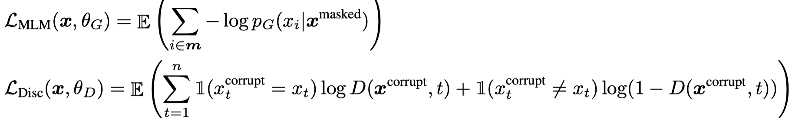
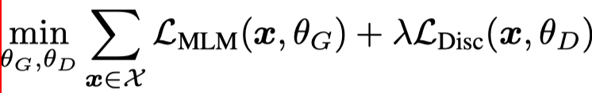

> > ICLR2020

## Motivation-论文解决了什么问题

在BERT中，句子内 15% 的token被选中，其中 80% 被 `[MASK]` 替换，10% 被随机替换，10% 保持不变，随后将替换后的句子输入到 BERT 中用于预测那些被替换的 token。(Masked Language Modeling) MLM 预训练方法借助双向表征取得了优于 LM 的效果，但是由于网络仅从 15% 的 token 中学习，使得产生大量计算成本。

## Motivation-本文的方法思路

本文提出了新的预训练任务：replaced token detection。 即首先使用生成器预测句中被 mask 掉的 token，然后使用判别器判断句中的每个 token 是原始的还是替换后的。

**在预训练后，丢弃生成器，对判别器进行微调用于下游任务。**作者认为 replaced token detection 任务让模型可以在所有的 token 上学习，而不是那些仅仅被 mask 掉的 token，这使得计算效率更高。

## Method-模型/方法概述

### Generator

预测句中被 MASK 的 token，使用 maximize likelihood 训练。注意此部分的loss只计算被mask掉的位置。

### Discriminator

通过序列标注的方法，判断当前 token 是否是原始 token。BERT 的 MLM loss 只计算被 mask 的token，而这里在优化判别器时计算了所有 token上的 loss，在后来的实验中也验证了这种方式更有效。

### 训练

由于生成器输出改写过的句子，而字词是离散的，所以梯度在这里就断了，判别器的梯度无法传给生成器。于是生成器的训练目标还是 MLM，判别器的目标是序列标注，两者同时训练 ，目标函数如下：

因为判别器的任务相对来说容易些，Disc loss 相对 MLM loss 会很小，因此加上一个系数，作者训练时使用了50。

## Experiment-实验

### 数据集

GLUE、SQuAD

### Weight Sharing

作者建议通过在生成器和判别器之间共享权重来提高预训练的效率。他们做了一个实验，在不共享权重下的效果是 83.6，只共享 token embedding 层的效果是 84.3，共享所有权重的效果是 84.4。

作者认为生成器对 embedding 有更好的学习能力，因为在计算 MLM 时，softmax 是建立在所有 vocab 上的，之后反向传播时会更新所有 embedding，而判别器只会更新输入的 token embedding。最后作者只使用了 embedding sharing。

### Smaller Generators

如果生成器和判别器的大小相同，则训练 ELECTRA 每步所需的计算量大约是仅使用 MLM 进行训练的两倍。 作者在保持原有 hidden size 的设置下减少了层数，得到了下图所示的关系图：

可以看到， 生成器的大小在判别器的 1/4 到 1/2 之间效果是最好的。作者认为过强的生成器会增大判别器的难度。

### Small models

这项工作的目标是提高预训练的效率，因此作者设计了一个小模型，可以在单个GPU上对其进行快速训练。与其他模型的对比结果如下：

可以看到，ELECTRA-Small的性能非常出色，与使用大量计算和参数的其他方法相比，其GLUE得分更高。仅用 14M 参数量，在提升了训练速度的同时还提升了效果。

### Large Models

GLUE的结果显示在上图中。ELECTRA-Large 与当前 SOTA 的预训练模型 RoBERTa 的性能相当。 但是，与训练 RoBERTa 相比，训练 ELECTRA-Large 所花费的计算不到 1/4。

### Efficiency Analysis

此外，作者还做了实验探究哪种 MASK 机制更好：

- ELECTRA 15%：判别器只计算 15% token 上的 loss
- Replace MLM：训练 MLM，输入不用 [MASK] 进行替换，而是由其他生成器生成。
- All-Tokens MLM：用 Replace MLM，目标函数变为预测所有的 token。

三种实验结果如下：

ELECTRA 15% 比 ELECTRA 性能差很多，说明在所有 token 上计算 loss 确实能提升效果。同时可以看到，[MASK] 标志确实会对模型产生影响。而且 BERT 还有一个trick，以帮助改善预训练和微调的差异：被替换的 10% token 使用随机 token 替代，还有 10% 训练时不变。对比 All-Tokens MLM 和 BERT，可以得出结论：如果 BERT 预测所有 token 的话，效果会接近 ELECTRA。

## Highlight

- 随机替换输入 token，再让 BERT 像判别器一样去预测是否替换过，这是否可行？
  - 不可以，因为随机替换过于简单，效果不好