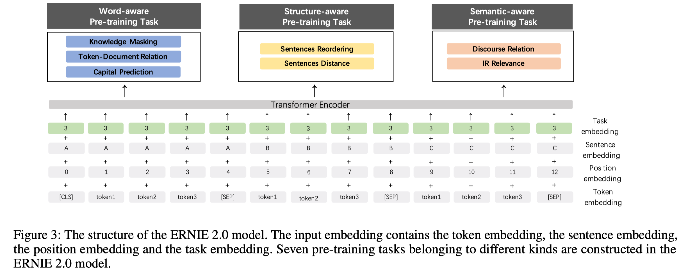
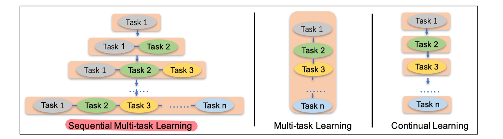
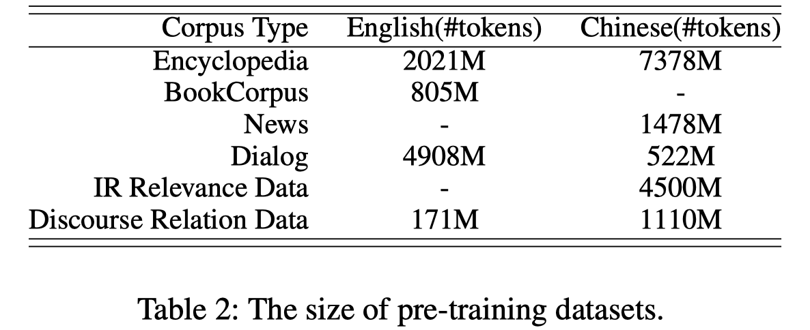
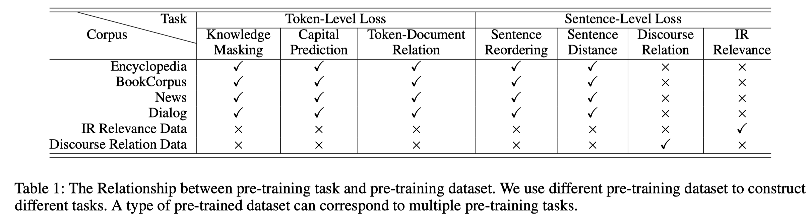
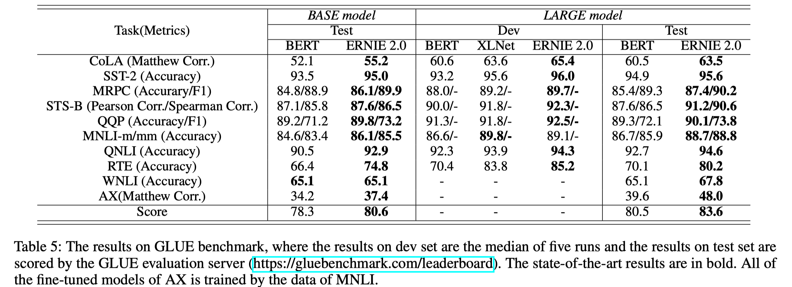
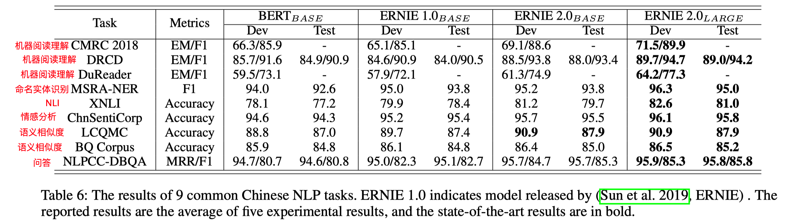
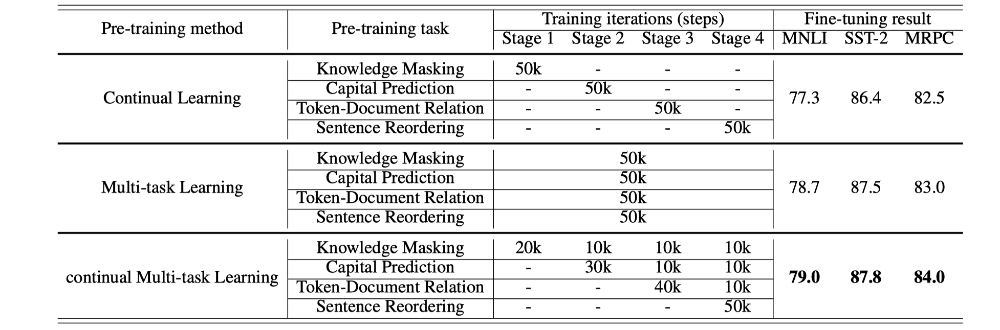

> > AAAI2020，ERNIE2.0，连续多任务学习，预训练模型

源代码和预训练模型：https://github.com/PaddlePaddle/ERNIE

## 背景

过去的预训练模型一般都是设计几个简单的任务来捕捉词和句子的共现特征，但是通常在训练语料中还存在<u>词汇、句法、语义信息。</u>

本文提出了**ERNIE2.0模型**，增量地创建一些（或大量）预训练任务，然后通过**连续多任务学习策略**在这些任务上进行模型训练。

## 方法

#### 模型架构

使用和BERT相同的结构。给定一个序列，嵌入[CLS]到序列首位，若有多个输入段，将[SEP]添加为分隔符。

Task Embedding：该模型提供任务嵌入以表示不同任务的特征。 ID为0到N，每个任务ID都分配一个唯一的任务嵌入。。 在微调阶段，可以对微调任务分配任意ID。

#### 预训练

- 无监督（自监督/弱监督）预训练任务构建（共7个预训练任务）

  - word-aware task：捕捉词汇信息。
    - Knowledge Masking Task：mask掉短语和命名实体，然后让模型进行预测，以学习局部上下文和全局上下文的依赖信息。
    - Capitalization（大写） Prediction Task：预测单词是否是大写的。
    - Token-Document Relation Prediction Task：预测出现在一个段落中的某个词是否也出现在原文中的其他段落，即识别文中出现的频繁词。该任务在某种程度上可以识别文中的关键词。
  - structure-aware task：捕捉句法信息。
    - Sentence Reordering Task：把原文分成m段并随机打乱组合，让模型预测正确的组合顺序，该任务被形式化为k分类任务。该任务可以帮助学习句子间的关系。
    - Sentence Distance Task：3分类任务，0表示两个句子相邻，1表示两个句子在同一篇文中但不相邻，2表示两个句子不属于同一篇文章。
  - semantic-aware task：捕捉语义信息。
    - Discourse Relation Task：预测两个句子之间的语义或修辞关系。？？？？？？？？？？？
    - IR Relevance Task：预测query和title的相关性。0表示强相关，即被用户点击的返回结果，1表示弱相关，即未被用户点击的返回解果，2表示不相关，即随机的。

- 连续多任务增量学习

  

  面临的两个挑战：1）如何在不忘记之前学到的知识的条件在，在预训练任务上以连续的方式进行训练；2）如何以有效地方式在预训练任务上进行训练。

  解决方案：连续多任务学习，即当新任务来时，使用之前学到的参数进行初始化，然后再同时使用旧任务和新任务一起进行训练。。具体地，每个任务共迭代训练N次，ERNIE架构可以自动地把每个任务的N次训练分配到不同的训练阶段。

  > 多任务学习：需要在训练开始前准备好所有的任务，无法实现增量。
  >
  > 连续学习：依次训练各个任务，容易忘记之前学到的知识。

#### 

## 实验

##### 预训练

使用的预训练数据情况：

##### 微调实验

1. English task

   

2. Chinese task

3. 学习策略的比较

   

