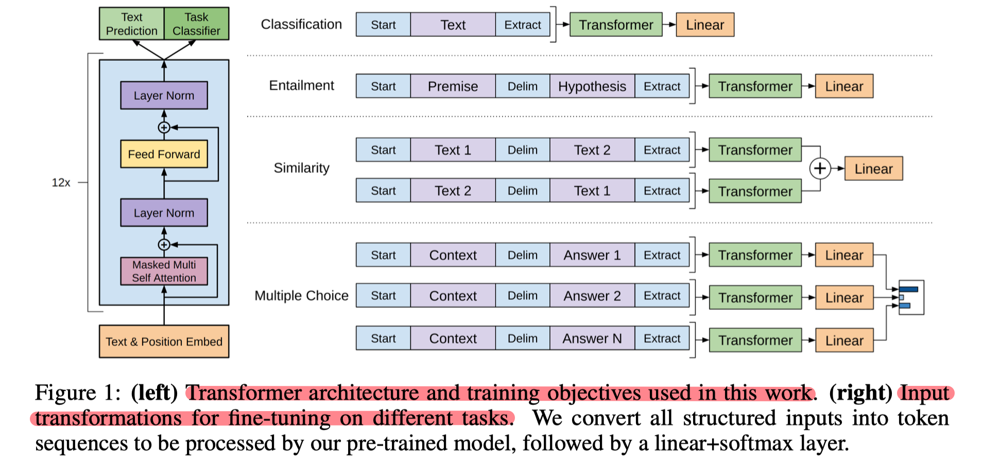
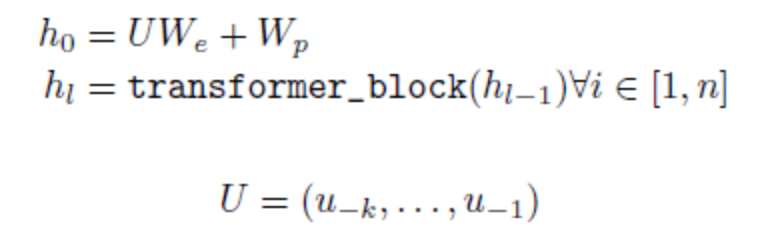
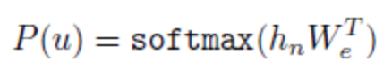
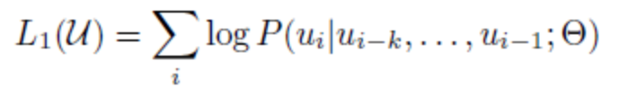
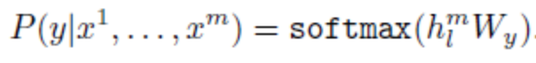
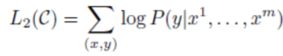
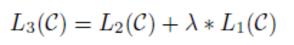
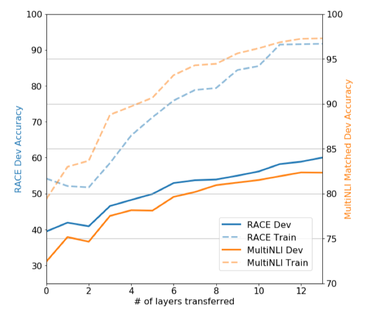
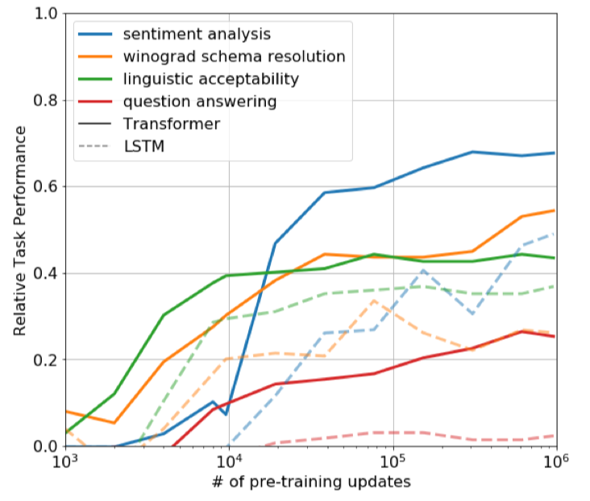
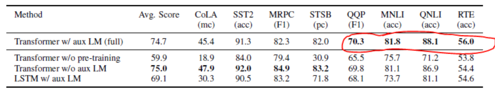

## 背景

为了方便nlp的迁移学习，人们提出采用无标注数据训练语言模型（language model），并在其后加上一层全连接和softmax组成分类器，用有标注数据fine-tuning分类器。

本文使用transformer decoder做语言模型，并且将模型的input根据task做一定的转变，以期待分类器基本不变。本文在自然语言推断，问答系统，语义相似度，文本分类这四个问题上做了实验，并且做了预训练模型的zero-shot实验。

## 方法

##### 模型架构

该模型在pretrain语言模型（第一阶段）使用transfomer+左边的绿色部分，在fine-tuning分类器（第二阶段）使用transfomer+右边的绿色部分。

1. 第一阶段

   语言模型采用transformer decoder，内有12个相同的transformer block。

   

   在最后一个transformer block后跟一层全连接和softmax构成text prediction，预测下一个token的概率。

   

   我们希望根据之前的tokens预测下一个token的概率最大，目标函数为：

   

2. 第二阶段

   在最后一个transformer block后跟一层全连接和softmax构成task classifier，预测每个类别的概率。

   

   我们希望在输入所有的token后，预测true类别的概率最大，目标函数为：

   

   为了更好的fine-tuning分类器，更快的收敛，修改目标函数为task classifier和text prediction相结合：

   

##### 输入形式调整

 所有的任务的input都由[start]开始，由[extract]结束。

entailment任务：因输入有前提和假说两个句子，那就在两个句子中加入分隔符（delim）连接两条句子，作为输入，经过语言模型送入分类器。

similarity任务：因两条句子的顺序不影响结果，就按两种顺序分别放入语言模型得到各自的hidden state，将两种hidden state相加，送入分类器。

multiple choice任务：对于每个答案，都将context、问题、该答案以分隔符隔开连接起来，作为输入，经过语言模型送入分类器得到一个向量，将所有答案的向量送入softmax。

## 实验

1. 在四个任务上效果都比相应任务的state of art好。

   transformer block的个数越多，也就是语言模型越深，效果越好，说明语言模型的各个layer确实学到了不一样的东西。

   

2. 不对语言模型进行fine-tuning时，pretrain语言模型的迭代次数越多，最后的效果越好，说明语言模型的pretrain确实学到了general的东西。

   

3. fine-tuning分类器的时候，当task数据较多时，使用加了text prediction的目标函数效果更好一点（下图圈出来了），并且用transformer比lstm好。

   

## 思考

两点在于采用Transformer-decoder的生成式架构。

