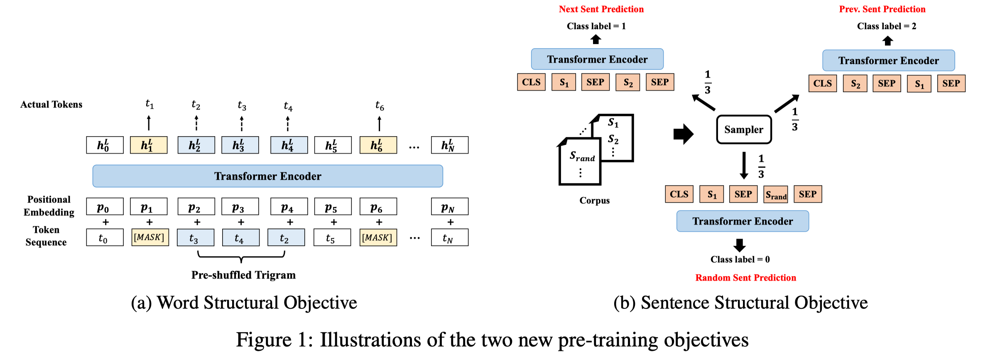

> >ICLR2020

## Motivation-论文解决了什么问题

BERT和它的升级版Roberta在nlp领域已经取得了很大的成功，但是这些预训练模型都没有显式的考虑到句子结构。句子结构对于自然语言来说是非常重要的，因此，本文主要探讨如何利用句子的结构来提升预训练模型

## Motivation-本文的方法思路

作者通过将词之间和句子之间的顺序作为两个新增的预训练目标函数进行预训练，令人意外的是，通过这两个预训练目标的加入，效果提升明显，与同级数的BERT相比，提升4个点左右

## Method-模型/方法概述

模型结构同BERT一样，不再赘述。预训练的目标函数如下：

- 在进行Mask掉token之后，shuffle一定数量的token，然后预测其正确顺序

- 打乱前后句的顺序，然后预测其实前一句还是后一句或者是随机的一句

- MLM(本以为只有上两种，但作者在后边说的是pre-train these two auxiliary objectives together with the original masked LM objective。

  

  以上对于词序预测中，打乱多少个连续token是个超参数K，作者设置为trigram=3，并且5%的trigram会被打乱顺序。

## Experiment-实验

预训练的设置基本和BERT一样，包括使用的数据集English Wikipedia和Book Corpus，预训练的方法，所使用的optimizer等。
使用了64个V100，训练40个epoch，base结构花费38h，large约一周

可以看出structbert提升比较明显

消融实验 ：

## Highlight

- 尝试将自然语言结构融入到预训练中，但是文中的关于词序的处理是否真正的融合了句子结构信息尚不可知。
- 根据ACL2019的一篇论文，对BERT学到的表示进行分析的结果来看，已经表明BERT可以学习到句子的结构（树状）。
- 对于第二个目标函数的改进，和ALBERT论文中的一样。
- 对于词序预测的预训练任务，从直观上看是对训练数据利用更充分，但不知道是否真的学到了句子的结构信息。

