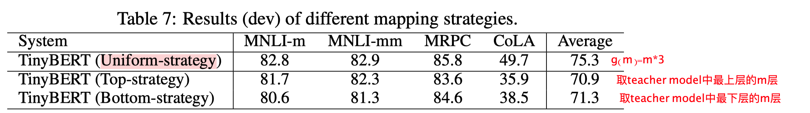
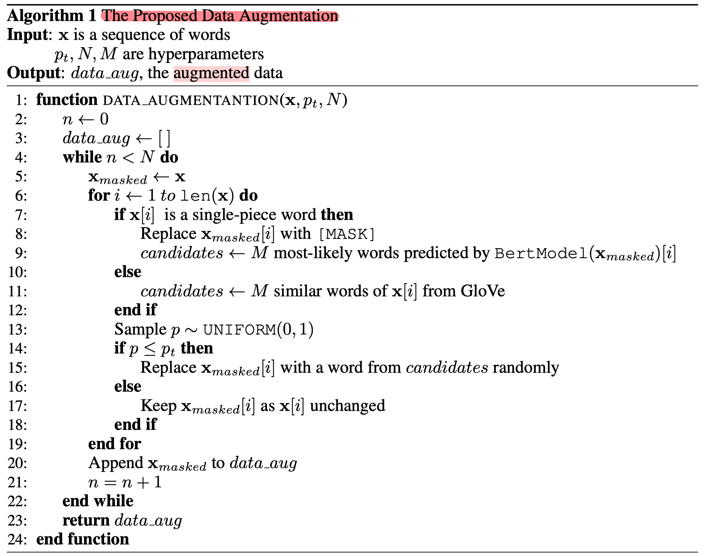

> >ICLR2020

## Motivation-论文解决了什么问题

BERT预训练模型虽然强大，但是由于模型参数量过大，训练成本要求高代价高。本文主要是为了在保持性能的前提下，进行加速推断和减小模型参数量。

## Motivation-本文的方法思路

作者主要使用了知识蒸馏的方法，将原始bert中(teacher)包含的知识迁移到一个小的模型中(student)，模型大小不到 BERT 的 1/7，但速度提高了 9 倍，而且性能没有出现明显下降（论文没有被ICLR2020录用），并且和当前stoa蒸馏bert的方法相比，本文也只有28%的参数量和31%的推断时间。

> 有关知识蒸馏的可以去看Hinton2015年的那一篇，写的很有趣，主要是让student的输出层的logits和teacher的尽可能相似，loss function是MSE，为了减小两个模型输出的差异。

## Method-模型/方法概述

和以前的方法比较，主要体现了本文方法的蒸馏包含了更多的内容，像嵌入层，attention层，隐层等，本文大部分工作都是在loss的设计上，最起码表面看来：

##### TinyBERT模型框架结构

以下介绍主要分为对transformer的三个模块蒸馏的详细介绍和transformer两阶段：预训练和finetune阶段的蒸馏的方法。

##### **问题规范**

对于teacher模型假设有N层，student模型有M层，蒸馏时，从teacher选择相同的M层数进行蒸馏，使用一个map function g（实验部分有具体说明） 来进行层之间的映射，loss 如下，其中 λ 是表征重要性的权重， Llayer 是loss function， S,T 代表student模型和teacher模型

- **transformer-layer**

包括attention和hidden state的蒸馏

其中h是head的数量，A代表attention matrix，这里看着像直接去拟合了attention matrix

其中 Wh 主要用来将student模型小矩阵进行放大到跟teacher模型一样大，进行直接比较，还是直接去拟合某一层的输出

- **embedding-layer**

和hidden layer类似。

- **prediction-layer**

这里就和Hinton提的一样，去拟合输出层的logit，其中 zT,zS 都是logit， t 是temperature起一个放缩的作用
所以总的loss如下：

##### TinyBERT两阶段学习：

- **预训练阶段的蒸馏-general distillation**
只包括transfor-layer和embedding-layer的蒸馏，不包括prediction-layer

- **finetune阶段的蒸馏-Task-specific Distillation**
这里对所有三个模块都进行蒸馏，但是是在一个数据增强后的特定任务训练数据集上进行的。

## Experiment-实验

- 可以看到跟BERT相比还是有差距的

- 在模型大小和推断速度上提高很多

- 消融实验上可以看到预训练阶段的蒸馏没啥用，但是数据增强也很有用。对于三个模块来说embedding层没啥用。

- 上表可见，不同的map函数g的影响。

## Highlight

- 该文章提出的方法确实在transformer蒸馏上有一定的效果，但是创新性不够，除了基本的蒸馏方法外，就是多了中间层的蒸馏和一个数据增强技术（文中没有细讲，也被reviewer argue了），本文也因创新性不够被拒了，区域主席说这篇文章在及格线上。
- 数据增强算法

