## 背景

- 本文引入一个统一的自然语言处理迁移框架，该框架将所有的自然语言处理任务统一为text-to-text形式。（对每个NLP任务使用text-to-text框架能够直接使用相同模型、目标函数、训练流程和解码步骤。这就极大地方便了使用和对比，特别适合单因素变量对照。）

- 本文系统研究比较了**预训练目标、系统架构、未标记数据集和迁移方法等其他因素**对数十个自然语言理解任务的影响，同时通过**扩展模型和数据集**探索迁移学习的边界。
- 本文还引入一个新的数据集：Colossal Clean Crawled Corpus，名为C4。该数据集引入的初衷是为了探索尺度规模(包括模型规模和数据规模)在NLP中的影响。
- 本文其实并没有引入新的模型或者新的方法，而是将现有的方法和技术做一次集大成，进行统一。

## 模型

- T5中的encoder-decoder Transformer与 Transformer 原始论文类似，不同点在于位置编码：

  原始的 Transformer 直接给出一个正弦函数形式的位置嵌入方式。但是，本文这里采用的是**相对位置嵌入**。相对位置嵌入不再对每个位置使用固定的嵌入，而是根据自注意机制中被比较的“key”和“query”之间的偏移量产生不同的学习嵌入。本文这里使用一种简化的位置嵌入形式，每个“嵌入”只是一个标量，它被添加到相应的logit中，用于计算注意力权重。为了提高效率，在模型中**共享所有层的位置嵌入参数**，尽管在给定的层中，每个注意力头部使用不同的学习位置嵌入。通常，需要学习固定数量的嵌入，每个嵌入对应key-query 可能的偏移量范围。具体到本文这里，所有模型一共使用32个嵌入，范围增量步长以对数方式，直到偏移量超过128，对于超出128的则将所有的相对位置赋予相同的嵌入。主要特别注意，给定层对128个标记之外的相对位置是不敏感的！但是，后续的层可以通过结合前一层的局部信息来建立对较大偏移量的敏感性。

- 为指定模型所处理的具体任务类别，需要在原始的输入序列上增加task-specific (text) 前缀。

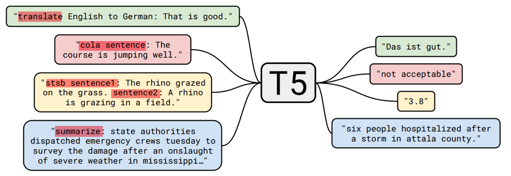

## 实验

### 1. baseline

模型：本文选用的baseline模型与`BERT_base` 很接近，模型大概 220 million 参数。由于baseline模型采用了双层的stacks，而非一个，所以参数量是`BERT_base`的2倍。

预训练目标：

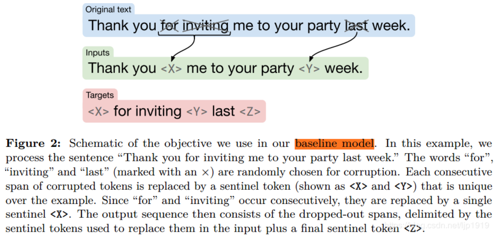

性能表现：

### 2. 不同框架对比

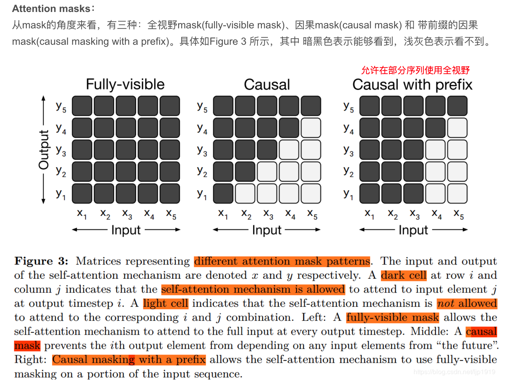

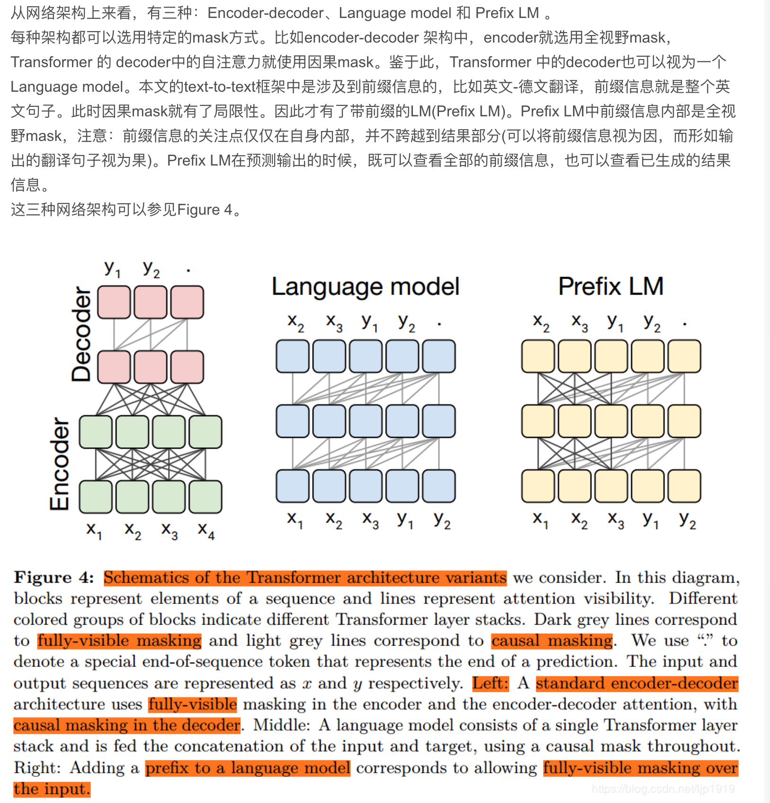

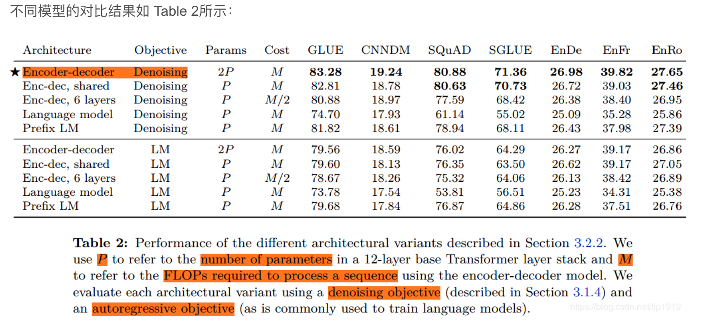

### 3. 无监督目标函数

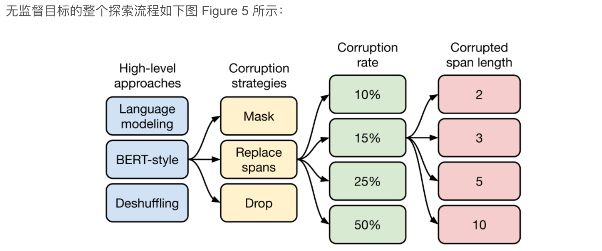

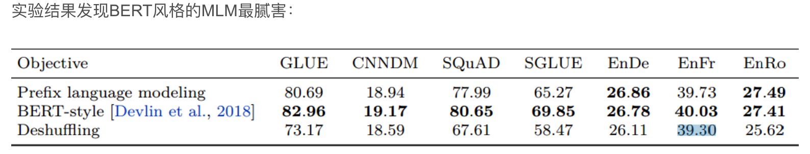

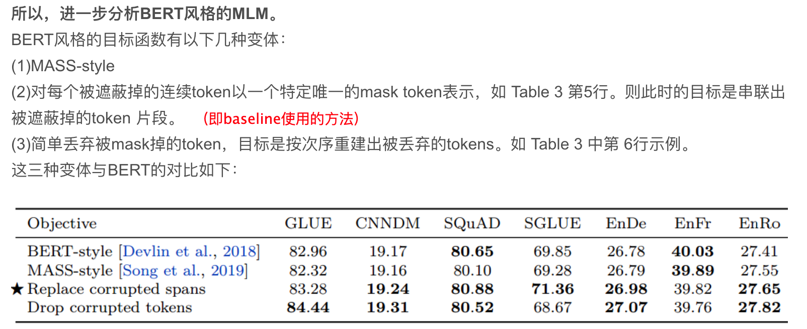

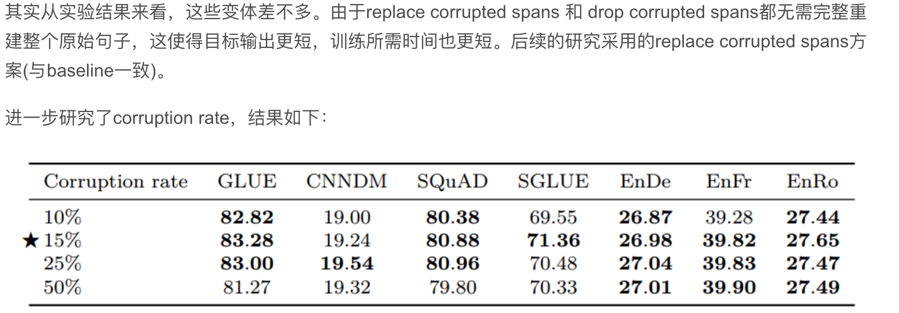

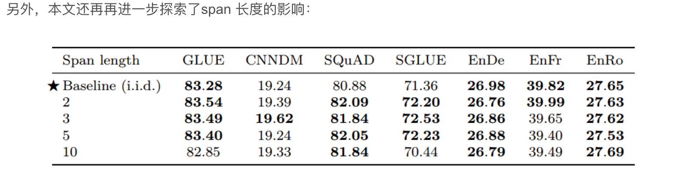

### 4. 预训练数据集（略）

### 5. 预训练策略

#### 5.1 微调策略

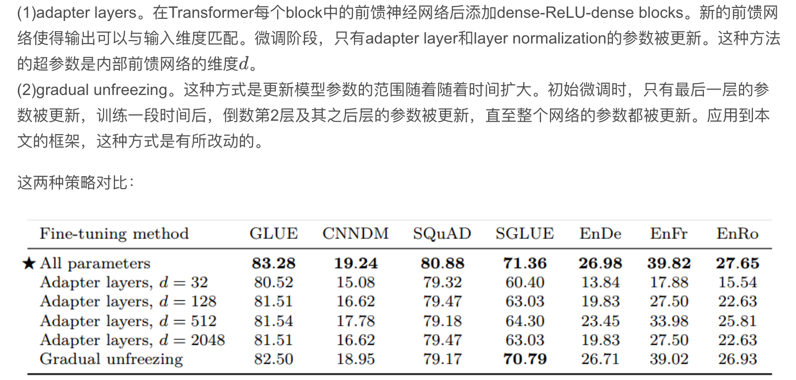

#### 5.2 多任务学习

本文这里是简化版的多任务学习，并不热衷于多任务之间的参数共享，而是更关注于用同一个时间训练多个任务。在本文统一的text-to-text框架中，“多任务学习”简单地对应于将数据集混合在一起。

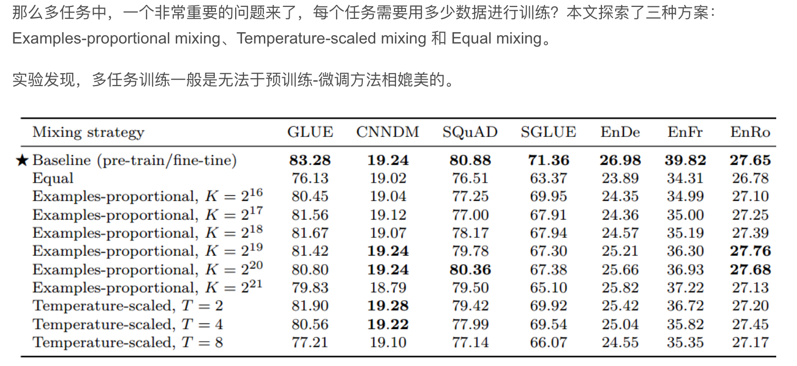

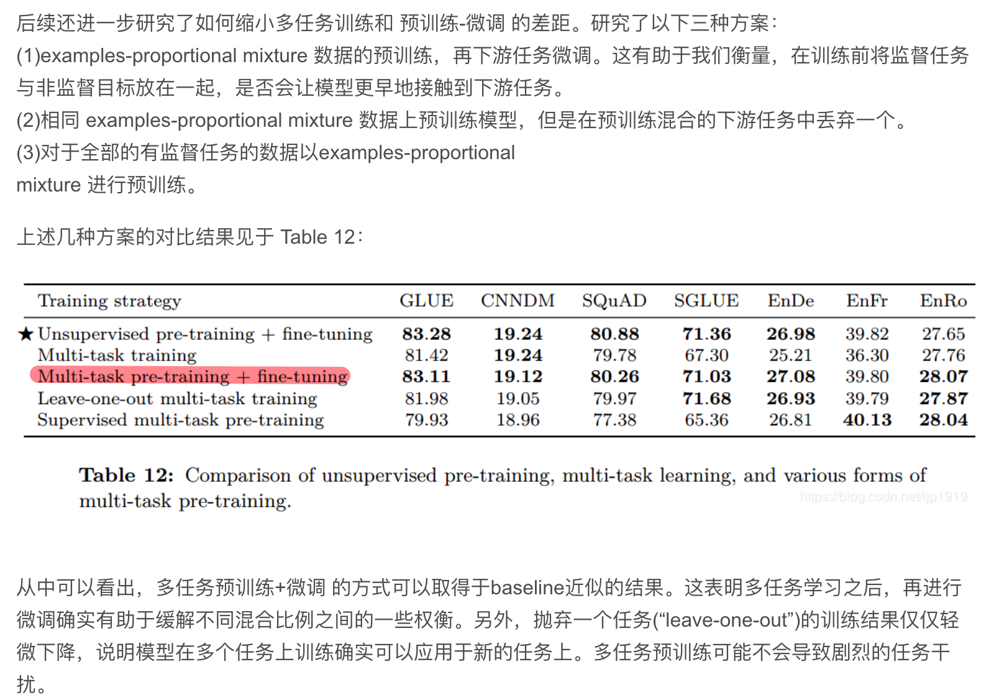

### 6. 规模的影响

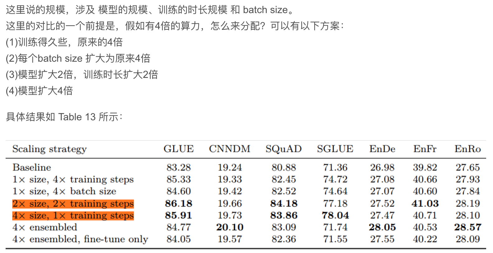

## 思考

- 大模型的难处：我们也知道大模型表现好，终究不是长久之计，distillation、parameter sharing和conditional computation 或许是一条新出路。

- 更高效地抽取知识：我们需要一个更有效的方法来学到通用的知识，强烈怀疑BERT-style loss的效率。

- 形式化任务之间的相似性：需要一个衡量pre-training和下游任务相似性的方法。

- 与语言无关的模型：
  English-only pre-training没能在翻译任务上达到SOTA的表现，说明单一语言还是有局限性。不受语言限制的模型可能是未来的一个研究方向。

