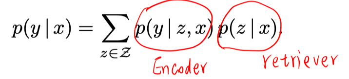
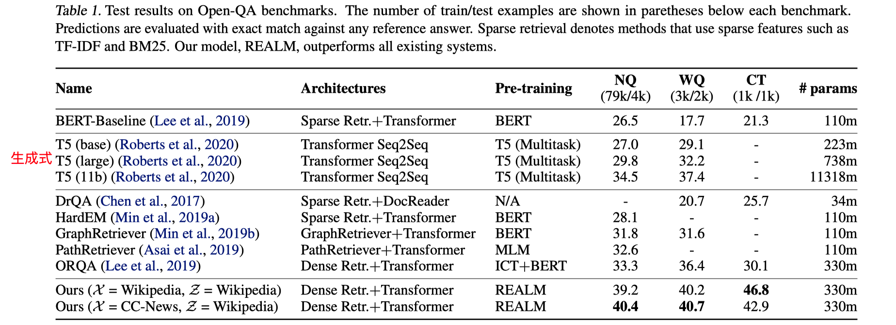
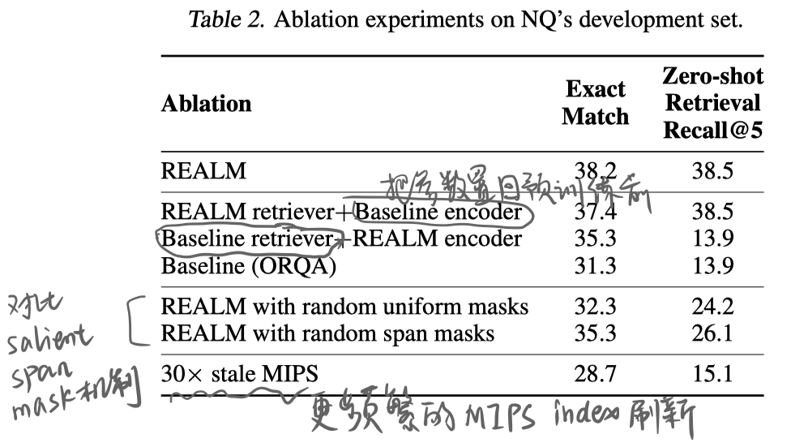

## 背景

本文提出在预训练阶段使用retriever增强的方法，然后应用在开放域QA的下游任务上。使得捕捉的知识更具可解释性。

## 方法

整体思路：预训练时，输入x是mask掉部分词的句子，然后检索模块找到一些相关文档，来帮助预测被mask掉的词。用于开放域QA任务时，输入x是question，然后检索模块找到一些相关文档，来帮助预测answer span。

##### 模型

- retriever

  

  

  

- Knowledge-augmented Encoder

  

  

##### 训练

预训练和微调的训练目标都是最大化 $logP(y|x)$ 

- 异步更新索引

  如果对整个文档集合Z上进行z的积分，则计算量太大，所以选择使用MIPS（maximum inner product search）找到topk，只在topk文档内积分。

  在预训练时，Embed_doc一直在发生变化，但是MIPS的索引是训练一定步数后才更新一次。。用旧的索引检索回topk文档后，再立即用更新的参数重新计算这k个文档的embed_doc，重新在k内排序并进行后续的处理。

  微调时，只构建一次MIPS索引，微调过程中不更新Embed_doc.

- warm up Embed

  使用ICT任务来训练好Embed_input 和 Embed_doc。以避免前期冷启动时，检索到的doc都是不相关的，从而不利于encoder的优化。

- salient span mask

  预训练时，尽量挑一些需要外部文档支持来帮助预测的span。

- null document

  在topk文档集合中加入空文档，以便处理不需要外部文档支持的样例。

## 实验

##### 数据集

NaturalQuestions-Open、WebQuestions、CuratedTrec

##### 实验结果

## 思考

未来的几个方向：结构化知识、多语言、多模态

