源码：https://github.com/microsoft/ProphetNet.

## 背景

本文提出了一个新的seq2seq预训练模型：先知网络。它使用future n-gram prediction的自监督目标函数，并提出了n-stream self-attention机制。

相比普通的seq2seq中使用的one-step ahead prediction，本文提出的 future n-gram prediction 可以避免对强局部相关过拟合 和 长期依赖关系欠拟合。

## 主要思路

本文设计的先知网络需要满足的要求是：在预训练阶段可以预测未来的n-gram，在微调和推断阶段只预测下一个词。为了满足这样的要求，本文在Transformer encoder-decoder的基础上扩展了XLNet的 two-stream，提出了n-stream self-attention机制。所有stream都共享参数。在预训练时，第i个stream与main stream进行attention，预测未来的第i个词。在预测阶段，直接减掉素哟偶的stream，只剩下main stream来预测下一个词。

## 方法

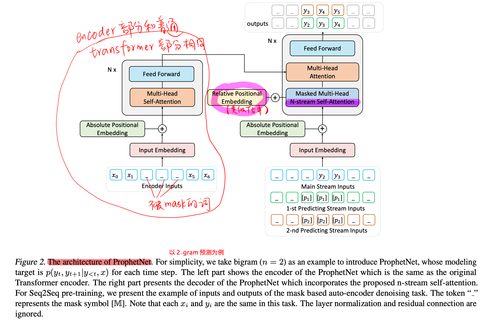

##### 整体模型

模型整体还是多层堆叠的Transformer Encoder-Decoder架构，只是做了以下四处改动：

- future N-gram prediction

  Encoder部分和传统Transformer的Encoder部分相同：

  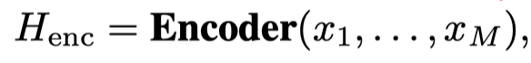

  Decoder部分改动为预测未来的 N-gram：

  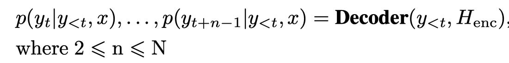

  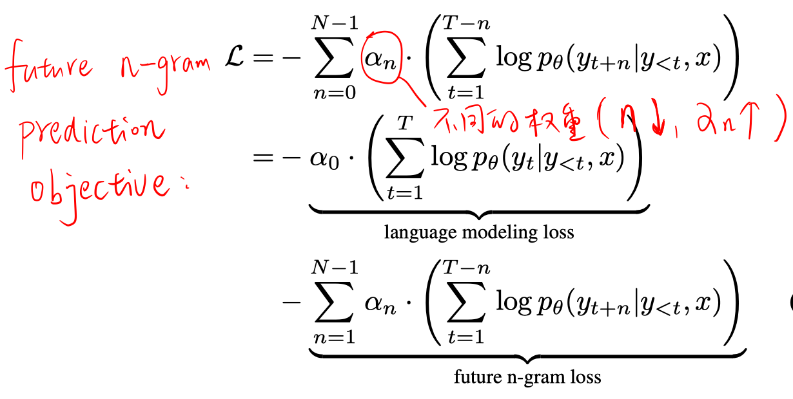

- N-stream Self-Attention（以future 2-gram预测为例）

  一个main stream：

  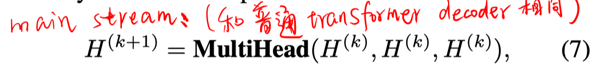

  第一个predict stream：

  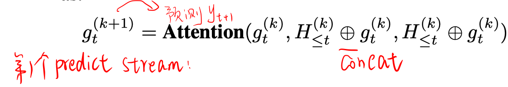

  第二个predict stream：

  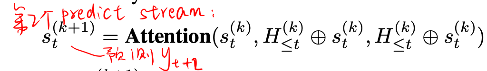

  > 注：虽然所有的stream共享参数，但是每个stream的初始值不同（只有H^0是用的word embedding，g^0 和 s^0 都是用可训练的向量p进行初始化。）、绝对位置编码不同、相对位置计算不同。

- position Embedding

  在decoder每层的self-attention模块加入相对位置编码（和T5中相同）

- seq2seq pre-training on denoising task

  该任务要求输入是被破坏的序列，输出是重构的原始序列。

  破坏序列的方式很多，包括random token masking，token delete，token shuffing，token span masking。本文采用的是token span masking（同MASS工作），即mask掉部分token序列。

  但注意和MASS不同的是，本文采用的是每次预测每个masked token span中的 future n-gram。

## 实验

##### 模型

使用12层的Transformer Encoder-decoder，1024维的embedding，4096维的FFN size。

##### 预训练

使用和bert预训练相同的16GB语料。

##### 下游任务微调

1. 抽象式摘要生成

   分别用CNN/DailyMail 和 Gigaword 进行微调。

   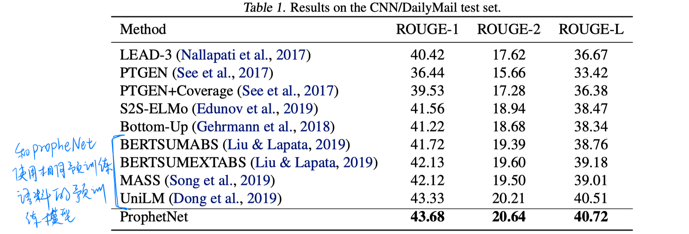

   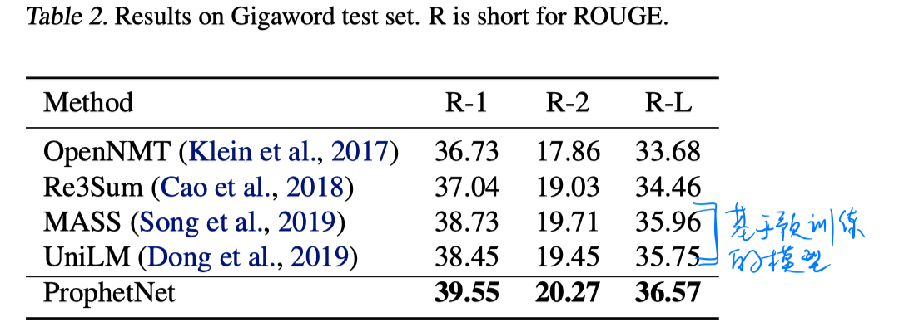

2. 答案感知的问题生成

   在SQuAD1.1上进行微调。

   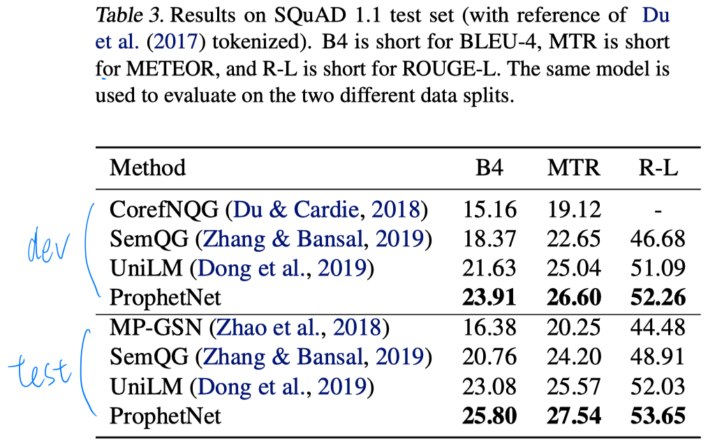

##### 更大规模的预训练

使用160GB的语训练语料训练14个epoch。然后在CNN/DailyMail上进行微调。

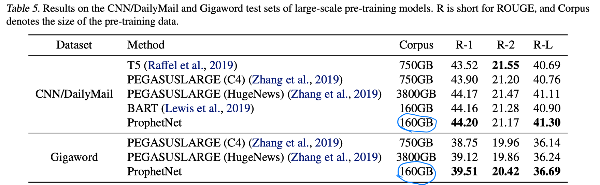

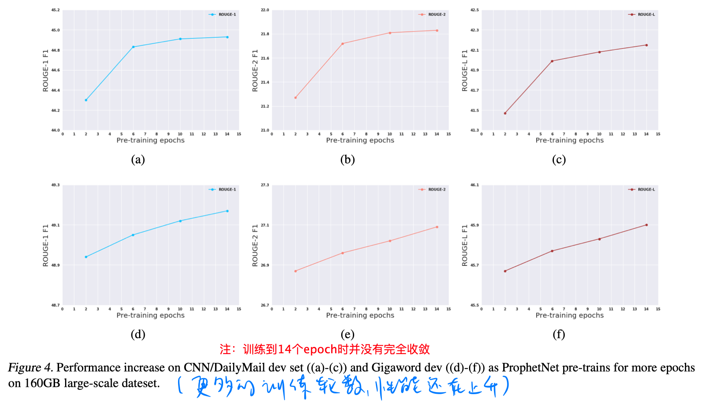

##### 消融实验

1. 对比是否有预训练

   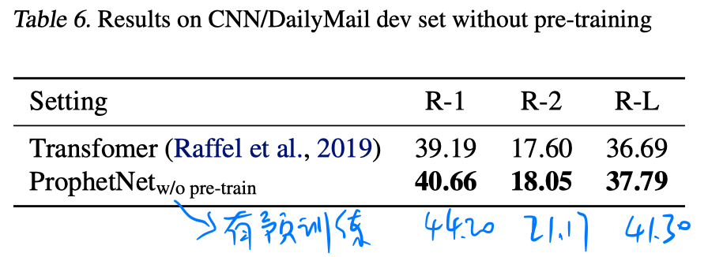

2. 对比不同n-gram值的影响

   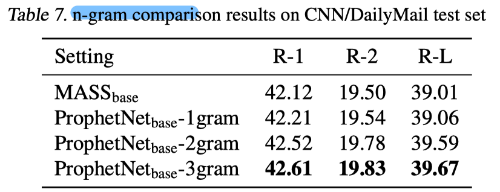

   预测更多的n-gram时效果可能会更好，但训练速度会下降，所以本文的实验都是以2-gram进行的。

## 思考

本文主要颠覆了以往seq2seq中只预测下一个词的结构，提出future n-gram预测，并将其融入到预训练模型中。这样的future n-gram预测具有广泛应用性，在之后的生成任务中可以尝试使用。

