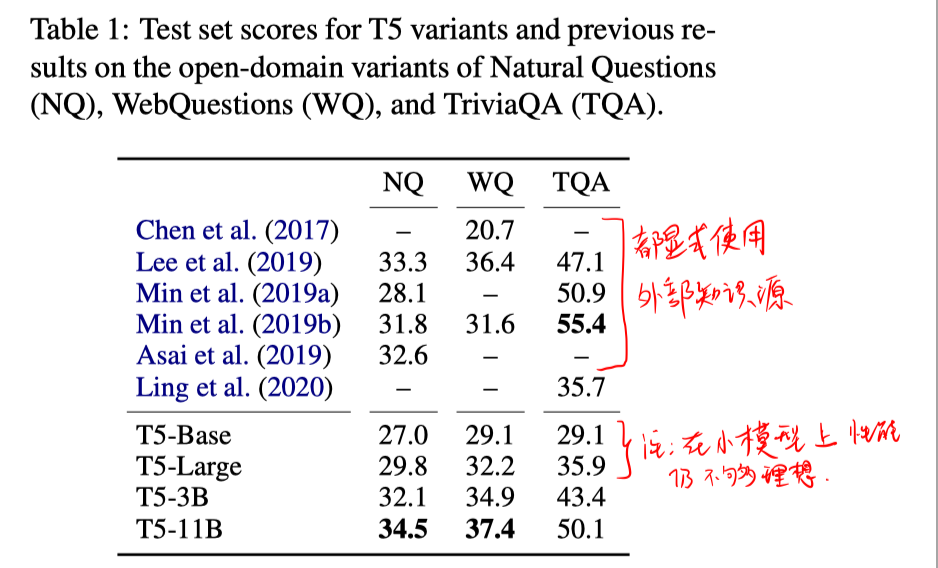

## 背景

本文用**开放域QA任务**来测试预训练模型中存储的知识。（本来开放域QA是需要有外部知识源输入的，但本文的设置是用预训练的模型在开放域QA上微调，微调时不适用任务外部知识源，从而可以看出在预训练时模型学到了多少知识）

## 方法

使用T5模型。

## 实验

##### 数据集

Neural Questions、WebQuestions、TriviaQA

##### 实验结果

- 在最大规模（T5-11B）的模型上效果还可以，但小规模的模型还是不行。而大规模的模型对于资源受限的应用场景的实用性不太行。
- 相比其他开放域QA模型，该方法的可解释性不行。

