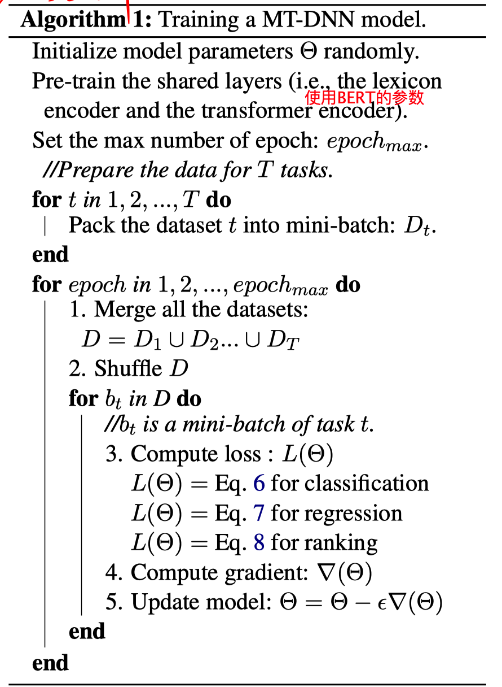
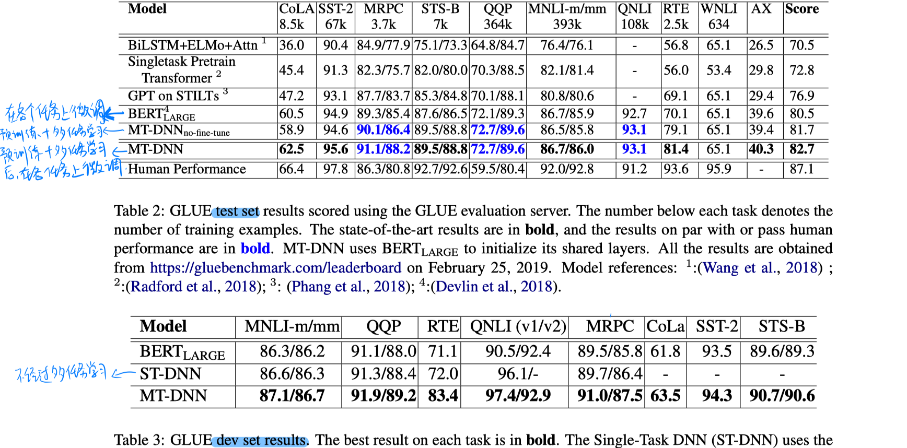

> >ACL2019，多任务学习，表示学习

代码：https://github.com/namisan/mt-dnn

### Motivation-论文解决了什么问题

- 学习文本的表达是很多自然语言理解领域的很多任务的基本。两种通用的方法是预训练和多任务联合学习。
- 多任务联合学习有很多好处：可以使用多任务的训练数据，增加训练数据量；具有正则化的作用，使模型学到的表达更加通用。

### Motivation-本文的方法思路

作者在预训练方法的基础上结合多任务联合学习的训练方法，统一训练GLUE上的所有任务。训练（预训练+多任务学习）之后在各种数据集上再进行微调达到stoa的水平，另外在新的领域的数据集进行了实验，发现泛化很好。

### Method-模型/方法概述

- **多任务联合学习的训练任务**

  Single-Sentence Classification：CoLA、SST-2

  Text Similarity：STS-B

  Pairwise Text Classification：RTE、MNLI、QQP、MRPC

  Relevance Ranking：QNLI

- **模型**

  

- **训练**

  多任务联合学习的算法如下图，作者只是简单的把多个数据集混合在一块进行了训练，并没有做别的复杂的策略。每个任务有自己的loss函数。

### Experiment-实验

1. 在GLUE上的实验

- 对于训练数据集越小的任务，MT-DNN相对BERT的提升约明显。

2. 域适应实验（在 SciTail 和 SNLI 上）

- MT-DNN的泛化效果很好，尤其数据量少的时候。说明多任务学习可以提高泛化性。

### Highlight

- 论文把多任务联合学习和预训练结合了一下，或者说是在预训练的基础上再使用所任务学习，得到了很好的泛化效果。

- future work：除了探索多任务共享的结构之外，如何利用多个任务之间的相关性进行训练也是值得探索的。