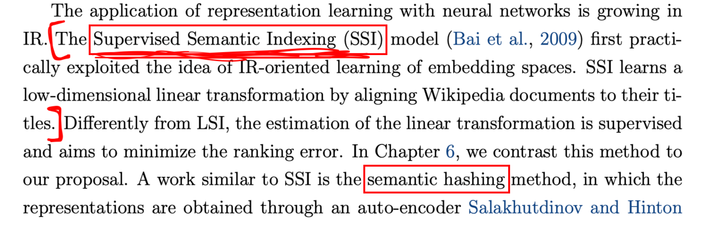
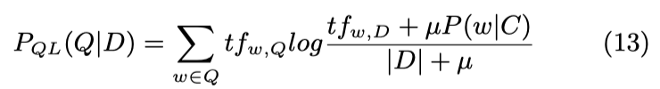
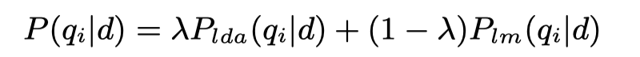
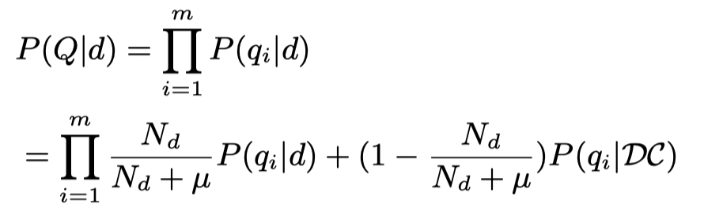
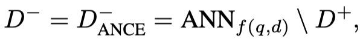

BISON: BM25-weighted selfattention framework for multi-fields document search

> It learns semantic representation for both query and multi-fields document by integrating BM25 into attention score calculation.

【MORES】Modularized Transfomer-based Ranking Framework.

> decouples ranking into Document Representation, Query Representation, and Interaction.

Learning a Beer Negative Sampling Policy with Deep Neural Networks for Search

Interactor: Exploring Flexible Query-Document Interaction for Fast and Accurate Text Retrieval

## Ad-hoc Retrieval

- [x] ~~Semantic hashing~~.（2009，Hinton,稀疏表示，proposed a neural IR model that employs deep auto-encoders for semantic modeling. They use a multi-layer auto-encoder to learn distributed representations of documents. This work only utilize document-term information and does not model the relevance relationship between queries and documents. It cannot outperform the standard lexical matching based retrieval model such as tf.idf and BM25.）

  > 注：有人把它归入学习稀疏表示，和SNRM一类；有人说它和SSI很接近；

- [x] ？？？SSI：Supervised semantic indexing（2009，first practically exploited the idea of IR-oriented learning of embedding spaces，线性变换到隐空间，直接优化的是hinge loss，使用点击日志作为训练数据）

  > 注：有人说它和semantic hashing很接近，因为都是学习的embedding，只是学习方式不同；有人把它和DSSM都归入latent space model；

- [x] ~~Off the Beaten Path: Let’s Replace Term-Based Retrieval with k-NN Search~~（2016CIKM，相似度计算使用BM25+翻译模型IBM1的加权，搜索时使用KNN，可以比BM25有更快的效率和更好的性能）

- [x] 【~~SNRM】From Neural Re-Ranking to Neural Ranking: Learning a Sparse Representation for Inverted Indexing（CIKM2018）~~

  > SNRM learns high dimensional but sparse embeddings in which queries and documents are represented by a set of “latent words”, so that they can be searched with standard inverted index. SNRM was shown to outperform traditional bag-of-words retrieval and several neural ranking/re-ranking models.

- [x] ~~Incorporating query term independence assumption for efficient retrieval and ranking using deep neural networks（2019，引入query term 独立性假设）~~

- [x] ~~Efficient Interaction-based Neural Ranking with Locality Sensitive Hashing（WWW2019，使用局部敏感哈希加快DRMM、KNRM、ConvKNRM的交互计算）~~

- [x] ~~【Doc2Query】Document Expansion by ‹query Prediction.（2019，使用seq2seq生成多个query，扩充原始文档）~~

- [x] ~~【DocTTTTTQuery】From doc2query to docTTTTTquery.（2019，doc2query的进一步工作，使用T5生成query）~~

- [x] Report on the First HIPstIR Workshop on the Future of Information Retrieval（2019，一个workshop，里面提高和“检索效率”相关的几点包括：1. 探索如何把bert用于高效的fullranking；2. 构建和检索效率有关的benchmark；3. 探索新的数据结构， e.g. 引入独立性假设那篇文章（可以继续做的工作包括，1）构建多层次的索引，term、phrase、query；2）基于强化学习的index scan策略）；4. 在设计deep model时考虑可以支持高效检索的数据结构， e.g. SNRM）

- [x] Let’s measure run time! Extending the IR replicability infrastructure to include performance aspects.（SIGIR2019，提出应该重视NeuIR的效率问题，并提出两个benchmark/docker可以公平对比不同的模型，Open-Source IR Replicability Challenge）

- [x] CoRT: Complementary Rankings from Transformers（ICTIR2019）

---------------- 2020

- [x] 【~~Poly-encoders】Poly-encoders: Architectures and Pre-training Strategies for Fast and Accurate Multi-sentence Scoring（ICLR2020，基于BERT，对question产生多个全局特征表示）~~

- [x] ~~【ColBERT】ColBERT: E€icient and E€ective Passage Search via Contextualized Late Interaction over BERT~~（SIGIR2020，使用两个BERT得到query和passage的表示，推迟词级别的交互到最后，使用max-sum的方法导致可以过滤掉大部分文档，只留小部分进行精确计算）

- [x] ~~【DeepCT】Context-Aware Sentence/Passage Term Importance Estimation for First Stage Retrieval（arxiv2019，sentence and passage ranking，包括 DeepCT-Index 和 DeepCT-Query 两种）~~

- [x] ~~【DeepCT】Context-Aware Term Weighting For First-Stage Passage Retrieval（SIGIR2020，passage ranking，仅有DeepCT-Index，在MSMARCO和CAR上进行实验）~~

- [x] ~~【HDCT】Context-Aware Document Term Weighting for Ad-Hoc Search（WWW2020，ad-hoc retrieval，由DeepCT得到的passage-level的term weights聚合得到document-level的term weights。并提出了三种training label获取方法。）~~

- [x] ~~【DeepCT】Efficiency Implications of Term Weighting for Passage Retrieval（SIGIR2020，探究DeepCT的效率）~~

- [x] ~~Learning Term Discrimination（SIGIR2020，用fasttext word embedding和一层全连接学习词的重要性来代替传统的IDF，而且可以利用稀疏性达到剪枝的效果，总而减少索引所需的空间占用，提高检索效率，同时得到更好的检索性能）~~

- [x] ~~【PreTTR】Efficient Document Re-Ranking for Transformers by Precomputing Term Representations~~（SIGIR2020，和DeFormer类似的结构，再多一个压缩层和解压层减少存储空间）

- [x] ~~Sparse, Dense, and Attentional Representations for Text Retrieval~~（2020，从理论上分析了dual encoder要保持term-based model的排序所需要的embedding维度，提出了multi-vector encoding模型，以及探索了混合模型可以提升明显的性能）

  > 负例构造：7 sampled negatives from a precomputed 200-document list and additional inbatch negatives (with a total number of 1024 candidates in a batch); the pre-computed candidates include 100 top neighbors from BM25 and 100 random samples。
  >
  > loss 函数：cross entropy loss
  
- [x] Embedding-based Zero-shot Retrieval through Query Generation（query生成，预训练）

  > 用MSMARCO的question-passage对训练BART问题生成模型，再在wikipedia数据上生成question，训练dual encoder的检索模型。

- [x] Zero-shot neural retrieval via domain-targeted synthetic query generation.（2020）

  > 用CQA的question-answer对训练问题生成模型，再在目标域上使用document生成question，训练retrieval模型。

- [x] 【CLEAR】Complementing lexical retrieval with semantic residual embedding.（2020。线性加权结合BM25和bert-based model）

- [x] Leveraging Semantic and Lexical Matching to Improve the Recall of Document Retrieval Systems: A Hybrid Approach（2020，混合方式，用RM3结合BM25和bert-based model）

- [x] 【RocketQA】An Optimized Training Approach to Dense Passage Retrieval for Open-Domain Question Answering

  > We have made three major technical contributions in RocketQA：1）cross-batch negatives； 2）denoised hard negative sampling；3）data augmentation.

- [x] Distilling Dense Representations for Ranking using Tightly-Coupled Teachers

  > 对ColBERT进行知识蒸馏，学习bi-encoder+dot product。

- [x] ~~repBERT: CONTEXTUALIZED TEXT EMBEDDINGS FOR FIRST-STAGE RETRIEVAL~~（2020，毛佳昕）

  > 使用基于BERT的dual-encoder + 点积。
  >
  > 使用in-batch negative。 

- [x] Learning to Retrieve：how to train a dense retrieval model effectively and efficiently

  > 用负采样训练dense retriever会造成模型训练和推断时的不一致问题。
  >
  > 为了解决不一致的问题，本文提出使用预训练的document encoder，训练时固定它，只训练query encoder。每次使用 full retrieval 检索出一些样本作为负例进行训练。

- [x] Conformer-kernel with query term independence for document retrieval

  > 把TK模型改进到适合第一阶段检索：1）用confermer（grouped convolution and Transformer with separable self-attention）层代替Transformer层，降低内存占用；2）引入query term独立性假设；3）扩展一个term matching子模块。
  
  

## QA

- [x] 【~~DenSPI】Real-Time Open-Domain Question Answering with Dense-Sparse Phrase Index~~（ACL2019，以phrase为单位编码，基于BERT学习dense vector + 基于2-gram的TFIDF的sparse vector）

- [x] ~~【SPARC】Contextualized Sparse Representations for Real-Time Open-Domain Question Answering~~（ACL2020，在DenSPI的基础上增加可学习的稀疏表示）

  

- [x] ~~Efficient natural language response suggestion for smart reply.（2017，使用基于n-gram的前向神经网络得到email和候选reply的表达，使用quantization技术加快搜索效率）~~

- [x] ~~【PIQA】Phrase indexed question answering: A new challenge for scalable document comprehension.（EMNLP2018，以phrase为单位编码，基于BiLSTM学习向量表示）~~

- [x] ~~【MUPPET】Multi-Hop Paragraph Retrieval for Open-Domain Question Answering（ACL2019，以passage为单位进行编码，但保留每个sentence的向量表示。基于BiGRU学习向量表示。仍然需要BM25缩小检索范围）~~

- [x] ~~【DC-BERT】DC-BERT: Decoupling Question and Document for Efficient Contextual Encoding~~（2020，用于openQA的rerank阶段。两个独立的BERT分别编码retrieved document和question，上层再用Transformer进行交互。**另外提出了两个针对语义检索的指标**）

- [x] ~~【DeFormer】DeFormer: Decomposing Pre-trained Transformers for Faster Question Answering~~（ACL2020，解耦低层的BERT，分别学习question和document的表示，并使用两个辅助loss）

- [x] ~~【DPR】Dense Passage Retrieval for Open-Domain Question Answering~~（2020，使用BERT分别建模query和passage，CLS处的输出作为表达，用于openQA的检索模块）【注：Sparse, Dense, and Attentional Representations for Text Retrieval中说DPR模型试dense+sparse的模式，因为该文章还提出了DPR+BM25的方法。】

- [x] 【GAR】Generation-augmented retrieval for open-domain question answering（训练生成模型，输入时query，输出是answer/answer所在的句子/answer所在的passage的title。根据query生成新的context来扩展query，再用BM25等方法进行检索）

  

- [x] ~~【ORQA】Latent Retrieval for Weakly Supervised Open Domain Question Answering~~（ACL2019，以passage为单位编码，用ICT任务预训练retriever）

  > propose to pre-train two-tower Transformer models with the Inverse Cloze Task (ICT) to replace BM25 in the passage retrieval phase. The advantage is that the retriever can be trained jointly with the reader/scorer. Nevertheless, their pre-trained two-tower models do not outperform BM25 on the SQuAD dataset, potentially because the fine-tuning is only performed on the query-tower.
  >
  > pre-training the retriever with an unsupervised task, namely Inverse Cloze Task (ICT), and then jointly fine-tuning the retriever and the reader on labeled data.

- [x] ~~【REALM】: Retrieval-Augmented Language Model Pre-Training（2020，一种检索增强的预训练方法）~~

  > jointly trained a masked language model and a neural retriever.

- [x] ~~（预训练）PRE-TRAINING TASKS FOR EMBEDDING-BASED LARGE-SCALE RETRIEVAL~~

  > BFS and WLP are newly proposed in this paper.
  >
  > conducted a comprehensive study on how various pre-training tasks help in the large-scale retrieval problem such as evidence retrieval for question-answering.
  >
  > With properly designed paragraph-level pre-training tasks inlcuding ICT, BFS and WLP, the two-tower Transformer models can considerably improve over the widely used BM-25 algorithm.

## 电商、推荐、广告

- [x] ~~From Semantic Retrieval to Pairwise Ranking: Applying Deep Learning in E-commerce Search（SIGIR2019，京东语义检索，分别提出了两个双塔模型用于semantic ranking和reranking）~~

- [x] ~~【DPSR】Towards Personalized and Semantic Retrieval: An End-to-End Solution for E-commerce Search via Embedding Learning（SIGIR2020，京东的语义检索模型）~~

- [ ] Learning a Joint Search and Recommendation Model from User-Item Interactions（WSDM2020）

- [ ] Mixed Negative Sampling for Learning Two-tower Neural Networks in Recommendations.（WWW2020）

- [ ] Sampling-bias-corrected neural modeling for large corpus item recommendations.（2019）

- [ ] ！！Deep Neural Networks for YouTube Recommendations.（2016）

- [ ] Multi-Interest Network with Dynamic Routing for Recommendation at Tmall.（CIKM2019）

- [ ] Learning Tree-Based Deep Model for Recommender Systems.（KDD2018）

- [ ] ！！Learning latent vector spaces for product search.（CIKM2016，用word embedding，entity embedding）

- [x] ~~MOBIUS: Towards the Next Generation of Query-Ad Matching in Baidu’s Sponsored Search（百度凤巢）~~

- [x] 【DIN】Deep interest network for click-through rate prediction

  > To improve the expressive ability of model, a novel approach named DIN is designed to activate related user behaviors and obtain an adaptive representation vector for user interests which varies over different ads.
  > 根据target item，得到用户的兴趣表示。

- [x] 【MIND】Multi-Interest Network with Dynamic Routing for Recommendation at Tmall（2019，天猫）

- [x] 【DMIN】Deep Multi-Interest Network for Click-through Rate Prediction（CIKM2020）

  > 在DIN的基础上，得到多个用户兴趣表示。

## -------------- 综述

- [x] Learning Representations for Information Retrieval （2016，表示学习博士论文）

- [x]  Representation Learning for Natural Language Processing（2020，表示学习book，刘知远）

  

- [x] Introduction to information retrieval（2008，book，Manning等人）

- [x] ~~Semantic Matching in Search~~（2014，综述）

- [x] ~~Neural information retrieval: At the end of the early years~~.（2017，NeuIR的综述） 

- [x] An Introduction to Neural Information Retrieval.（2018，NeuIR的综述）

- [x] ~~A Deep Look into Neural Ranking Models for Information Retrieval~~（2019，rerank综述）

- [x] Neural Matching and Importance Learning in Information Retrieval（Dai博士论文）

## -------------- 传统方法 【狭义的概率模型、语言模型、随即距离模型都属于概率模型】

- [ ] ~~VSM：A vector space model for automatic indexing（1975）~~

- [ ] ~~TFIDF：Developments in automatic text retrieval（1991）~~

- [ ] ~~TFIDF：Term-weighting approaches in automatic text retrieval.（1988）~~

- [ ] ~~Binary Independence Model：Relevance weighting of search terms（1976，一种概率模型，BM25的前身）~~

- [ ] 概率模型：Relevance weighting of search terms（1977）、Probabilistic models of  indexing and searching（1981）、The unified probabilistic model for ir（1983）、Efficient probabilistic inference for text retrieval（1991）、Some simple effective approximations to the 2-poisson model for probabilistic weighted retrieval（1994）、The Probability Ranking Principle in IR（1997，提出概率排序准则）、The unified model revisited（2003）、A new unified probabilistic model（2004）

- [ ] ~~Tree Dependence Model：A theoretical basis for the use of co-occurrence data in information retrieval~~

- [ ] ~~BM25：The probabilistic relevance framework: BM25 and beyond（2010）~~

- [ ] DFR（Divergence from Randomness）：Probabilistic models of information retrieval based on measuring the divergence from randomness（2002，随即距离模型）

- [ ] 语言模型/QL：~~A language modeling approach to information retrieval. （1998）~~

  > 

- [ ] ~~语言模型：Statistical language models for information retrieval a critical review（zhai,2007）~~

- [ ] ~~语言模型：Hypergeometric language model and Zipf-like scoring function for web document similarity retrieval.（2010）~~

## ----------- 查询扩展

> 查询扩展分为全局分析和局部分析方法（Query Expansion Using Local and Global Document Analysis. 1996）
>
> 全局方法：
>
> - [ ] ~~Word-word associations in document retrieval systems.（1969）~~
> - [ ] ~~Concept based query expansion（1993）~~
> - [ ] ~~Query Expansion Using Lexical-semantic Relations.~~
> - [ ] ~~Using Query Contexts in Information Retrieval.~~
>
> 局部方法：
>
> - [ ] ~~RM3：Relevance based language models.（2001）~~
> - [ ] Model-based feedback in the language modeling approach to information retrieval.（2001）
> - [ ] ~~Query expansion using local and global document analysis.~~

- [ ] 伪相关反馈：Query expansion using lexical-semantic relations.（1994）
- [ ] 伪相关反馈：Selecting good expansion terms for pseudo-relevance feedback.（2008）
- [ ] ~~Relevance Feedback in Information Retrieval（1971，Rocchio伪相关反馈，最著名的相关反馈）~~
- [ ] Search Engines: Information Retrieval in Practice.（查询扩展的有效性，2009）
- [ ] ~~A comparative study of methods for estimating query language models with pseudo feedback~~.（2009，一个最先进的伪相关反馈方法，RM3中采用的相关反馈方法）
- [ ] Pseudo-relevance feedback based on matrix factorization（2016）
- [ ] Reducing the risk of query expansion via robust constrained optimization（2009，基于伪相关反馈的查询扩展容易遭受query drift的问题）

## ------------- term dependency model

- [ ] VSM + term dependency
  - Experiments in automatic phrase indexing for document retrieval: A comparison of syntactic and non-syntactic methods.（1987）
  - An analysis of statistical and syntactic phrases.（1997）
  - ~~Term-weighting approaches in automatic text retrieval.（1988~~）
  - ~~A probabilistic model of information retrieval: development and comparative experiments.（2000~~）
- [ ] BM25 + term dependency
  - ~~Relevance ranking using kernels.（2010）~~
- [ ] LM + term dependency 
  - A general language model for information retrieval.（1999）
  - Biterm language models for document retrieval.（2002）
  - Capturing term dependencies using a language model based on sentence trees.（2002）
  - ~~Dependence language model for information retrieval~~.（2004）
- [ ] ~~A generative theory of relevance~~（2004，表示融合term dependency并没有得到预期的那么大收益）
- [ ] ~~SDM：A Markov random field model for term dependencies~~.（2005，首个使用term dependency提升明显的模型）

## ----------- 使用topic model

- [ ] GVSM：Generalized vector spaces model in information retrieval.（1985）

- [ ] LSA/LSI：~~Indexing by latent semantic analysis.（1990）~~

- [ ] ~~NMF：Algorithms for non-negative matrix factorization.（2001）~~

- [ ] RLSI：~~Regularized latent semantic indexing~~（2011）、Group matrix factorization for scalable topic modeling.（2012）

- [ ] ~~PLSA：Probabilistic latent semantic indexing（1999，线性结合topic model 和 term-based model）~~

- [ ] ~~LDA： Latent dirichlet allocation（~~2003，提出LDA）

- [ ] Supervised topic models.（2007，sLDA，引入一些辅助label作为有监督的信号，the supervised task is not a task of learning to rank because the supervised signal is at the document level and is query independent.）

- [ ] Investigating task performance of probabilistic topic models: an empirical study of PLSA and LDA.（2010，for IR 任务）

- [ ] ~~Corpus structure, language models, and ad hoc information retrieval.（~~2004，topic 模型用于平滑项）

- [ ] ~~Regularizing ad hoc retrieval scores（~~2005，topic 模型用于平滑项）

- [ ] ~~Lda-based document models for ad-hoc retrieval.（2006，LDA for IR 和 LDA用于LM的平滑）~~

  > 
  >
  > 

- [ ] ~~A comparative study of utilizing topic models for information retrieval.~~（2009，topic 模型用于平滑项）

  > 狄利克雷平滑 for LM：
  >
  > 

- [ ] ~~Latent semantic indexing (lsi) fails for trec collections~~.（2011，指出LSA、pLSA、LDA这些模型表现糟糕，除非和term-based模型相结合）

- [ ] 

- [ ] 指明快速推断对于IR的重要性，提出两层无向图模型：Exponential family harmoniums with an application to information retrieval.（2005）

- [ ] 无向图模型：The rate adapting poisson (RAP) model for information retrieval and object recognition.（2006）

- [ ] 无向图模型：Mining associated text and images with dual-wing harmoniums.（2005）

## ----------- 融合翻译模型

- [ ] Information retrieval as statistical translation.（1999，把统计机器翻译融合到LM中，用于retrieval）

  > proposed two models of document-query translation, i.e., a mixture model and a binomial model, based on different document-query translation processes. The probability of translating a document word to a query word is estimated based on synthetic training data.
  >
  > One alternative is statistical machine translation methods [Information retrieval as statistical translation]. They weight a document term using its probability of translating into a query term. Statistical machine translation models have not been used much because they are difficult to train due to data sparsity, and were not more effective than tf -based retrieval with pseudo-relevance feedback [RM3] in most situations.

- [ ] Estimation of statistical translation models based on mutual information for ad hoc information retrieval.（2010，把统计机器翻译融合到LM中，用于retrieval，提出了一组基于互信息去计算翻译概率的方法）

  > addressed this estimation problem based on normalized mutual information between words, which is less computationally expensive and has better coverage of query words than the synthetic query method of estimation~{Information retrieval as statistical translation}. 

- [ ] Axiomatic analysis of translation language model for information retrieval.（2012，把统计机器翻译融合到LM中，用于retrieval，提出了一组基于互信息去计算翻译概率的方法，主要是改进上一篇论文，解决self-translation probabilities的问题）

- [ ] Language model for information retrieval（2002）

  > considered a document title as a possible query, and use the titledocument pairs to train the translation model.

## ------------ learn to ranking

- [ ] Learning to rank for information retrieval.（L2R，2009）
- [ ] Learning to rank for information retrieval and natural language processing.（2011）
- [ ] Learning to efficiently rank（SIGIR2010）

## ------------- 使用word embedding

- [ ] ~~【word2vec】Efficient Estimation of Word Representations in Vector Space，2013~~
- [ ] ~~【GloVe】GloVe: Global Vectors for Word Representation，2014~~
- [ ] ~~【Fasttext】Enriching Word Vectors with Subword Information，2017~~
- [ ] NLM：Neural probabilistic language models.（2006，Bengio）
- [x] 【Fisher】~~Aggregating continuous word embeddings for information retrieval~~.（2013，最早使用word embedding，使用了1999年提出的Fisher Kernel（Exploiting generative models in discriminative classifiers））
- [ ] Learning Concept Embeddings for Query Expansion by Quantum Entropy Minimization.（2014，用于查询扩展）
- [x] 【DeepTR】~~Learning to reweight terms with distributed representations~~（2015，基于embedding的term reweight，（BM25中相当于用IDF作为term weight），来改进BM25和LM。）
- [x] ~~Monolingual and cross-lingual information retrieval models based on (bilingual) word embeddings.（2015，第一个融合word embedding学习和上下文预测的分布式语义模型。使用方式有两种：1）只使用word embedding；2）线性结合，两个socre加权。）~~
- [x] ~~【GLM】 Word embedding based generalized language model for information retrieval.（2015，用word embedding inprove language mo~~del，线性结合的方法。）
- [x] 【NTLM】~~Integrating and evaluating neural word embeddings in information retrieval~~.（2015，把word embedding和翻译模型融合，用word embedding计算词之间的翻译概率，再进行query-likelihood IR）
- [x] ~~Using word embeddings for automatic query expansion.（2016，用word embedding进行查询扩展。使用word embedding进行**查询扩展**）~~
- [x] ~~Query expansion with locally-trained word embeddings（2016，用word embedding进行**查询扩展**。对每个query使用其伪相关反馈文档训练word embedding，会效率比较低，因为对每个query都要重新训练一个word2vec模型）~~
- [x] ~~Embedding-based query language models（2016，使用word embedding进行**查询扩展**,提出了三个查询扩展方法，前两个不带相关反馈，最后一个带相关反馈。）~~
- [x] ~~Representing documents and queries as sets of word embedded vectors for information retrieval.（2016，用word embedding inprove language model。把word embedding 融合到LM中，线性结合的方法。）~~
- [x] ~~【DESM】A Dual Embedding Space Model for Document Ranking~~（2016，基于embedding的向量表示的相似度与BM25的相似度进行加权）（同Improving document ranking with dual word embeddings）
- [x] ~~End-to-end retrieval in continuous space~~（2018，提出端到端的检索方式代替基于term的离散检索。使用Dual Encoder结构，用word embedding的平均作为encoder，用cos作为相似度函数。评估任务是相似问题检索Quora、AskUbuntu。提出多任务训练目标（**设计了三个loss**）。使用WikiAnswer大数据集作为补充数据帮助训练一个可迁移的模型）
- [ ] Relevance-based Word Embedding（2017）

##### 数据集

- [ ] 【~~TREC CAR】Laura Dietz, Manisha Verma, Filip Radlinski, and Nick Craswell. 2017. TREC Complex Answer Retrieval Overview.. In TREC.~~

  > 数据集简介：It is based on Wikipedia sections: the heading is used as the query and the section body is the deemed relevant paragraph in the automatic annotations.
  
- [ ] ~~Ms marco: A human-generated machine reading comprehension datase~~t

##### 表示学习

- [ ] 【word embedding】Spine: Sparse interpretable neural embeddings.（AAAI2018，通过去噪稀疏自编码学习更好的word embedding）
- [ ] Deep sentence embedding using long short-term memory networks: Analysis and application to information retrieval.（2016）
- [ ] Cane: Context-aware network embedding for relation modeling（ACL2017，利用文档间的关系学习表示）
- [ ] Improving textual network embedding with global attention via optimal transport.（ACL2019）
- [x] 【学术document embedding】SPECTER: Document-level Representation Learning using Citation-informed Transformers（ACL2020，利用预训练的语言模型学习学术文章的表示。以SciBERT预训练模型作为初始化，输入是title+abstract，输出是CLS处的作为文章表达。监督信号是文章之间的引用关系作为相关性监督信息，loss是hinge loss。而且提出了一个评估学术文章嵌入的benchmark，包含7个任务）

#### 实体链接

- [x] ~~Learning dense representations for entity retrieval（2019，dual结构）~~

#### 图像

- [ ] Supervised Hashing for Image Retrieval via Image Representation（AAAI2014）

- [ ] Speed/accuracy trade-offs for modern convolutional object detectors.（2017，）
- [ ] Generating Long Sequences with Sparse Transformers（2019，改进Transformer结构，使其可以处理长文本的输入输出）

- [x] A survey on deep supervised hashing methods for image retrieval（2020，综述了最近提出的深度有监督的哈希方法，并提出了一种新的方法）

#### 其他

- [x] ~~Embedding-based Retrieval in Facebook Search~~（KDD2020，Google搜索的向量retrieval，不过主要是工业界的实战经验，讨论了neg samples和pos 样本之类的构造）

  > term-based 和 embedding-based（dual encoder）的混合检索方式。
  >
  > 讨论了hard neg samples 样本的构造。Online：Each batch comprises n positive pairs. Then for each query, we formed a small document pool using all other positive documents and select the documents which received the highest similarity scores as the hardest negatives to create the training triplets. Online hard negative mining was one major contributor to our modeling improvement. We also had observations that the optimal setting is at most two hard negatives per positive. Using more than two hard negatives will start to regress model quality.  Offline：generate top K results for each query, select hard negatives based on hard selection strategy. We found that using the hardest examples is not the best strategy. We compared sampling from different rank positions and found sampling between rank 101-500 achieved the best model recall.
  >
  >  One finding that may first seem counterintuitive is that models trained simply using hard negatives cannot outperform models trained with random negatives. Our hypothesis is that presence of easy negatives in training data is still necessary, as a retrieval model is to operate on an input space which comprises data with mixed levels of hardness, and the majority of which are very easy negatives. Therefore, we explored several ways of integrating random negatives together with hard negatives, including transfer learning from an easy model. From our empirical study the following two techniques showed highest effectiveness: Mixed easy/hard training(Increasing the ratio of easy to hard negatives continues to improve the model recall and saturated at easy:hard=100:1); transfer learning from hard to easy achieved further model recall improvement.
  >
  > 讨论了hard pos samples 样本的构造。To this aim, we mined potential target results for failed search sessions from searchers’ activity log. We found that the positive samples mined in this way is effective to help model training. Model trained using hard positives alone can achieve similar level of model recall as click training data while the data volume is only 4% if it. It can further improve model recall by combining both hard positives and impressions as training data.

- [x] ~~Approximate Nearest Neighbor Negative Contrastive Learning for Dense Text Retrieval~~（提出了训练时的负例构造策略。解决了Dense retrieval训练和测试时数据分布差异的问题。）

  > In this paper, we identify that the underwhelming performance of dense retrieval resides in its learning mechanisms, as there exists a severe mismatch between the negatives used to train DR representations and those seen in testing.
  > 本文提出的ANCE方法就是训练时，每隔k个checkpoint更新一次每个文档的最近邻作为负例。we propose Asynchronous ANCE training which refreshes the ANN index used to construct D-ANCE only after each checkpoint k which include m training batches.
  > 
  >
  > ANCE is the only one that elevates the same BERT-Siamese architecture to robustly exceed the sparse methods in document retrieval. It also convincingly surpasses the concurrent DR models in passage retrieval on OpenQA benchmarks. Solely using the first-stage retrieval, ANCE nearly matches the accuracy of the cascade retrieval-and-reranking pipeline (BERT Reranker) – with effective representation learning, dot product is all you need.

- [x] ~~Debiased Contrastive Learning~~ （negative sampling的bias问题，正负样本的构造和loss的定义）

  > Since true labels or true semantic similarity are typically not available, negative counterparts are commonly drawn uniformly from the training data. But, this means it is possible that x− is actually similar to x. This phenomenon, which we refer to as sampling bias, can empirically lead to significant performance drop.
  >
  > we develop a debiased contrastive objective that corrects for the sampling of same-label datapoints, even without knowledge of the true labels.

- [x] ~~moco:Momentum contrast for unsupervised visual representation learning~~.; Improved baselines with momentum contrastive learning.（把in batch方式负样本的大小和batch size解耦）

  > At the core of our approach is maintaining the dictionary as a queue of data samples. This allows us to reuse the encoded keys from the immediate preceding mini-batches. The introduction of a queue decouples the dictionary size from the mini-batch size. Our dictionary size can be much larger than a typical mini-batch size, and can be flexibly and independently set as a hyper-parameter.
  >
  > The end-to-end update by back-propagation is a natural mechanism. It uses samples in the current mini-batch as the dictionary, so the keys are consistently encoded (by the same set of encoder parameters). But the dictionary size is coupled with the mini-batch size, limited by the GPU memory size. It is also challenged by large mini-batch optimization.
  >
  > MoCo 做的事情很简单，就是把负例样本的 encoder ![[公式]](https://www.zhihu.com/equation?tex=f%28%5Ccdot%29)和 mini-batch 大小解耦。一方面，用一个 queue 来维护当前的 negative candidates pool，queue 有着进出的动态更新机制，一方面能够和 Mini-batch 解耦，queue size 可以设置的比较大，另外一方面也就不用对所有样本做类似预处理的进行编码；对于负例样本的参数，采用 Momentum update 的方式，来把正例 encoder 的参数copy 给负例 encoder。

- [x] ~~Learning K-way D-dimensional Discrete Codes for Compact Embedding Representations~~

- [x] ~~Deep Retrieval: An End-to-End Learnable Structure Model for Large-Scale Recommendations~~（跟现在的向量检索都不一样）

  > https://mp.weixin.qq.com/s/VcBZCrlq3ceroOG3PWbPTA

- [ ] ！！！Noise-contrastive estimation: a new estimation principle for unnormalized statistical models.（2010）

- [ ] ~~Text embeddings for retrieval from a large knowledge base~~（2018）

- [x] Training neural response selection for task-oriented dialogue systems.（2019,pretraining the response selection model using general-domain conversational Reddit data and efficiently adapting this model to individual dialogue domains using in-domain data）

- [ ] ~~Neural vector spaces for unsupervised information retrieval~~.（2018）

  > KNN search was used for the retrieval stage with neural network-based embeddings.
  >
  > is not applicable for large collections since it requires the learning of document-specific representations for the entire collection

- [ ] ~~Signature verification using a Siamese time delay neural network~~（1994，首次提出**Siamese网络结构**）

- [x] DeQA: On-Device Question Answering.（2019）

- [x] Simple Applications of BERT for Ad Hoc Document Retrieval.（2019）

