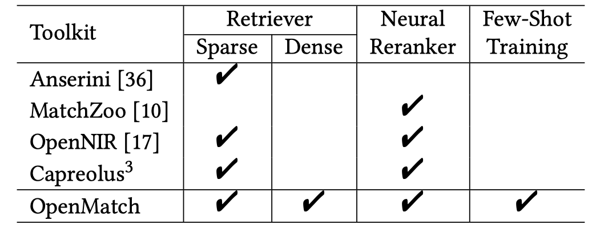
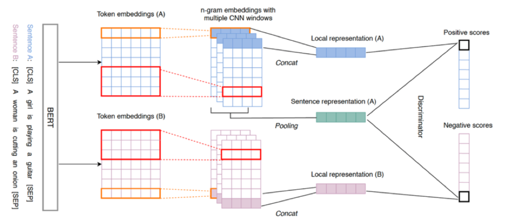
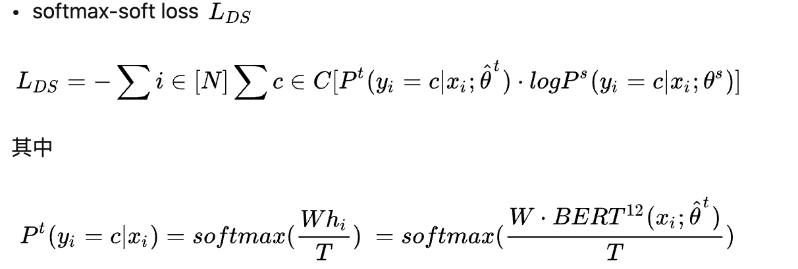
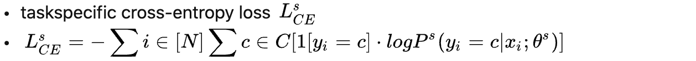

其他

- [x] Rethinking Query Expansion for BERT Reranking（ECIR2020）

  > BERT reranker更适合于自然语言句子的长query，所以传统模型的问题扩展方法可能并不太适用于BERT-based reranker。本文探究了新的问题扩展方法，发现结合扩展【结构词】和【概念词】的方法最有效。

- [x] 【Transformer-kernel】Interpretable & Time-Budget-Constrained Contextualization for Re-Ranking（ECAI2020）

  > 网络结构：对query和document分别采用三层Transformer，对contextual word embedding结果计算交互矩阵，再进行kernel-pooling。
  > 卖点：1）相比BERT来说效率更高，相比非BERT的模型性能更好，所以达到effective和efficiency的平衡。2）采用交互矩阵和kernel-pooling，具有更好的解释性，因为可以看到document每个term的得分。
  > 实验数据集：MARCO-passge、MARCO-document、TREC-CAR2017
  > 亮点：评估效率的方式，比较了在相同的时间限制下，每个模型的MRR、NDCG、Recall性能。而不是像其他工作中仅比较处理每个document/query所需的时间。
  
- [x] 【WMD：word mover‘s distance】From Word Embeddings To Document Distances（2015，ICML）

  > 定义一种Word mover distance，由word embedding之间的距离得到docuemnt之间的距离。主要用于文本分类任务，原论文中不涉及检索任务。
  
- [x] Reqa: an evaluation for end-to-end answer retrieval models（2019）

  > 本文把SQUAD和NQ数据集改编成ReQA任务，即introduce Retrieval QuestionAnswering (ReQA) as a new benchmark for evaluating end-to-end answer retrieval models.
  >
  > ReQA任务：The task assesses how well models are able to retrieve relevant sentence-level answers to queries from a large corpus.

- [x] PARADE: Passage representation aggregation for document reranking

  > 提出了三种由passage-level representation得到document-level representation，进而得到document打分的方法：PARADE_Max、PARADE_Attn、PARADE_Transformer。
  
- [ ] Learning a Beer Negative Sampling Policy with Deep Neural Networks for Search（ICTIR2019）

  > we establish that using reinforcement learning to optimize a policy over a set of sampling functions.
  
- [x] BERT-QE: Contextualized Query Expansion for Document Re-ranking

  > this paper proposes a novel query expansion model that leverages the strength of the BERT model to select relevant document chunks for expansion

# 2020

- [x] Neural Passage Retrieval with Improved Negative Contrast

  > We explore four negative sampling strategies: 1) coarse semantic similarity, 2) fine semantic similarity, 3) BM25 negative, 4) context negative.
  >
  > We train the dual encoder models in two stages: pre-training with synthetic data and fine tuning with domain-specific data. We apply negative sampling to both stages.
  >
  > it is not evident that there is one single sampling strategy that works best in all the tasks. mixing the negatives from different strategies achieve performance on par with the best performing strategy in all tasks.

- [x] Neural Retrieval for Question Answering with Cross-Attention Supervised Data Augmentation

  > we explore a supervised data augmentation approach leveraging a complex classification model with cross-attention between questionanswer pairs.

- [x] A White Box Analysis of ColBERT

  > our analysis reveals that ColBERT (i) is able to capture a notion of term importance; (ii) relies on exact matches for important terms.
  >
  > 1）IDF越大的query term，对整个相关性的贡献更大。但IDF大到一定程度后，这种正向性不再明显。
  >
  > 2）IDF越大的query term，则对该词存在精确匹配信号很重要。微调可以加剧这种正向性。
  >
  > 3）IDF低的词更容易吸收上下文中其他词的词义。

- [x] Diagnosing BERT with Retrieval Heuristics

  > 作者设计了9个diagnostic datasets去探究BERT（微调on TREC DL）满足的retrieval axiom。
  > 结论：在现有的实验设置上，发现BERT, while significantly better than traditional models for ad-hoc retrieval, does not fulfil most retrieval heuristics。说明the axioms are not suitable to analyse BERT and it is an open question what type of axioms would be able to capture some performance aspects of BERT and related models.

- [x] 

# 2021

- [x] Match-Ignition: Plugging PageRank into Transformer for Long-form Text Matching

  > 解决长文本re-rank的问题。

- [x] Rethink Training of BERT Rerankers in Multi-Stage Retrieval Pipeline（ECIR）

  > 随着深度语言模型在第一阶段检索中的应用（如doc2query，DeepCT，HDCT），使得第一阶段检索得到的结果有更多的hard negative。之前用于reranking阶段的BERT模型通常使用binary cross entropy目标函数，但在强retriever的背景下，这不再是最优的模型训练方式。对此，本文提出了Localized Contrastive Estimation目标函数。

- [x] Optimizing Dense Retrieval Model Training with Hard Negatives

  > 提出了两种dense retrieval model训练策略：
  >
  > 1）STAR：static hard negative samling方法的训练不太稳定。为了稳定训练过程，引入random negatives。而且为了在引入random negatives的同时不增加计算代价，采用in-batch策略。
  >
  > 2）ADORE：训练过程固定doc embedding，只训练query embedding。从而可以时时得到真正的dynamic hard negatives。

- [x] OpenMatch: An Open-Source Package for Information Retrieval

  > 清华开源的NeuIR工具包。
  >
  > 

- [x] Improving Efficient Neural Ranking Models with Cross-Architecture Knowledge Distillation

  > Following our observation that different architectures converge to different scoring ranges, we proposed to optimize not the raw scores, but rather the margin between a pair of relevant and non-relevant passages with a Margin-MSE loss.

- [x] Improving Bi-encoder Document Ranking Models with Two Rankers and Multi-teacher Distillation

  > we propose TRMD, a method enabling a bi-encoder model to learn from cross-encoder and bi-encoder teachers by applying multi-teacher knowledge distillation.

- [x] Composite Re-Ranking for Efficient Document Search with BERT

  > With token encoding, BECR effectively approximates the query representations and makes a proper use of deep contextual and lexical matching features, allowing for strong ad-hoc ranking performance to be achieved on TREC datasets.

- [x] TwinBERT: Distilling Knowledge to Twin-Structured BERT Models for E€icient Retrieval

- [x] Towards Robust Neural Retrieval Models with Synthetic Pre-Training

  > 本文提出DPR模型（用NQ数据集微调训练的）的zero-shot迁移能力不强，尤其是领域差异较大时。本文提出用合成的数据来先对DPR进行预训练，然后再用NQ数据集进行DPR的微调，这样就能获得较好zero-shot性能。其中合成的数据的指：先用NQ数据集（question+passage）微调BART生成器，然后用训练好的BART生成器对Wikipedia的每个passage生成question，拿生成的question-passage预训练DPQ模型。

- [x] Efficiently Teaching an Effective Dense Retriever with Balanced Topic Aware Sampling

  > We proposed to improve dense passage retrieval training with a cost-neutral topic aware (query) and balanced margin (passage pairs) sampling strategy, called TAS-Balanced.
  >
  > 而且使用BERT_CAT和ColBERT两个模型进行蒸馏。

- [x] COIL: Revisit Exact Lexical Match in Information Retrieval with Contextualized Inverted List

  > 对dual encoder得到的上下文词嵌入（降维后）进行倒排索引。计算相似度时只看doc中存在的query term与 query term的相似度，再把所有query term的相似度相加。

- [x] UHD-BERT: Bucketed Ultra-High Dimensional Sparse Representations for Full Ranking（EMNLP2021）

  > 在双塔BERT的基础上学习高维稀疏表示。

- [x] Learning Passage Impacts for Inverted Indexes

  > 先用DocT5Query对文档进行扩展，然后对原文档的词和扩展词进行term impact的计算。

- [x] Pre-trained Language Model based Ranking in Baidu Search

  > we perform relevance-oriented pre-training using large-scale user behavioral data and design a tree-based calibration model to refine the noisy and biased clicking data.

- [x] GLOW : Global Weighted Self-Attention Network for Web Search

  > It learns semantic representation for both queries and documents by integrating global weight into attention score calculation.

- [x] Context-Aware Learning to Rank with Self-Attention

  > In this paper, we propose a context-aware neural network model that learns item scores by applying a self-attention mechanism.

- [x] **Distilling Knowledge from Reader to Retriever for Question Answering**

  > reader中的attention分布作为retriever的监督信号。

- [x] **End-to-End Training of Multi-Document Reader and Retriever for Open-Domain Question Answering**

  > openQA的retriever和reader联合训练。

- [x] **Is Retriever Merely an Approximator of Reader?**

  > given that the retriever and the reader are complementary to each other, we propose to distill the reader into the retriever to combine the best of both worlds. Our distillation method significantly enhances the recall rate of an existing retriever, which also translates into a non-trivial improvement in the end-to-end QA accuracy.

- [x] Efficient Passage Retrieval with Hashing for Open-domain Question Answering

- [x] Whitening Sentence Representations for Better Semantics and Faster Retrieval

  > the whitening operation in traditional machine learning can similarly enhance the isotropy of sentence representations and achieve competitive results.

- [x] Learnt Sparsity for Effective and Interpretable Document Ranking

  > 对document ranking，先选句子，再计算相关性。

- [x] Pre-trained Language Model for Web-scale Retrieval in Baidu Search（KDD）

  > The system employs 1) an ERNIE-based retrieval model, 2) a multi-stage training paradigm and 3) a unified workflow for the retrieval system.

- [x] 【coCondenser】Unsupervised Corpus Aware Language Model Pre-training for Dense Passage Retrieval

  > identify and address two underlying problems of dense retrievers: i) fragility to training data noise and ii) requiring large batches to robustly learn the embedding space.
  >
  > 1. 使用Condenser模型做预训练（预训练过程：BERT初始化 + Condenser 的通用预训练[MLM目标] + coCondenser 的语料预训练[MLM+对比学习的目标]）。
  > 2. 提出一种显存占用高效的cross-batch训练方法。

- [x] 【Condenser】Is Your Language Model Ready for Dense Representation Fine-tuning? （EMNLP 2021）

  > 提出Condenser模型，包括early、late、head三个部分。预训练结束后把head部分丢弃。
  >
  > 在STS、openQA、MARCO passage三个任务上做实验。

- [x] On Single and Multiple Representations in Dense Passage Retrieval

  > 比较了一些单表达（ANCE）和多表达模型（ColBERT），发现对于难的query（hardest for BM25，definitional queries，complex information needs.），多表达模型更有用。

- [x] Domain-matched Pre-training Tasks for Dense Retrieval

  > 使用in-batch loss在一些任务类型非常接近的大数据集（PAQ、Reddit）上继续预训练，然后再下游任务（MARCO、OpenQA、dialogue）微调。

- [x] 【Pre-Rank】Modeling Relevance Ranking under the Pre-training and Fine-tuning Paradigm

  > 同时考虑user view（用click log进行预训练）和system view（用专家标注的数据进行微调）的相关性。

- [x] 【ST5】Sentence-T5: Scalable Sentence Encoders from Pre-trained Text-to-Text Models

  > We investigate three methods for extracting T5 sentence embeddings: two utilize only the T5 encoder and one uses the full T5 encoder-decoder model.

- [x] Pseudo Relevance Feedback with Deep Language Models and Dense Retrievers: Successes and Pitfalls

  > we address this gap by investigating methods for integrating PRF signals into **rerankers** and dense **retrievers** based on deep language models. 
  >
  > We consider **text-based** and **vector-based** PRF approaches, and investigate different ways of combining and scoring relevance signals.
  >
  > Text-based PRF会带来太大的效率损失，vector-based PRF在效率方面不会有太大代价。

- [x] Dealing with Typos for BERT-based Passage Retrieval and Ranking

  > MS MARCO passage ranking数据集中存在拼写错误。

- [x] Shallow pooling for sparse labels

- [x] **SEED-Encoder: Less is More: Pre-training a Strong Siamese Encoder Using a Weak Decoder**（EMNLP2021）

  > we propose a self-learning task that employs an auxiliary decoder that learns to reconstruct the input from the pre-training encoder’s [CLS] embeddings. we deliberately make the decoder weaker by restricting its parameter capacity and attention flexibility.
  >
  > SEED-Encoder indeed obtains more encoding power by allocating less capacity to the decoder.

- [x] Exploiting Sentence-Level Representations for Passage Ranking

  > we explicitly model the sentence-level representations by using Dynamic Memory Networks (DMNs) and conduct empirical evaluation to show improvements in passage re-ranking over fine-tuned vanilla BERT models by memory-enhanced explicit sentence modelling on a diverse set of open-domain QA datasets.

- [x] Scale Efficiently: Insights from Pre-training and Fine-tuning Transformers

  > 1. the shape of models plays an important role on how it performs on the target task and the performance is not merely a function of parameter size.
  > 2. pretraining perplexity is not indicative of transfer performance

- [x] Serverless BM25 Search and BERT Reranking

  > we introduce a serverless prototype of the retrieve–rerank pipeline for search using Amazon Web Services (AWS), comprised of BM25 for first-stage retrieval using Lucene followed by reranking with the monoBERT model using Hugging Face Transformers. 

- [x] SPLADE v2: Sparse Lexical and Expansion Model for Information Retrieval

  > we build on SPLADE and propose several significant improvements in terms of effectiveness and/or efficiency. More specifically, we modify the pooling mechanism, benchmark a model solely based on document expansion, and introduce models trained with distillation.

- [x] Unsupervised Open-Domain Question Answering

  > we first propose the task of Unsupervised Open-domain Question Answering, and explore to what extent it can perform based on our suggested data construction methods.

- [x] Combining Lexical and Dense Retrieval for Computationally Efficient Multi-hop Question Answering

  > we provided insights on the performance of state-of-the-art dense retrieval for multihop questions. We showed that Rerank+DPR 2 (our hybrid model) outperforms MDR (the state-of-the-art multi-hop dense retrieval model) in the low resource setting,

- [x] YES SIR!Optimizing Semantic Space of Negatives with Self-Involvement Ranker

  > we propose a fine-tuning strategy for document ranking, namely Self-Involvement Ranker (SIR), to dynamically select hard negative samples to construct high-quality semantic space for training a high-quality ranking model.

- [x] Relation-Guided Pre-Training for Open-Domain Question Answering

  > we propose a simple yet effective pre-training framework RGPT-QA. We leverage both the Wikipedia hyperlinks and Wikidata relation triplets to construct Grounded Relational WikiGraph, based on which we generate relational QA dataset. We then pre-train a QA model to infer the latent relation from the question, and then conduct extractive QA to get the target answer entity.

- [x] A Semantic Indexing Structure for Image Retrieval

  > The SIS provide a new way to combine high-level semantic information and low-level texture information. SIS solves some problems other ANN searching methods bring, which result from the dimension limitation of other Index.

- [x] Keyword Extraction for Improved Document Retrieval in Conversational Search

- [x] Born Again Neural Rankers

  > We propose Born Again neural Rankers (BAR) and further push the limits of neural ranker effectiveness without sacrificing efficiency. We show that the key success factors of BAR lie in a proper teacher score transform and a listwise distillation approach specifically designed for ranking problems

- [x] A Proposed Conceptual Framework for a Representational Approach to Information Retrieval

  > The conceptual framework for text retrieval presented in this paper allow us to “tie together” recent work in dense and sparse retrieval, along with multi-stage ranking architectures, and to understand them not as disjoint innovations, but different aspects of the same underlying research program that has remained hidden until now.
  
-  [x] Encoder Adaptation of Dense Passage Retrieval for Open-Domain Question Answering
  
  > we examine different combinations of DPR’s question encoders and passage encoders trained on five different QA datasets, which we refer to as “encoder adaptation”. we observe that the passage encoder affects the generalization lower bound more while the question encoder seems to play a more vital role in the generalization upper bound.
  
- [x] How Does BERT Rerank Passages? An Attribution Analysis with Information Bottlenecks

  > we leverage information bottleneck for attribution (IBA) method to examine BERT for reranking. 
  >
  > 1) We compare ranking mechanisms between BM25 and BERT, finding that BERT still values token matching, and it also learns deeper relevance between queries and passages. 
  > 2) We further analyze special tokens across layers and demonstrate patterns that [CLS] aggregate evidence. 
  > 3) We then investigate the robustness of top-ranked passages. 
  > 4) Finally, we find that BERT fine-tuned on MSMARCO has positional bias towards the start of the passage.

- [x] Simple and Effective Unsupervised Redundancy Elimination to Compress Dense Vectors for Passage Retrieval

  > we analyze the redundancy present in encoded dense vectors and show that the default dimension of 768 is unnecessarily large. To improve space efficiency, we propose a simple unsupervised compression pipeline that consists of principal component analysis (PCA), product quantization, and hybrid search.

- [x] **Adversarial Retriever-Ranker for dense text retrieval**

  > we present Adversarial RetrieverRanker (AR2), which consists of a dual-encoder retriever plus a cross-encoder ranker. The two models are jointly optimized according to a minimax adversarial objective: the retriever learns to retrieve negative documents to cheat the ranker, while the ranker learns to rank a collection of candidates including both the ground-truth and the retrieved ones, as well as providing progressive direct feedback to the dual-encoder retriever.

- [x] Multi-Task Dense Retrieval via Model Uncertainty Fusion for Open-Domain Question Answering（EMNLP 2021 finding）

  > we propose to train individual dense passage retrievers (DPR) for different tasks and aggregate their predictions during test time, where we use uncertainty estimation as weights to indicate how probable a specific query belongs to each expert’s expertise.

- [x] Pre-train, Prompt, and Predict: A Systematic Survey of Prompting Methods in Natural Language Processing

- [x] Unsupervised Document Expansion for Information Retrieval with Stochastic Text Generation

  > we propose an Unsupervised Document Expansion with Generation (UDEG) framework with a pretrained language model, which generates diverse supplementary sentences for the original document without using labels on querydocument pairs for training. 
  >
  > For generating sentences, we further stochastically perturb their embeddings to generate more diverse sentences for document expansion.

- [x] Zero-Shot Dense Retrieval with Momentum Adversarial Domain Invariant Representations

  > we aim to improve the generalization ability of DR models from source training domains with rich supervision signals to target domains without any relevant labels, in the zero-shot setting.
  >
  > we propose Momentum adversarial Domain Invariant Representation learning (MoDIR), which introduces a momentum method in the DR training process to train a domain classifier distinguishing source versus target, and then adversarially updates the DR encoder to learn domain invariant representations.
  
- [x] Salient Phrase Aware Dense Retrieval: Can a Dense Retriever Imitate a Sparse One?

  > we show that it is indeed possible to mimic a given sparse retriever (e.g., BM25 or UniCOIL) with a dense model Λ, and we build the SPAR model by combining Λ with a standard dense retriever(e.g., DPR or ANCE).
  >
  > 利用BM25检索的top结果构造正负例对，训练dense retrieval，来达到模仿的效果。

- [x] Embracing Structure in Data for Billion-Scale Semantic Product Search

  > we model dyadic data as a bipartite graph with edges between positively associated pairs. We partition the nodes of this graph into balanced clusters by approximately minimizing edge-cuts. Given this partitioned graph, we can speed up training and inference.

- [x] Fast Forward Indexes for Efficient Document Ranking

  > Using interpolation, we observe increased performance compared to hybrid retrieval and up to 75% improvements in query processing latency and memory footprint due to our optimization techniques, sequential coalescing and early stopping.

- [x] Representation Decoupling for Open-Domain Passage Retrieval

  > The cause of the Contrastive Conflicts lies in the fact that each passage is always composed of several sentences, while these sentences may not always stick to the same topic.
  >
  > we propose to decouple the passage representation into contextual sentence-level ones for better retrieval performance. We refine the original CL framework by creating sentence-aware positive and negative samples.

- [x] BEIR: A Heterogeneous Benchmark for Zero-shot Evaluation of Information Retrieval Models

  > 提出了一个信息检索benchmark用于zrro-shot评估，包括10个数据集。
  >
  > 比较了BM25、sparse、dense，Late-interaction, rerank模型（共10个model）的表现。
  >
  > 分析了目前的数据集存在的lexical bias

- [x] FiD: Leveraging passage retrieval with generative models for open domain question answering

  > building generative seq2seq model T5 on top of DPR retrieved passages.
  >
  > The key benefit of FiD is that the answer decoder can efficiently fuse the information from multiple passages. In detail, it separately encodes retrieved passages, each appended with question, and then concatenates all resulting passage token embeddings to send to the decoder.

- [x] KG-FiD: Infusing Knowledge Graph in Fusion-in-Decoder for Open-Domain Question Answering

  >Our reranking model reuses the passage representation generated by the reader encoder and apply graph neural networks to compute reranking scores. We propose to use the intermediate layer of encoder to reduce computation cost while maintaining good performance.

- [ ] ~~（模型不可知的检索结果的可解释性）Explaining Documents’ Relevance to Search Queries~~

  > we propose GenEx, an approach that generates terse explanations on the level of noun phrases – for search results describing what aspect of the query is covered by a retrieved document.
  >
  > we cast the task of search result explanation as a sequence transduction problem, where an attention-based encoder-decoder architecture first provides a query-focused contextual representation of a document and then generates desired explanations.

- [x] Recent Advances in Natural Language Processing via Large Pre-Trained Language Models: A Survey

- [x] Knowledge Inheritance for Pre-trained Language Models

  > loss = 自学习loss + 知识继承loss（蒸馏）
  >
  > 使用动态的继承比例（两个loss之间的比例超参数随训练步数发生变化）

- [x] Pre-Trained Models: Past, Present and Future

˙

# （完成）SIGIR2018

- [x] （IR匹配）Modeling Diverse Relevance Patterns in Ad-hoc Retrieval（范意兴师兄）

- [x] ！！（排序）Learning a Deep Listwise Context Model for Ranking Refinement

- [x] ！！（点击模型）A Click Sequence Model for Web Search

- [x] ！！（多跳问答匹配）Multihop Attention Networks for Question Answer Matching

- [x] ！！（对话系统的response排序）Response Ranking with Deep Matching Networks and External Knowledge in Information-seeking Conversation Systems

- [x] ！！（句子相似度建模、对抗学习）CAN: Enhancing Sentence Similarity Modeling with Collaborative and Adversarial Network

- [x] ！！（CQA的相似问题识别）Related or Duplicate: Distinguishing Similar CQA Questions via Convolutional Neural Networks

- [x] ！！（QA排序、知识库）Knowledge-aware Attentive Neural Network for Ranking Question Answer Pairs

- [x] ！！（融合知识库）Towards Better Text Understanding and Retrieval through Kernel Entity Salience Modeling

- [x] （TREC-CAR任务，对question path进行分段处理）Characterizing Question Facets for Complex Answer Retrieval

- [x] （无监督的QA任务的baseline）Sanity Check: A Strong Alignment and Information Retrieval Baseline for Question Answering

- [x] ！！（IR）Multi-level Abstraction Convolutional Model with Weak Supervision for Information Retrieval

- [ ] ！！（点击相关性数据集）**Sogou-QCL: A New Dataset with Click Relevance Label**

- [ ] ！！（QA数据集）**WikiPassageQA: A Benchmark Collection for Research on Non-factoid Answer Passage Retrieval**

- [x] ！！（对话和用户意图分析的数据集）Analyzing and Characterizing User Intent in Information-seeking Conversations

  

- [ ] ！！（文本生成平台）Texygen: A Benchmarking Platform for Text Generation Models

- [ ] XXX（IR）Modeling multidimensional user relevance in IR using vector spaces

- [ ]  XXX（IR）Are we on the Right Track? Integrating Theoretical and Empirical Methodologies for Information Retrieval

- [ ]  XXX（概率信息检索模型）A New Term Frequency Normalization Model for Probabilistic Information Retrieval

- [ ] XXX（L2R）Universal Approximation Functions for Fast Learning to Rank

- [ ] XXX (搜索的点击模型) Constructing Click Models for Mobile Search

- [ ] XXX（电商搜索中的问题分类）A taxonomy of queries for e-commerce search

- [ ] XXX（问答）Characterizing and Supporting Question Answering in Human-to-Human Communication

- [ ] XXX (搜索结果的多样性) From Greedy Selection to Exploratory Decision-Making: Diverse Ranking with Policy-Value Networks （徐君老师）

- [ ] Predicting User Knowledge Gain in Informational Search Sessions

- [ ] （排序的鲁棒性）Ranking Robustness under Adversarial Document Manipulations

- [ ] ？？（一个信息检索框架）An Information Retrieval Framework for Contextual Suggestion Based on Heterogeneous Information Network Embeddings

- [ ] ？？Deep Semantic Text Hashing with Weak Supervision

- [ ] ？？（排序中的公平性）Equity of Attention: Amortizing Individual Fairness in Rankings

- [ ] ？？Generating Better Queries for Systematic Reviews

- [ ] ？？Neural Compatibility Modeling with Attentive Knowledge Distillation

- [ ] ？？Measuring the Utility of Search Engine Result Pages

- [ ] ？？Ranking Documents by Answer-Passage Quality

- [ ] ？？（相关性的理论）What Can Rationales behind Relevance Judgments Tell Us About Assessor Disagreement?

- [ ] ？？（相关性的理论）Testing the Cluster Hypothesis with Focused and Graded Relevance Judgment

- [ ] ？？Neural Query Performance Prediction using Weak Supervision from Multiple Signals

- [ ] ？？Query Performance Prediction using Passage Information

- [ ] ？？Query Performance Prediction Focused on Summarized Letor Features

- [ ] ？？Query Performance Prediction and Effectiveness Evaluation Without Relevance Judgments: Two Sides of the Same Coin

- [ ] ？？Query Variation Performance Prediction for Systematic Reviews

- [ ] ？？Efficient Exploration of Gradient Space for Online Learning to Rank

- [ ] ？？Selective Gradient Boosting for Effective Learning to Rank

- [ ] ？？Item Retrieval as Utility Estimation

- [ ] ？？Attention-based Hierarchical Neural Query Suggestion

- [ ] ？？Optimizing Query Evaluations using Reinforcement Learning for Web Search

- [ ] （network embedding）BiNE: Bipartite Network Embedding

- [ ] Translating Representations of Knowledge Graphs with Neighbors

# （完成）SIGIR2019

- [x] （CQA中的重复问题检测）Adaptive Multi-Attention Network Incorporating Answer Information for Duplicate Question Detection

  > 动机：paired answers can provide effective information for duplicate question detection while they may simultaneously introduce noise to the detection.
  >
  > 方法：We propose an adaptive multi-attention network (AMAN), an effective method integrating external knowledge from answers for duplicate identification and filtering out the noise introduced by paired answers adaptively.

- [x] Controlling Risk of Web Question Answering

- [ ] （人类行为）Human Behavior Inspired Machine Reading Comprehension

- [x] （人类行为）Teach Machine How to Read: Reading Behavior Inspired Relevance Estimation

  > 由人类阅读的6条启发式规则设计检索模型。

- [x] （人类行为）Investigating Passage-level Relevance and Its Role in Document-level Relevance Judgment

  > 如何由passage-level的相关性得到document-level的相关性。

- [x] CEDR: Contextualized Embeddings for Document Ranking

  > 把BERT得到的contextual embedding 融合到现有的neural ranking models（KNRM、DRMM、PACRR）

- [x] Content-Based Weak Supervision for Ad-Hoc Re-Ranking

  > We presented an approach for employing content-based sources of pseudo relevance for training neural IR models.
  >
  > We also showed that performance can be boosted using two filtering techniques: one heuristic-based and one that re-purposes a neural ranker

- [x] Deeper Text Understanding for IR with Contextual Neural Language Modeling

  > 用bing search log数据微调Bert，再在Robust和CluWeb上进行rerank BoW top-100的实验。
  >
  > 使用Bert时把document切分成passage，再使用BERT-FirstP、BERT-MaxP、BERT-SumP三种组合方式。

- [x] FAQ Retrieval Using Attentive Matching

  > 本文提出了多种方法解决FAQ检索。We compared various possible aggregation methods to e￿ectively represent query, question and answer information, and observed that answers in FAQs can provide valuable and bene￿cial information for retrieval models, if properly aggregated.
  > 表明了在FAQ检索中也可以使用answer的信息。

- [x] FAQ Retrieval using Query-Question Similarity and BERT-Based Query-Answer Relevance

  > This paper presented a method for using TSUBAKI-based query-question similarity and BERT-based query-answer relevance in a FAQ retrieval task.

- [x] History Modeling for Conversational Question Answering

  > 提出了一个模型 for 对话式QA。

- [x] Learning More From Less: Towards Strengthening Weak Supervision for Ad-Hoc Retrieval

  > presented two approaches(noise-aware model 和 influence-aware model) to reduce the amount of weak data needed to surpass the performance of the unsupervised method that generates the training data.

- [x] 【MMN】Multi-level Matching Networks for Text Matching

  > 动机：A major limitation of existing works is that only high level contextualized word representations are utilized to obtain word level matching results without considering other levels of word representations, thus resulting in incorrect matching decisions for cases where two words with different meanings are very close in high level contextualized word representation space.
  >
  > 方法：instead of making decisions utilizing single level word representations, a multi-level matching network (MMN) is proposed in this paper for text matching, which utilizes multiple levels of word representations to obtain multiple word level matching results for final text level matching decision.

- [x] Document Gated Reader for Open Domain Question Answering（计算每个文档与query的相似度时考虑其他文档的信息；将文档的相似度与answer span的概率相乘，在全局进行normalize；用bootstrapping数据生成机制解决远程监督带来的假正例问题）

- [x] An axiomatic approach to regularizing neural ranking models

  > 使用一些公理对document进行扰动，使得扰动后的文本比原文本更相关或者更不相关，从而得到更多的监督信号，帮助模型的训练。

- [x] Report on the First HIPstIR Workshop on the Future of Information Retrieval

  > 一个workshop，里面提高和“检索效率”相关的几点包括：1. 探索如何把bert用于高效的fullranking；2. 构建和检索效率有关的benchmark；3. 探索新的数据结构， e.g. 引入独立性假设那篇文章（可以继续做的工作包括，1）构建多层次的索引，term、phrase、query；2）基于强化学习的index scan策略）；4. 在设计deep model时考虑可以支持高效检索的数据结构， e.g. SNRM

- [ ] Let’s measure run time! Extending the IR replicability infrastructure to include performance aspects.

  >提出应该重视NeuIR的效率问题，并提出两个benchmark/docker可以公平对比不同的模型，Open-Source IR Replicability Challenge）

- [ ] 

  

  

# （完成）SIGIR2020

- [x] （TKL）Local Self-Attention over Long Text for Efficient Document Retrieval

  > 对Transformer-kernel的改进，主要是针对Transformer-kernel用于长文本时。之前的基于Transformer的模型用于长文本时通常的做法是直接截断。本文在Transformer-kernel模型的基础上提出了local self-attention。并且计算出每个区域的相关度之后再使用top-local-max机制组合得到全局相关度。
  > 数据集：MARCO的document retrieval数据集

- [x] **Training Curricula for Open Domain Answer Re-Ranking**

  > for passage re-ranking 阶段。
  >
  > 提出课程学习策略，改进BERT和Conv-KNRM的训练过程，刚开始给容易的passage更大的权重，给难的passage更小的权重，后期给相同的权重。

- [x] ColBERT: Efficient and Effective Passage Search via Contextualized Late Interaction over BERT

- [x] 【PreTTR】Efficient Document Re-Ranking for Transformers by Precomputing Term Representations

- [ ] SetRank: Learning a Permutation-Invariant Ranking Model for Information Retrieval

- [x] Open-Retrieval Conversational Question Answering

  > 提出了一个开放域对话式QA数据集：OR-QuAC。
  >
  > 提出了一个baseline，包括retriever、re-ranker，reader。

- [x] Match$^2$: A Matching over Matching Model for Similar Question Identification

- [x] **MarkedBERT: Integrating Traditional IR cues in pre-trained language models for passage retrieval**

  > We proposed MarkedBERT that incorporates Exact Matching signals via a simple yet effective marking technique that only modifies the model input. 

- [x] Context-Aware Term Weighting For First-Stage Passage Retrieval

- [x] Learning Term Discrimination

- [x] Improving Contextual Language Models for Response Retrieval in Multi-Turn Conversation

  > 对BERT类的上下文预训练模型提出针对多轮对话任务的两种改进策略：1）Speaker Segmentation；2）Dialogue Augmentation

- [x] Large-scale Image Retrieval with Sparse Binary Projections

- [x] 【EPIC】**Expansion via Prediction of Importance with Contextualization**

  > 把query表示成稀疏向量，document表示成dense向量，计算点积。

- [x] Efficiency Implications of Term Re-Weighting for Passage Retrieval

- [x] DC-BERT: Decoupling Question and Document for Efficient Contextual Encoding

- [x] Improving Matching Models with Hierarchical Contextualized Representations for Multi-turn Response Selection

- [x] **Distilling Knowledge for fast retrieval-based chat-bots**

  > we introduced an enhanced BERT cross-encoder architecture modified for the task of response retrieval. Alongside that, we utilized knowledge distillation to compress the complex BERT cross-encoder network as a teacher model into the student BERT bi-encoder model. This increases the BERT bi-encoders prediction quality without affecting its inference speed.

- [x] **Having Your Cake and Eating it Too: Training Neural Retrieval for Language Inference without Losing Lexical Match**

  > We presented a simple approach to infuse lexical matching using unsupervised IR methods into a state-of-the-art transformer method - RoBERTa. We show that infusing lexical-matching improves the performance on simpler retrieval based question and the (justification) retrieval task itself。

- [x] An analysis of BERT in document ranking

  > What Does BERT Look At? An Analysis of BERT’s Attention.
  >
  > How Contextual are Contextualized Word Representations.
  >
  > Understanding the Behaviors of BERT in Ranking（刘知远）

- [x] Read, Attend, and Exclude:  Multi-Choice Reading Comprehension by Mimicking Human Reasoning Process

  > 提出了一个针对多选型阅读理解任务的模型。

- [x] Unsupervised Text Summarization with Sentence Graph Compression

  > 对多篇文档生成摘要。

# （完成）SIGIR2021

- [ ] ~~Optimizing Training of Pre-trained Rerankers in Multi-Stage Dense Retrieval（未录用）~~

  > 提出【动态多粒度】的训练方法，解决不充分的正例标注问题。

- [x] ~~Dense Representation for Few-sample Knowledge Retrieval（未录用）~~

  > 没有足够的数据对训练dense retriever的问题。

- [x] Learning Robust Dense Retrieval Models from Incomplete Relevance Labels

  > 解决负样本标注不充分的问题，使用具有完整相关性标注的开发集（e.g., TREC DL）来评估负样本分布，从而帮助dense retrieval模型的训练。

- [ ] ~~Analysing Dense Passage Retrieval for Multi-Hop Questions（未录用）~~

  > 分析dense retrieval模型在多跳问答上成功的原因。

- [x] SPLADE: Sparse Lexical and Expansion Model for First Stage Ranking

  > 在SparTerm的基础上，提出explicit sparsity regularization and a log-saturation effect on term weights。
  
- [ ] 【模型预测的不确定性、风险性】Not All Relevance Scores are Equal: Efficient Uncertainty and Calibration Modeling for Deep Retrieval Models（数学公式，看不太懂）

  > we introduced an efficient Bayesian framework to estimate epistemic and aleatoric uncertainty in retrieval models.
  >
  > The performance of these stochastic models stays reasonably close to their deterministic versions while offering substantially more information per document score. Furthermore, the actual scores themselves are better calibrated with each other allowing for a more accurate comparison between documents.

- [x] Intra-Document Cascading: Learning to Select Passages for Neural Document Ranking

  > we adopt an intra-document cascading strategy, which prunes passages of a candidate document using a less expensive model, called ESM, before running a scoring model that is more expensive and effective, called ETM. We found it best to train ESM (short for Efficient Student Model) via knowledge distillation from the ETM (short for Effective Teacher Model) e.g., BERT.

- [x] Efficiently Teaching an Effective Dense Retriever with Balanced Topic Aware Sampling

- [x] B-PROP: Bootstrapped Pre-training with Representative Words Prediction for Ad-hoc Retrieval

- [x] Few-Shot Conversational Dense Retrieval

- [x] Optimizing Dense Retrieval Model Training with Hard Negatives

- [x] **Binary Neural Network Hashing for Image Retrieval**

  > we propose a novel deep hashing method, called Binary Neural Network Hashing (BNNH) for fast image retrieval.

- [ ] ~~Answer Complex Questions: Path Ranker Is All You Need~~（多跳问答，未看）

- [ ] ~~Answering Any-hop Open-domain Questions with Iterative Document Reranking~~（任意跳（一跳和多跳）的问答，未看）

- [x] TILDE: Term Independent Likelihood moDEl for Passage Re-ranking

  > 在基于BERT的查询似然语言模型中引入查询词的独立性假设。
  >
  > 把document输入到BERT，通过CLS计算生成query中出现的词的概率，并通过最大化该概率来进行模型训练。从而可以用document计算生成每个词的概率，提前存储，节省在线检索时间。
  >
  > 后续工作：Fast Passage Re-ranking with Contextualized Exact Term Matching and Efficient Passage Expansion（先用TILDE模型进行passage expansion，然后对query使用TF表示，对doc中每个词的BERT embedding映射到单个值，与query向量计算相似度）

- [x] Learning Early Exit Strategies for Additive Ranking Ensembles

  > 在LTR场景中应用早退机制。基础模型是集成树的𝜆-Mart。

- [x] Contextualized Offline Relevance Weighting for Efficient and Effective Neural Retrieval

  > the neighbour documents of selected seed documents are quickly re-ranked using pre-computed relevance and pseudo-queries.

- [x] Improving Bi-encoder Document Ranking Models with Two Rankers and Multi-teacher Distillation

- [x] Text-to-Text Multi-view Learning for Passage Re-ranking

  > 在T5的基础上，同时训练passage reranking和query generation。从而提升passage reranking的性能。（提升很小）

- [x] 【CCSA】Composite Code Sparse Autoencoders for First Stage Retrieval

  > 在Dense retriever的基础上再加一个自编码器，从而将稠密表达转化成稀疏编码。目的是提高cpu-based的搜索延迟。
  >
  > 关键组件：Composite code + Gumbel-softmax activation + Uniformity regularizer

- [x] 【KeyBLD】KeyBLD: Selecting Key Blocks with Local Pre-ranking for Long Document Information Retrieval

  > 解决长文本检索的问题。
  >
  > one first selects key blocks with local pre-ranking using classical IR models. A joint representation of queries and key blocks is then learned using a standard BERT model. A final relevance score is calculated from the representation obtained, which can be regarded as an aggregation of local relevance information。

- [ ] ~~Significant Improvements over the State of the Art? A Case Study of the MS MARCO Document Ranking Leaderboard~~

- [x] Learning Passage Impacts for Inverted Indexes

- [x] Improving Transformer-Kernel Ranking Model Using Conformer and Query Term Independence

  > 原论文名：Conformer-kernel with query term independence for document retrieval

- [x] A Systematic Evaluation of Transfer Learning and Pseudo-labeling with BERT-based Ranking Models

  > 迁移学习的模型性能通常比伪标签（BM25 score弱监督）训练的模型好。

- [x] Joint Learning of Deep Retrieval Model and Product Quantization based Embedding Index

- [x] Passage Retrieval for Outside-Knowledge Visual Question Answering

- [x] MS MARCO: Benchmarking Ranking Models in the Large-Data Regime

- [x] 【CBNS】Cross-Batch Negative Sampling for Training Two-Tower Recommenders

  > analyse the embedding stability，提出cross-batch负采样策略。
  
- [ ] ~~Semantic Query Labeling Through Synthetic Query Generation~~

- [x] Towards a Better Tradeoff between Effectiveness and Efficiency in Pre-Ranking: A Learnable Feature Selection based Approach

  > 提出一个在电商推荐系统的多级检索架构中的pre-ranking模型。本来pre-ranking模型只能用双塔架构，但本文提出一个基于交互的模型，其中应用特征选择来保证效率和性能的平衡。

- [x] 【Adapted DPR】Synthetic Target Domain Supervision for Open Retrieval QA

  > 动机：直接把DPR用于COVID数据时，检索效果不好。
  >
  > 本文提出用SQuAD数据集微调BART模型，由passage生成query和answer。微调后在目标域（COVID）的文本集合上生成训练样本对，再用这些生成的数据微调DPR。
  
- [x] **Rethinking Search: Making Domain Experts out of Dilettantes**

  > a so-called model-based information retrieval framework is proposed that breaks away from the traditional index-retrieve-then-rank paradigm.

# ACL2018

- [x] Entity-duet neural ranking: Understanding the role of knowledge graph semantics in neural information retrieval

# （完成）ACL2019

- [x] RankQA: Neural Question Answering with Answer Re-Ranking 

- [x] Episodic Memory Reader: Learning What to Remember for Question Answering from Streaming Data 

- [x] Retrieve, Read, Rerank: Towards End-to-End Multi-Document Reading Comprehension

- [x] Latent Retrieval for Weakly Supervised Open Domain Question Answering

- [x] Multi-Hop Paragraph Retrieval for Open-Domain Question Answering

- [x] Real-Time Open-Domain Question Answering with Dense-Sparse Phrase Index

- [x] A cross-sentence latent variable model for semi-supervised sequence matching

- [x] Answering while Summarizing: Multi-task Learning for Multi-hop QA with Evidence Extraction 

- [x] Learning a Matching Model with Co-teaching for Multi-turn Response Selection in Retrieval-based Dialogue Systems

- [x] Matching Article Pairs with Graphical Decomposition and Convolutions

- [x] RE2: Simple and Effective Text Matching with Richer Alignment Features

- [x] A Lightweight Recurrent Network for Sequence Modeling

- [x] Encouraging Paragraph Embeddings to Remember Sentence Identity Improves Classification

- [x] Pretraining Methods for Dialog Context Representation Learning

- [x] Relational Word Embeddings

- [x] Training Neural Response Selection for Task-Oriented Dialogue Systems

- [x] Learning Transferable Feature Representations Using Neural Networks

- [x] Sampling Matters! An Empirical Study of Negative Sampling Strategies for Learning of Matching Models in Retrieval-based Dialogue Systems

  > In this paper, instead of configuring new architectures, we investigate how to improve the performance of existing matching models with a better learning method. we consider four negative sampling strategies, namely minimum sampling, maximum sampling, semi-hard sampling, and decay-hard sampling.
  >
  > In the first two strategies, a response candidate that corresponds to the minimal or the maximal matching score at the current step is picked from a pool as a negative example for the next step; and in the latter two strategies, we select negative examples by considering how hard they are to the current matching models. The semi-hard sampling prefers candidates with moderate difficulty to avoid both false negatives and trivial true negatives, and the decay-hard sampling gradually increases the difficulty of negative samples with the training process going on.

第一次阅读列表

- [x] ！！（多段落MRC）**Multi-hop reading comprehension across multiple documents by reasoning over heterogeneous graphs**

- [x] ！！（生成式MRC）**Multi-style Generative Reading Comprehension** 【基于transformer】

- [x] **（NLI数据集中的bias问题）Don’t Take the Premise for Granted: Mitigating Artifacts in Natural Language Inference 【给定假设和label，预测前提。。。方法新颖，但没看懂帖子】**

- [ ] （MRC、推理）Inferential Machine Comprehension: Answering Questions by Recursively Deducing the Evidence Chain from Text 【模型很复杂，，主要针对多步推理】

  

第二次论文列表（20篇）

- [x] ！！（MRC，外部知识）**Explicit Utilization of General Knowledge in Machine Reading Comprehension**【提出一种使用外部知识WordNet的方式】
- [x] ！！（MRC）**Token-level Dynamic Self-Attention Network for Multi-Passage Reading Comprehension**【提出词级别的动态self-attention机制用于多段落MRC】
- [x] ！！（多任务学习）**Multi-Task Deep Neural Networks for Natural Language Understanding** 【在BERT的基础上对GLUE的所有任务联合学习】
- [x] （无监督MRC数据集生成）Unsupervised Question Answering by Cloze Translation
- [x] ！！（BERT+知识图谱）ERNIE: Enhanced Language Representation with Informative Entities
- [x] ！！（问题生成）**Learning to Ask Unanswerable Questions for Machine Reading Comprehension** 【论坛上的帖子没太看懂具体方法，但感觉有价值】
- [x] ！！（QA对生成）**Generating Question-Answer Hierarchies** 【论坛上的帖子没太看懂具体方法，但感觉有价值】
- [x] ！！（MRC）**Exploiting Explicit Paths for Multi-hop Reading Comprehension**
- [x] ！！（self-attention）**Analyzing Multi-Head Self-Attention: Specialized Heads Do the Heavy Lifting, the Rest Can Be Pruned**
- [x] ！！（对话）**One Time of Interaction May Not Be Enough: Go Deep with an Interaction-over-Interaction Network for Response Selection in Dialogues**  【论坛上的帖子没太看懂具体方法，但感觉有价值】

第三次论文列表

- [x] ！！（QA模型的鲁棒性）**Improving the Robustness of Question Answering Systems to Question Paraphrasing**
- [x] **！！（对话的问题生成）Reinforced Dynamic Reasoning for Conversational Question Generation**
- [x] **Transformer-XL: Attentive Language Models beyond a Fixed-Length Context   **【循环机制 + 相对位置编码】
- [x] ！！！（多跳MRC）**Cognitive Graph for Multi-Hop Reading Comprehension at Scale** 【用两个system解决多跳MRC的推理】
- [x] ！！！（开放域QA）**Improving Question Answering over Incomplete KBs with Knowledge-Aware Reader**【为了弥补KB无法提供开放域QA所需的全部知识，因此考虑加入一些非结构化文本知识】
- [x] ！！（多跳MRC）Multi-hop Reading Comprehension through Question Decomposition and Rescoring
- [x] ！！（MRC）Enhancing Pre-Trained Language Representations with Rich Knowledge for Machine Reading Comprehension 【在BERT上加入知识库】
- [x] **（对话式QA）MCˆ2: Multi-perspective Convolutional Cube for Conversational Machine Reading Comprehension**
- [x] MultiQA: An Empirical Investigation of Generalization and Transfer in Reading Comprehension
- [x] ！！（对话）**Are Training Samples Correlated? Learning to Generate Dialogue Responses with Multiple References**【建模并利用多个valid response之间的关系】
- [x] ！！（对话）**Conversing by Reading: Contentful Neural Conversation with On-demand Machine Reading**【融合外部知识，帮助对话系统生成response。。同时提供了一个包括外部知识的新数据集】

- [x] ！！（对话）Improving Multi-turn Dialogue Modelling with Utterance ReWriter

- [x] （对话）Do Neural Dialog Systems Use the Conversation History Effectively? An Empirical Study

- [x] ！！（对话系统）Reading Turn by Turn: Hierarchical Attention Architecture for Spoken Dialogue Comprehension

- [x] （对话，response生成）Incremental Transformer with Deliberation Decoder for Document Grounded Conversations

- [x] （对话，response选择）Constructing Interpretive Spatio-Temporal Features for Multi-Turn Responses Selection

- [x] （对话生成）ReCoSa: Detecting the Relevant Contexts with Self-Attention for Multi-turn Dialogue Generation

- [x] （response 生成）Retrieval-Enhanced Adversarial Training for Neural Response Generation

- [x] （response 生成）Learning to Abstract for Memory-augmented Conversational Response Generation

- [x] （response 生成）Neural Response Generation with Meta-words

- [x] （对话，元学习）Domain Adaptive Dialog Generation via Meta Learning

- [x] ！！（不可回答的问题生成）Self-Attention Architectures for Answer-Agnostic Neural Question Generation

- [x] （图网络、多跳推理）Dynamically Fused Graph Network for Multi-hop Reasoning

- [x] ！！（多步推理）Compositional Questions Do Not Necessitate Multi-hop Reasoning

- [x] （MRC）Simple and Effective Curriculum Pointer-Generator Networks for Reading Comprehension over Long Narratives 

- [x] （MRC）Explore, Propose, and Assemble: An Interpretable Model for Multi-Hop Reading Comprehension

- [x] ！！（预训练，迁移学习，自然语言生成）Large-Scale Transfer Learning for Natural Language Generation

- [x] Learning Compressed Sentence Representations for On-Device Text Processing

- [x] （BERT可解释性）What Does BERT Learn about the Structure of Language

- [x] Dual Supervised Learning for Natural Language Understanding and Generation

- [x] （梯度反转，域适应）Reversing Gradients in Adversarial Domain Adaptation for Question Deduplication and Textual Entailment Tasks

- [x] （知识蒸馏，多任务学习）BAM! Born-Again Multi-Task Networks for Natural Language Understanding

# （完成）ACL2020

- [x] （效率）DeFormer: Decomposing Pre-trained Transformers for Faster Question Answering（解耦低层的BERT）

- [x] （效率）DeeBERT: Dynamic Early Exiting for Accelerating BERT Inference

  > 本文提出假设：对有些样本而言，不需要通过BERT/RoBERT的所有层就可以得到正确的预测结果，即有些层是冗余的。基于此假设，本文提出的方法是在预训练的BERT/RoBERT的基础上，在每层Transformer后面加一个分类层，然后进行两阶段的参数微调，最后在推断阶段时，如果哪层的分类结果达到置信值，就提前退出。实验部分在GLUE的所有task上进行评估，可以在性能稍降的基础上明显提高效率。

- [x] （效率、蒸馏）FastBERT: a Self-distilling BERT with Adaptive Inference Time

  > 整体模型结构和motivation类似DeeBERT，只是在对每个分类层的训练方法上不太一样，本文使用self-distilling的方式，可以利用无限的unlabel数据，最后来看效果会比DeeBERT更好。实验在6个中文数据集和6个英文数据集上进行，可以在性能几乎不降的情况下3-5倍增加效率。

- [ ] （效率）HAT: Hardware-Aware Transformers for Efficient Natural Language Processing

- [ ] （效率、模型压缩）MobileBERT: a Compact Task-Agnostic BERT for Resource-Limited Devices

- [x] （效率、稀疏表示）Contextualized Sparse Representations for Real-Time Open-Domain Question Answering

  > 对DenSPI的稀疏表示部分的改进，增加可学习的稀疏表示，使用核函数思想。

- [x] A Mixture of h−1 Heads is Better than h Heads

- [x] Highway Transformer: Self-Gating Enhanced Self-Attentive Networks

  > 对Transformer结构进行改进，加入类似highway的思想，从而加快收敛速度，同时取得更好的性能。主要的motivation是：Transformer中multi-head attention的结构只保留了词之间的关系，没有保留词本身的特征。

- [ ] How Does Selective Mechanism Improve Self-Attention Networks?

- [ ] Combining Subword Representations into Word-level Representations in the Transformer Architecture

- [x] （可解释性）Roles and Utilization of Attention Heads in Transformer-based Neural Language Models

  > 1) we suggest an analysis method which helps understand where linguistic properties are learned and represented along attention heads in transformer architectures and 2) we show that using analysis results, attention heads can be maximally utilized for performance gains during the fine-tuning process on the downstream tasks and for capturing linguistic properties.

- [x] （预训练）BART: Denoising Sequence-to-Sequence Pre-training for Natural Language Generation, Translation, and Comprehension

  > 主要是针对生成式任务（翻译、摘要、QA、对话），同时保证分类任务表现也不差。
  >
  > 论文中也对比了不同预训练目标函数和噪声干扰函数的影响。

- [ ] BERTRAM: Improved Word Embeddings Have Big Impact on Contextualized Model Performance

- [ ] ？？schuBERT: Optimizing Elements of BERT

- [ ] SenseBERT: Driving Some Sense into BERT

- [ ] （可解释性）Perturbed Masking: Parameter-free Probing for Analyzing and Interpreting BERT

- [x] （预训练）Span Selection Pre-training for Question Answering

- [x] （表示学习）Attentive Pooling with Learnable Norms for Text Representation

  > we propose an Attentive Pooling with Learnable Norms (APLN) approach for text representation. we propose two methods to ensure the numerical stability of the model training: The first one is scale limiting, which limits the scale of input representations to ensure their non-negativity and avoid potential exponential explosion. The second one is re-formulation, which decomposes the exponent operation into several safe atomic operations to avoid computing the real-valued powers of input features with less computational cost.
  >
  > 评估任务是文本（情感）分类。

- [x] 【MRC】Document Modeling with Graph Attention Networks for Multi-grained Machine Reading Comprehension

  > We model documents at different levels of granularity to learn the hierarchical nature of the document. On the Natural Questions dataset, which contains two sub-tasks predicting a paragraph-level long answer and a token-level short answer, our method jointly trains the two sub-tasks to consider the dependencies of the twograined answers.

- [x] （表示学习）Fast and Accurate Deep Bidirectional Language Representations for Unsupervised Learning

  > we propose a new learning objective named language autoencoding (LAE) for obtaining fully contextualized language representations without repetition. To learn the proposed LAE, we develop a diagonal masking operation and an input isolation mechanism inside the T-TA.

- [x] QUASE: Question-Answer Driven Sentence Encoding

- [x] ReasoningOver Semantic-Level Graph for Fact Checking

  > The main contribution of this work is the graphbased reasoning approach for claim verification.

- [x] （表示学习）SPECTER: Document-level Representation Learning using Citation-informed Transformers（利用学术文章之间的引用关系更好的学习学术文章的document表示）

- [x] （课程学习）Curriculum Learning for Natural Language Understanding

  > We explore and demonstrate the effectiveness of CL in the context of finetuning LM on NLU tasks. We propose a novel CL framework that consists of a Difficulty Review method and a Curriculum Arrangement algorithm.

- [x] （问题生成）How to Ask Good Questions? Try to Leverage Paraphrases

- [x] （问题生成）Semantic Graphs for Generating Deep Questions

  > Deep Questions Generation: 生成需要多文本片段推理的复杂问题。
  >
  > we propose a novel framework which first constructs a semantic-level graph for the input document and then encodes the semantic graph by introducing an attention-based GGNN (Att-GGNN). Afterwards, we fuse the document-level and graphlevel representations to perform joint training of content selection and question decoding.

- [x] （商品检索）Learning Robust Models for e-Commerce Product Search（通过匹配的query-item pair生成不匹配的query，以便学习更鲁棒的分类界面，更好地识别不匹配的query-item pair。）

- [x] （FAQ）Unsupervised FAQ Retrieval with Question Generation and BERT

  > We presented a fully unsupervised method for FAQ retrieval. The method is based on an initial retrieval of FAQ candidates followed by three rerankers. The first one is based on an IR passage retrieval approach, and the others two are independent BERT models that are fine-tuned to predict query-to-answer and query-to-question matching.

- [x] The Cascade Transformer: an Application for Efficient Answer Sentence Selection

  >This work introduces CT, a variant of the traditional transformer model designed to improve inference throughput.  Our approach leverages classifiers placed at different encoding stages to prune candidates in a batch and improve model throughput.

- [x] （短文本匹配、图网络）Neural Graph Matching Networks for Chinese Short Text Matching

  > we propose a neural graph matching model for Chinese short text matching.

- [x] （语义匹配）tBERT: Topic Models and BERT Joining Forces for Semantic Similarity Detection

  > we proposed a flexible framework for combining topic models with BERT.

- [x] （自然语言生成）A Generative Model for Joint Natural Language Understanding and Generation

# ACL2021

- [x] 【DensePhrases】Learning Dense Representations of Phrases at Scale
  
- [x] 【GAR】Generation-augmented retrieval for open-domain question answering（训练生成模型，输入时query，输出是answer/answer所在的句子/answer所在的passage的title。根据query生成新的context来扩展query，再用BM25等方法进行检索）
  
- [x] Improving Document Representations by Generating Pseudo Query Embeddings for Dense Retrieval
  
  > our method mimics the real queries by an iterative K-means clustering algorithm.
  
- [x] ConSERT: A Contrastive Framework for Self-Supervised Sentence Representation Transfer

  > we present ConSERT, a Contrastive Framework for Self-Supervised SEntence Representation Transfer, that adopts contrastive learning to fine-tune BERT in an unsupervised and effective way.

- [x] PAIR: Leveraging Passage-Centric Similarity Relation for Improving Dense Passage Retrieval

  > we propose a novel approach that leverages both query-centric and PAssage-centric sImilarity Relations (called PAIR) for dense passage retrieval: 1) introducing formal formulations of the two kinds of similarity relations, 2) generating high-quality pseudo labeled data via knowledge distillation, 3) designing an effective two-stage training procedure.

- [x] 【APE】Training Adaptive Computation for Open-Domain Question Answering with Computational Constraints

  > by replacing the encoder of generative ODQA models with our proposed adaptive passage encoder, we can train an effective adaptive computation policy without tuning the base model.

- [ ] Neural Machine Translation with Monolingual Translation Memory（Outstanding papers）

- [ ] Vocabulary Learning via Optimal Transport for Neural Machine Translation（best paper）

- [ ] （表示学习）DeCLUTR: Deep Contrastive Learning for Unsupervised Textual Representations

- [ ] End-to-End Training of Neural Retrievers for Open-Domain Question Answering

  > End-to-End Training of Multi-Document Reader and Retriever for Open-Domain Question Answering

- [ ] Few-Shot Text Ranking with Meta Adapted Synthetic Weak Supervision

- [ ] Integrating Semantics and Neighborhood Information with Graph-Driven Generative Models for Document Retrieval

- [ ] LeeBERT: Learned Early Exit for BERT with cross-level optimization

- [ ] EarlyBERT: Efficient BERT Training via Early-bird Lottery Tickets

- [ ] Probing Toxic Content in Large Pre-Trained Language Models

- [ ] Intrinsic Dimensionality Explains the Effectiveness of Language Model Fine-Tuning

- [ ] Optimizing Deeper Transformers on Small Datasets

- [ ] xMoCo: Cross Momentum Contrastive Learning for Open-Domain Question Answering

- [ ] A Novel Estimator of Mutual Information for Learning to Disentangle Textual Representations

- [ ] Self-Guided Contrastive Learning for BERT Sentence Representations

- [ ] Pre-training Universal Language Representation

- [ ] UnitedQA: A Hybrid Approach for Open Domain Question Answering

- [ ] LexFit: Lexical Fine-Tuning of Pretrained Language Models

- [ ] Selecting Informative Contexts Improves Language Model Fine-tuning

- [ ] Language Model Augmented Relevance Score

- [ ] CLINE: Contrastive Learning with Semantic Negative Examples for Natural Language Understanding

- [ ] The Curse of Dense Low-Dimensional Information Retrieval for Large Index Sizes

- [ ] Efficient Passage Retrieval with Hashing for Open-domain Question Answering

- [x] Neural Retrieval for Question Answering with Cross-Attention Supervised Data Augmentation

- [ ] Contrastive Fine-tuning Improves Robustness for Neural Rankers

- [ ] Weakly Supervised Pre-Training for Multi-Hop Retriever

- [ ] K-Adapter: Infusing Knowledge into Pre-Trained Models with Adapters

- [x] Reader-Guided Passage Reranking for Open-Domain Question Answering

  >we propose a simple and effective passage reranking method, named ReaderguIDEd Reranker (R IDER), which does not involve training and reranks the retrieved passages solely based on the top predictions of the reader before reranking.
  
- [x] The Curse of Dense Low-Dimensional Information Retrieval for Large Index Sizes

  > We have proven and shown empirically that the probability for false positives in dense information retrieval depends on the index size and on the dimensionality of the used representations.

# EMNLP2018

- [x] Phrase indexed question answering: A new challenge for scalable document comprehension.（学习独立的document phrase表示和question表示）
- [x] Ranking paragraphs for improving answer recall in open-domain question answering.（对top ranked documents进行段落排序，选择topM个段落进行RC。以便经过retrieval之后可以接触更多的段落，提高answer的召回率）
- [x]  Adaptive Document Retrieval for Deep Question Answering.（探究了retriever和reader之间的关系，对于不同的question，取不同top数目的document用于RC）

# EMNLP2019

- [x] （对话）Multi-hop Selector Network for Multi-turn Response Selection in Retrieval-based Chatbots

- [x] （对话）Multi-Granularity Representations of Dialog

- [x] （文本分类、表示学习）Enhancing Local Feature Extraction with Global Representation for Neural Text Classification

- [x] （表示学习）Evaluation Benchmarks and Learning Criteria for Discourse-Aware Sentence Representations

- [x] （表示学习）Sentence-BERT: Sentence Embeddings using Siamese BERT-Networks

- [x] ~~（句子表示学习）Parameter-free Sentence Embedding via Orthogonal Basis~~

- [x] （机器翻译）Hierarchical Modeling of Global Context for Document-Level Neural Machine Translation

- [x] 【OSOA-DFN】（文本匹配）Original Semantics-Oriented Attention and Deep Fusion Network for Sentence Matching

- [x] （文本匹配）Aggregating Bidirectional Encoder Representations Using MatchLSTM for Sequence Matching

  > Given a sentence pair, we extract the output representations of it from BERT. Then we extend BERT with a MatchLSTM layer to get further interaction of the sentence pair for sequence matching tasks.

- [x] （语义匹配）Incorporating Contextual and Syntactic Structures Improves Semantic Similarity Modeling

  > we start with the Pairwise Word Interaction Model, then introduce components for modeling context and structure using multi-layer BiLSTMs and TreeLSTMs.

- [x] 【ADIN】（文本匹配）Asynchronous Deep Interaction Network for Natural Language Inference

  > This model is stacked with multiple inference sub-layers to implement the multi-step reasoning, and each sub-layer consists of two local inference modules in an asymmetrical manner to simulate the asynchronous and interpretable reasoning process.

- [x] 【HCAN】（文本匹配）Bridging the Gap between Relevance Matching and Semantic Matching for Short Text Similarity Modeling

  > We propose the HCAN model with a relevance matching module to capture weighted n-gram matching signals and a semantic matching module for contextaware representation learning.
  >
  > experiments show that relevance matching alone performs reasonably well for many NLP tasks, while semantic matching alone is not effective for IR tasks. We show that relevance matching and semantic matching are complementary, and HCAN combines the best of both worlds.

- [x] （QA的采样策略）Improving Answer Selection and Answer Triggering using Hard Negatives

  > We have shown that selection of hard negatives is a powerful tool for answer selection.

- [x] 【GSAMN】（文本匹配）A Gated Self-attention Memory Network for Answer Selection

  > propose a new gated self-attention memory network for Answer selection.

- [x] （文本匹配）MICRON: Multigranular Interaction for Contextualizing RepresentatiON in Non-factoid Question Answering

  > we propose MICRON, allowing to match flexible n-grams and to combine with word-based query term weighting, achieving the state of the art among baselines with reported performances on WikiPassageQA and InsuranceQA.

- [x] （对上下文词向量的分析）How Contextual are Contextualized Word Representations? Comparing the Geometry of BERT, ELMo, and GPT-2 Embeddings

  > 1）In all layers of all three models, the contextualized word representations of all words are not isotropic（即各向异性的）: they are not uniformly distributed with respect to direction. Instead, they are anisotropic, occupying a narrow cone in the vector space.
  >
  > 2）While representations of the same word in different contexts still have a greater cosine similarity than those of two different words, this self-similarity is much lower in upper layers. This suggests that upper layers of contextualizing models produce more context-specific representations.
  >
  > 3）In ELMo, representations of words in the same sentence grow more similar to each other as context-specificity increases in upper layers; in BERT, they become more dissimilar to each other in upper layers but are still more similar than randomly sampled words are on average; in GPT-2, however, words in the same sentence are no more similar to each other than two randomly chosen words.
  >
  > 4）In all layers of ELMo, BERT, and GPT-2, on average, less than 5% of the variance in a word’s contextualized representations can be explained by a static embedding for that word, providing some justification for the success of contextualized representations.

- [x] （对transformer的改进）Tree Transformer: Integrating Tree Structures into Self-Attention

  > This paper proposes Tree Transformer, a first attempt of integrating tree structures into Transformer by constraining the attention heads to attend within constituents. The tree structures are automatically induced from the raw texts by our proposed Constituent Attention module.

- [x] （对bert的改进）Fine-tune BERT with Sparse Self-Attention Mechanism

  > we develop a novel Sparse Self-Attention Fine-tuning model (referred as SSAF) which integrates sparsity into selfattention mechanism to enhance the fine-tuning performance of BERT.
  >
  > sparsity is introduced into the self-attention by replacing softmax function with a controllable sparse transformation when fine-tuning with BERT.

- [x] （bert预训练加微调为什么比从0开始训练更好的可解释性）Visualizing and Understanding the Effectiveness of BERT

  > we propose to visualize loss landscapes and optimization trajectories of fine-tuning BERT on specific datasets.
  >
  > 发现：1）visualization results indicate that BERT pretraining reaches a good initial point across downstream tasks。2）loss landscapes of fine-tuning partially explain the good generalization capability of BERT。3）we demonstrate that the lower (i.e., close to input) layers of BERT are more invariant across tasks than the higher layers。

- [x] 【Birch】（长文本的ad-hoc检索）Cross-Domain Modeling of Sentence-Level Evidence for Document Retrieval

  > 用BERT sentence-level的得分得到document-level的得分。
  >
  > Our results demonstrate two surprising findings: first, that relevance models can be transferred quite straightforwardly across domains by BERT, and second, that effective document retrieval requires only “paying attention” to a small number of “top sentences” in each document.

- [x] （外部知识，生成式QA）Incorporating External Knowledge into Machine Reading for Generative Question Answering

- [x] ！！**PullNet: Open Domain Question Answering with Iterative Retrieval on Knowledge Bases and Text**

- [x] ！！**Ranking and Sampling in Open-Domain Question Answering**

- [x] ！！Revealing the Importance of Semantic Retrieval for Machine Reading at Scale

- [x] （多跳问答）Quick and (not so) Dirty: Unsupervised Selection of Justification Sentences for Multi-hop Question Answering

  > We introduced ROCC, a simple unsupervised approach for selecting justification sentences for question answering, which balances relevance, overlap of selected sentences, and coverage of the question and answer. We coupled this method with a state-of-the-art BERT-based supervised question answering system, and achieved a new state-of-the-art on the MultiRC and ARC datasets among approaches that do not use external resources during training.

- [x] （开放域多跳QA）**Answering Complex Open-domain Questions Through Iterative Query Generation**

  > In the very first hop of reasoning, GOLDEN Retriever is presented the original question q, from which it generates a search query q1 that retrieves supporting document d1. Then for each of the subsequent reasoning steps (k = 2, . . . , S), GOLDEN Retriever generates a query q_k from the question and the available context, (q, d_1 , . . . , d_k−1 ). This formulation allows the model to generate queries based on information revealed in the supporting facts.

- [x]  （开放域QA）Multi-passage BERT: A Globally Normalized BERT Model for Open-domain Question Answering（提出要跨段落进行global normalization，并使用基于BERT的passage reranker）

# （完成）EMNLP2020

- [ ] *~~AmbigQA: Answering Ambiguous Open-domain Questions~~*

  > 研究开放域问答中问题的歧义性，找到歧义性问题对应的多个答案，并针对每一个答案对问题进行重写以实现消歧。
  >
  > 提出了一个对应的任务和数据集，以及baseline。

- [x] 【**句子表示学习**】*An Unsupervised Sentence Embedding Method by Mutual Information Maximization*

  > 
  >
  > 句子输入到 BERT 后被编码，其输出的 token embeddings 通过多个不同 kernel size 的一维卷积神经网络得到多个 n-gram 特征。我们把每一个 n-gram 特征当成局部表征（Local representation）， 将平均池化后的局部表征称为全局表征（Global representation）。最后，我们用一个基于互信息的损失函数来学习最终的句向量。该损失函数的出发点是最大化句子的全局表征（句向量）与局部表征之间的平均互信息值，因为对于一个好的全局句向量，它与所对应的局部表征之间的 MI 应该是很高的， 相反，它与其他句子的局部表征间的 MI 应该是很低的。
  >
  > 这样的任务类似 contrastive learning，可以鼓励编码器更好地捕捉句子的局部表征，并且更好地区分不同句子之间的表征。

- [x] 【**模型的可解释性**】*Analyzing Individual Neurons in Pre-trained Language Models*

  > 分析模型：ELMo，T-ELMo，BERT，XLNet
  >
  > 分析方式：从neuron而不是layer的角度进行探测。
  >
  > 一些分析结论：1）it is possible to extract a very small subset of neurons to predict a linguistic task with the same accuracy as using the entire network. Low level tasks such as predicting morphology require fewer neurons compared to high level tasks such as predicting syntax. 2）ELMo generally needed fewer neurons while T-ELMo required more neurons compared to the other models to achieve oracle performance. 说明knowledge of lexical semantics in T-ELMo is distributed in more neurons。3）lexical tasks such as learning morphology (POS tagging) and word semantics (SEM tagging) are dominantly captured by the neurons at lower layers, whereas the more complicated task of modeling syntax (CCG supertagging) is taken care of at the final layer. An exception to this overall pattern is the BERT model. Top neurons in BERT spread across all the layers, unlike other models where top neurons (for a particular task) are contributed by fewer layers. 4）BERT is the most distributed model with respect to all properties while XLNet exhibits focus with the most disjoint set of neurons and layers designated for different linguistic properties. 5）Some phenomena (e.g. Verbs) are distributed across many neurons while others (e.g. Interjections) are localized in a fewer neurons。

- [x] *Analyzing Redundancy in Pretrained Transformer Models*

  > 结论：1）相邻层的冗余度高，除了最后两层。2）85%的神经元可以被remove，而且没有性能的损失。大部分冗余的神经元来自于同一层或者相邻层。3）high layer-level redundancy for sequence labeling tasks, The amount of redundancy is substantially lower for sequence classification tasks. all the sequence classification tasks are learned at higher layers and none of the lower layers were found to be redundant. 4）XLNet is more redundant than BERT。5）Complex core language tasks require more neurons。Less task-specific redundancy for core linguistic tasks compared to higher-level tasks

- [x] *Context-Aware Answer Extraction in Question Answering**.* （没找到）

- [x] *Dense Passage Retrieval for Open-Domain Question Answering**.*

- [x] *Masking as an Efficient Alternative to Finetuning for Pretrained Language Models**.* 

  > 实验方法：使用预训练模型到下游任务时，不是采用微调所有参数的方法，而是选择一组weights，mask掉其他的参数，最后可以取得和微调差不多的性能。
  > 实验结果：1）Intrinsic evaluations show that masked language models extract valid representations for downstream tasks。2）the representations are generalizable。3）the minima obtained by finetuning and masking can be easily connected by a line segment。

- [x] Modularized Transfomer-based Ranking Framework.

  > This paper proposes MORES, a modular Transformer ranking framework that decouples ranking into Document Representation, Query Representation, and Interaction.

- [x] *Multi-Step Inference for Reasoning Over Paragraphs*

  > 提出推理模型，分为select+chain+predict三个模块。

- [x] *MultiCQA: Zero-Shot Transfer of Self-Supervised Text Matching Models on a Massive Scale**.*

  > 结论：1）neither domain similarity nor training data size are suitable for predicting the best models。

- [x] *Multilevel Text Alignment with Cross-Document Attention*

  > 在hierarchical attention 的双塔模型中加入cross-attention。
  >
  > 提出一个doc-doc和sentence-doc对齐的benchmark。

- [x] *On the Sentence Embeddings from BERT for Semantic Textual Similarity**.*

  > BERT-flow

- [ ] ~~*Probing Pretrained Language Models for Lexical Semantics*~~(看不懂)

- [x] *Recall and Learn: Fine-tuning Deep Pretrained Language Models with Less Forgetting*

  > 在微调阶段使用多任务学习的思想，联合学习预训练任务，但是需要Pretraining Simulation mechanism解决预训练任务不可得的困难，而且多任务学习时要使用Objective Shifting mechanism逐渐偏重下游任务。

- [x] *Ad-hoc Document Retrieval using Weak-Supervision with BERT and GPT2**.* 

- [ ] *Towards Better Context-aware Lexical Semantics: Adjusting Contextualized Representations through Static Anchors* (找不到)

- [x] FastFormers: Highly Efficient Transformer Models for Natural Language Understanding

  > We showed that utilizing knowledge distillation, structured pruning and numerical optimization can lead to drastic improvements on inference efficiency.

- [x] A Little Bit Is Worse Than None: Ranking with Limited Training Data

- [x] Early Exiting BERT for Efficient Document Ranking

  > We propose asymmetric early exiting BERT for document ranking, an effective method to improve model efficiency in IR tasks.

- [ ] ~~Don’t Read Too Much Into It: Adaptive Computation for Open-Domain Question Answering~~

- [x] Exploring the Boundaries of Low-Resource BERT Distillation

- [ ] ETC: Encoding Long and Structured Inputs in Transformers

  > we present a new Transformer architecture, Extended Transformer Construction (ETC), that addresses two key challenges of standard Transformer architectures, namely scaling input length and encoding structured inputs.
  >
  > The key ideas are a new globallocal attention mechanism, coupled with relative position encodings and a CPC pre-training task.
  
- [x] Wasserstein Distance Regularized Sequence Representation for Text Matching in Asymmetrical Domains

- [x] Beyond [CLS] through Ranking by Generation

  > we revisit the generative framework for information retrieval. The global pretrained generator is fine-tuned on the task of query generation conditioned on document content as the context.

- [ ] 

# EMNLP2021

- [ ] ~~Dealing with Typos for BERT-based Passage Retrieval and Ranking~~

- [x] When Retriever-Reader Meets Scenario-Based Multiple-Choice Questions

  > we propose a joint retriever-reader model called JEEVES where the retriever is implicitly supervised only using QA labels via a novel word weighting mechanism.

- [x] Matching-oriented Product Quantization For Ad-hoc Retrieval

  > we propose MoPQ to optimize PQ’s ad-hoc retrieval accuracy. We propose MCL as our new training objective, where the model can be learned to maximize the querykey matching probability to achieve the optimal retrieval accuracy. We further leverage DCS for contrastive sample argumentation, which ensures the effective minimization of MCL.

- [x] Unsupervised Contextualized Document Representation

  > we propose a new approach (SCDV+BERT(ctxd), which leverages a combination of clustering techniques for word-sense disambiguation and combines it with the expressibility of SCDV partition averaging method for creating better document representation.

- [x] Phrase Retrieval Learns Passage Retrieval, Too

  > we follow the intuition that retrieving phrases naturally entails retrieving larger text blocks and study whether phrase retrieval can serve as the basis for coarse-level retrieval including passages and documents.

- [x] **Refining BERT Embeddings for Document Hashing via Mutual Information Maximization**

  > we modify existing generative hashing methods to accommodate the BERT embeddings and then use the trained model to generate hash codes。
  > 利用了互信息最大化和对比学习。

- [x] RoR: Read-over-Read for Long Document Machine Reading Comprehension

  > we propose RoR, a read-over-read pipeline, which is able to expand the reading field from chunk-level to documentlevel.

- [x] Simple Entity-Centric Questions Challenge Dense Retrievers

  > We first construct EntityQuestions, a set of simple, entityrich questions based on facts from Wikidata and observe that dense retrievers drastically underperform sparse methods.
  >
  > We discuss two simple solutions towards addressing this critical problem. First, we demonstrate that data augmentation is unable to fix the generalization problem. Second, we argue a more robust passage encoder helps facilitate better question adaptation using specialized question encoders.

- [x] **Adaptive Information Seeking for Open-Domain Question Answering**(朱运昌)

  > It models the open-domain QA task as a POMDP, where the environment contains a large corpus and the agent is asked to sequentially select retrieval function and reformulate query to collect the evidence.

- [x] RocketQAv2: A Joint Training Method for Dense Passage Retrieval and Passage Re-ranking

  >This paper has presented a novel joint training approach for dense passage retrieval and passage re-ranking. To implement the joint training, we have made two important technical contributions, namely dynamic listwise distillation and hybrid data augmentation

- [x] ~~LMSOC: An Approach for Socially Sensitive Pretraining~~

  > We propose a simple but effective approach to incorporate speaker social context into the learned representations of large-scale language models.
  
- [ ] Joint Passage Ranking for Diverse Multi-Answer Retrieval

- [ ] Answering Open-Domain Questions of Varying Reasoning Steps from Text（开放域问答，多步推理）

- [x] SimCSE: Simple Contrastive Learning of Sentence Embeddings

  > We present an unsupervised approach which predicts input sentence itself with dropout noise and a supervised approach utilizing NLI datasets.

- [ ] Raise a Child in Large Language Model: Towards Effective and Generalizable Fine-tuning（微调）

- [ ] The Power of Scale for Parameter-Efficient Prompt Tuning （Prompt）

- [ ] Dynamic Knowledge Distillation for Pre-trained Language Models

- [ ] More is Better: Enhancing Open-Domain Dialogue Generation via Multi-Source Heterogeneous Knowledge（知识增强）

- [ ] Universal Sentence Representation Learning with Conditional Masked Language Model（句子表示学习）

- [ ] Pairwise Supervised Contrastive Learning of Sentence Representations（句子表示学习）

- [ ] TSDAE: Using Transformer-based Sequential Denoising Auto-Encoderfor Unsupervised Sentence Embedding Learning（句子表示学习）

- [ ] WhiteningBERT: An Easy Unsupervised Sentence Embedding Approach（句子表示学习）

- [ ] Implicit Sentiment Analysis with Event-centered Text Representation（事件为中心的文本表示）

- [ ] Fast, Effective, and Self-Supervised: Transforming Masked Language Models into Universal Lexical and Sentence Encoders（句子表示学习）

- [ ] Distantly-Supervised Dense Retrieval Enables Open-Domain Question Answering without Evidence Annotation（OpenQA的无监督检索）

- [ ] FewshotQA: A simple framework for few-shot learning of question answering tasks using pre-trained text-to-text models（少样本学习forQA）

- [ ] Multi-stage Training with Improved Negative Contrast for Neural Passage Retrieval

- [x] Ultra-High Dimensional Sparse Representations with Binarization for Efficient Text Retrieval

- [ ] Importance Estimation from Multiple Perspectives for Keyphrase Extraction

- [ ] Do Long-Range Language Models Actually Use Long-Range Context?

  > 本文探索的问题：How do “long-range” Transformer（能处理4000+或8000+的Transformer） LMs make use of the long-range context?
  >
  > 分析方法参考了：Sharp Nearby, Fuzzy Far Away: How Neural Language Models Use Context（探究LSTM的）
  >
  > 

- [ ] Not All Negatives are Equal: Label-Aware Contrastive Loss for Fine-grained Text Classification（Negative的问题）

- [ ] Mitigating False-Negative Contexts in Multi-document Question Answering with Retrieval Marginalization（伪负例的问题）

- [ ] Simple and Effective Unsupervised Redundancy Elimination to Compress Dense Vectors for Passage Retrieval（dense retrieval）

- [ ] Improving Embedding-based Large-scale Retrieval via Label Enhancement

- [ ] Dense Hierarchical Retrieval for Open-domain Question Answering

- [ ] Distilling the Knowledge of Large-scale Generative Models into Retrieval Models for Efficient Open-domain Conversation

- [ ] 

- [ ] 

# （完成）ICLR2018

（2.3%的口头展示，31.4%的poster接受，9%的workshop）

- [x] ！！！！（DIIN）Natural Language Inference over Interaction Space

- [x] ！！！！（IR，多任务学习）Multi-Task Learning for Document Ranking and Query Suggestion 

- [x] ！！！！（表达学习）An efficient framework for learning sentence representations

- [x] ！！（表达学习，多任务学习）Learning General Purpose Distributed Sentence Representations via Large Scale Multi-task Learning

- [x] ！！！！（序列建模）Bi-Directional Block Self-Attention for Fast and Memory-Efficient Sequence Modeling

- [x] ！！！！（开放域QA）Evidence Aggregation for Answer Re-Ranking in Open-Domain Question Answering

- [x] ！！！（QA，强化学习）Ask the Right Questions: Active Question Reformulation with Reinforcement Learning

- [x] ！！（MRC）QANet: Combining Local Convolution with Global Self-Attention for Reading Comprehension

- [x] ！！（MRC）DCN+: Mixed Objective And Deep Residual Coattention for Question Answering

- [x] ！！（MRC）FusionNet: Fusing via Fully-aware Attention with Application to Machine Comprehension

  

- [x] （MRC）Multi-Mention Learning for Reading Comprehension with Neural Cascades 

- [x] （摘要）Generating Wikipedia by Summarizing Long Sequences 

- [x] （表达学习）A New Method of Region Embedding for Text Classification 

  

- [ ] （语言模型）breaking_the_softmax_bottleneck：a_high_rank_rnn_language_model

- [ ] （语言模型）Neural Language Modeling by Jointly Learning Syntax and Lexicon

- [ ] （文本生成，GAN）MaskGAN: Better Text Generation via Filling in the _______ 

- [ ] （摘要）A Deep Reinforced Model for Abstractive Summarization

- [ ] （LSTM的可解释性，情感分析）Beyond Word Importance: Contextual Decomposition to Extract Interactions from LSTMs

- [ ] （迁移学习）Minimal-Entropy Correlation Alignment for Unsupervised Deep Domain Adaptation

- [ ] （图卷积+self-attention）Graph Attention Networks

- [ ] （多任务学习）Routing Networks: Adaptive Selection of Non-Linear Functions for Multi-Task Learning 

- [ ] All-but-the-Top: Simple and Effective Postprocessing for Word Representations

- [ ] ！！（一个逻辑蕴含的数据集）Can Neural Networks Understand Logical Entailment? 

- [ ] Spherical CNNs

- [ ] （多任务学习）Beyond Shared Hierarchies: Deep Multitask Learning through Soft Layer Ordering

- [ ] （transformer-based）Non-Autoregressive Neural Machine Translation

# （完成）ICLR2019

- [x] （面向任务型对话系统）Global-to-local Memory Pointer Networks for Task-Oriented Dialogue
- [x] 方法过于数学（对话系统的问题生成）Large-Scale Answerer in Questioner's Mind for Visual Dialog Question Generation
- [x] （对话系统）Wizard of Wikipedia: Knowledge-Powered Conversational Agents
- [x] （NLU）GLUE: A Multi-Task Benchmark and Analysis Platform for Natural Language Understanding 
- [x] （多文档QA）Coarse-grain Fine-grain Coattention Network for Multi-evidence Question Answering
- [x] （开放域QA）Multi-step Retriever-Reader Interaction for Scalable Open-domain Question Answering
- [x] 论文写得很不清晰（QA）Generative Question Answering: Learning to Answer the Whole Question
- [x] （对话式QA）flowQA

- [ ] （对话系统）Detecting Egregious Responses in Neural Sequence-to-sequence Models 
- [ ] （信息检索）textTOvec: DEEP CONTEXTUALIZED NEURAL AUTOREGRESSIVE TOPIC MODELS OF LANGUAGE WITH DISTRIBUTED COMPOSITIONAL PRIOR

- [ ] Posterior Attention Models for Sequence to Sequence Learning

- [ ] Universal Transformers 
- [ ] Trellis Networks for Sequence Modeling
- [ ] 

# （完成）ICLR2020

第一次阅读列表：

- [x] ！！！**NeurQuRI: Neural Question Requirement Inspector for Answerability Prediction in Machine Reading Comprehension**【提出一个比较好用的 answerability 判定模块，可借鉴到qq匹配任务上】

- [x] ！！！（对话、外部知识）**Sequential Latent Knowledge Selection for Knowledge-Grounded Dialogue**【对话任务，如何更好地选择知识】

- [x] **TinyBERT: Distilling BERT for Natural Language Understanding**

- [x] **StructBERT: Incorporating Language Structures into Pre-training for Deep Language Understanding**

- [x] **ELECTRA: Pre-training Text Encoders as Discriminators Rather Than Generators**【对bert预训练任务的改进】

- [x] Neural Symbolic Reader: Scalable Integration of Distributed and Symbolic Representations for Reading Comprehension

- [x] （和我的研究好像很像）Poly-encoders: Architectures and Pre-training Strategies for Fast and Accurate Multi-sentence Scoring

- [x] （对BERT的改进）ALBERT: A Lite BERT for Self-supervised Learning of Language Representations

- [x] （对BERT的改进）RoBERTa: A Robustly Optimized BERT Pretraining Approach

- [x] （对话生成，低资源）Low-Resource Knowledge-Grounded Dialogue Generation 【论坛上写的很清晰，方法简明，不用再看了】

- [x] Learning Robust Representations via Multi-View Information Bottleneck

  > 在监督学习的设置下，信息瓶颈理论（information bottleneck principle）可以只保留对预测label有用的信息。
  >
  > 在无监督学习的设置下，信息最大化（InfoMax）是尽量保留所有的信息。
  >
  > In this paper, we extend the information bottleneck method to the unsupervised multi-view setting. We also extend our theory to the single-view setting by taking advantage of standard data augmentation techniques。

第二次阅读列表：

- [x] **！！！！（多跳QA）Transformer-XH: Multi-hop question answering with eXtra Hop attention**
- [x] **！！！！（问题生成）Reinforcement Learning Based Graph-to-Sequence Model for Natural Question Generation**
- [x] （QA、推理）**Learning to Retrieve Reasoning Paths over Wikipedia Graph for Question Answering**
- [x] ！！！（BERT、机器翻译）**Incorporating BERT into Neural Machine Translation**【不直接使用BERT初始化模型，本文是把BERT的输出融入到SEQ2SEQ模型的每一层，用在每个self-attention之中。此外，本文还提出drop-net——随机丢弃BERT表示或模型本身的表示，充分利用两个方面的信息。实验结果还不错。】
- [x] ！！！（互信息最大化、表达学习）**A Mutual Information Maximization Perspective of Language Representation Learning**

- [x] **（基于知识的预训练语言模型）Pretrained Encyclopedia: Weakly Supervised Knowledge-Pretrained Language Model** 【论坛上写的很清楚】
- [ ] （新的阅读理解数据集）ReClor: A Reading Comprehension Dataset Requiring Logical Reasoning
- [ ] ！！（对transformer的理解）Are Transformers universal approximators of sequence-to-sequence functions?
- [ ] ！！（Transformer的可解释性）Robustness Verification for Transformers 
- [ ] ！！（Transformer）On the Relationship between Self-Attention and Convolutional Layers【好像不少数学 推理】
- [x] **（预训练的检索模型）GOING BEYOND TOKEN-LEVEL PRE-TRAINING FOR EMBEDDING-BASED LARGE-SCALE RETRIEVAL** 【论坛上写的很清楚】
- [ ] （学习word embedding）DeFINE: Deep Factorized Input Word Embeddings for Neural Sequence Modeling
- [ ] （MRC、推理）**Neural Module Networks for Reasoning over Text** 

- [ ] ！！Mixout: Effective Regularization to Finetune Large-scale Pretrained Language Models

- [ ] （文本生成、对抗学习）Self-Adversarial Learning with Comparative Discrimination for Text Generation

# （完成）ICLR2021

- [x] Universal Sentence Representations Learning with Conditional Masked Language Model 

  > A novel pre-training technique CMLM for unsupervised sentence representation learning on unlabeled corpora (either in monolingual and multilingual). CMLM通过以相邻句子的编码向量为条件，将句子表示学习整合到MLM训练中。 

- [x] Synthesizer: Rethinking Self-Attention for Transformer Models 

  > This paper seeks to develop a deeper understanding of the role that the dot product self-attention mechanism plays in Transformer models.
  >
  > This paper proposes SYNTHESIZER, a new model that learns to synthesize the self-alignment matrix instead of manually computing pairwise dot products.

- [x] Multi-Head Attention: Collaborate Instead of Concatenate

  > As the multiple heads are inherently solving similar tasks, they can collaborate instead of being independent. Collaborative MHA introduces weight sharing across the key/query projections and decreases the number of parameters and FLOPS.

- [x] Deepening Hidden Representations from Pre-trained Language Models 

  > We argue that only taking single layer’s output restricts the power of pre-trained representation. Thus we deepen the representation learned by the model by fusing the hidden representation in terms of an explicit HIdden Representation Extractor (HIRE), which automatically absorbs the complementary representation with respect to the output from the final layer.

- [x] Contextual Knowledge Distillation for Transformer Compression

  > we present a new knowledge distillation strategy for language representation learning that transfers the contextual knowledge via two types of relationships across representations: Word Relation and Layer Transforming Relation. WR is proposed to capture the knowledge of relationships between word representations and LTR defines how each word representation changes as it passes through the network layers.

- [ ] A Mathematical Exploration of Why Language Models Help Solve Downstream Tasks

- [x] JAKET: Joint Pre-training of Knowledge Graph and Language Understanding

  > These Pre-trained language models models struggle to grasp world knowledge about entities and relations. we propose JAKET, a Joint pre-trAining framework for KnowledgE graph and Text. Under our framework, the knowledge module and language module both provide essential information for each other.

- [x] Optimizing Transformers with Approximate Computing for Faster, Smaller and more Accurate NLP Models 

  > We observe that for a given downstream task, some parts of the pre-trained Transformer are more significant to obtain good accuracy, while other parts are less important or unimportant. In order to exploit this observation in a principled manner, we introduce a framework to introduce approximations while fine-tuning a pre-trained Transformer network, optimizing for either size, latency, or accuracy of the final network.

- [ ] Do Wide and Deep Networks Learn the Same Things? Uncovering How Neural Network Representations Vary with Width and Depth 

  > In this paper, we study these core questions, through detailed analysis of a family of ResNet models with varying depths and widths trained on CIFAR-10, CIFAR-100 and ImageNet.

- [x] 【MDR】**Answering Complex Open-Domain Questions with Multi-Hop Dense Retrieval** 

  > We propose a simple and efficient multi-hop dense retrieval approach for answering complex open-domain questions, which achieves state-of-the-art performance on two multi-hop datasets, HotpotQA and multi-evidence FEVER.
  >
  > Our method iteratively encodes the question and previously retrieved documents as a query vector and retrieves the next relevant documents using efficient MIPS methods.
  >
  > It improves DPR by sampling negatives from a memory bank (Wu et al., 2018) — in which the representations of negative candidates are frozen so more candidates can be stored.

- [x] Cluster-Former: Clustering-based Sparse Transformer for Question Answering

  > self-attention suffers when handling inputs with extreme long-range dependencies, as its complexity grows quadratically
  >
  > we propose Cluster-Former, a novel clustering-based sparse Transformer to perform attention across chunked sequences. Cluster-Former consists of two types of encoding layer. The first one (noted as SlidingWindow Layer) focuses on extracting local information within a sliding window. The other one (noted as Cluster-Former Layer) learns to encode global information beyond the initial chunked sequences. we stack these two types of layer interchangeably to capture both global and local context efficiently.

- [x] Block Skim Transformer for Efficient Question Answering

  > We then propose Block Skim Transformer (BST), a plug-and-play module to the transformer-based models, to accelerate transformer-based models on QA tasks. 
  >
  > By handling the attention weight matrices as feature maps, the CNN-based Block Skim module extracts information from the attention mechanism to make a skim decision. With the predicted block mask, BST skips irrelevant context blocks, which do not enter subsequent layers’ computation.

- [x] Distilling Knowledge from Reader to Retriever for Question Answering

  > In this paper, we propose a technique to learn retriever models for downstream tasks, inspired by knowledge distillation, and which does not require annotated pairs of query and documents. Our approach leverages attention scores of a reader model, used to solve the task based on retrieved documents, to obtain synthetic labels for the retriever.
  >
  > Relevance-guided supervision for openqa with colbert

- [ ] When Do Curricula Work?

- [ ] Rethinking Embedding Coupling in Pre-trained Language Models

- [x] SEED: Self-supervised Distillation For Visual Representation

  > we find that existing techniques like contrastive learning do not work well on small networks.
  >
  > Instead of directly learning from unlabeled data, we proposed SEED as a novel self-supervised learning paradigm, which learns representation by self-supervised distillation from a bigger SSL pre-trained model.

- [x] Approximate Nearest Neighbor Negative Contrastive Learning for Dense Text Retrieval 

  > In this paper, we first theoretically show the learning bottleneck of dense retrieval is the domination of uninformative negatives sampled locally in batch, which yield diminishing gradient norms, large stochastic gradient variances, and slow learning convergence. 
  >
  > We then propose Approximate nearest neighbor Negative Contrastive Learning (ANCE), a learning mechanism that selects hard training negatives globally from the entire corpus, using an asynchronously updated ANN index.

- [ ] PMI-Masking: Principled masking of correlated spans

  > 不只是mask一个subtoken，而且mask一个span。

- [ ] Decomposing Mutual Information for Representation Learning

- [ ] Semantic Hashing with Locality Sensitive Embeddings

  > we propose a method for learning continuous representations in which the optimized similarity is the angular similarity.  

- [x] Memory Representation in Transformer 

  > Adding trainable memory to selectively store local as well as global representations of a sequence is a promising direction to improve the Transformer model.
  >
  > In this work, we propose and study few extensions of the Transformer baseline (1) by adding memory tokens to store non-local representations, (2) creating memory bottleneck for the global information, (3) controlling memory update with dedicated layer.

- [x] Improving Self-supervised Pre-training via a Fully-Explored Masked Language Model

  > In this paper, we argue that randomly sampled masks in MLM would lead to undesirably large gradient variance. To reduce the variance due to the sampling of masks, we proposed a fully-explored masking strategy, where a text sequence is divided into multiple non-overlapping segments. During training, all tokens in one segment are masked out, and the model is asked to predict them with the other segments as the context. It was demonstrated theoretically that the gradients obtained with such a novel masking strategy have a smaller variance, thus enabling more efficient pre-training.
  >
  > 现有的BERT等模型往往采用masked language model进行自监督学习，但是其往往采用随机的方法确定mask的word或者span；本文提出不合适的mask会导致梯度方差变大，并影响模型的效果，并分析原因在于同时mask的word之间具有一定的相似度；故本文提出一种特殊的mask机制，其考虑增大被mask的word之间的差异，进而削弱梯度方差大带来的影响。

- [x] Deep Retrieval: An End-to-End Structure Model for Large-Scale Recommendations（好像是没中，后来发了CIKM2021）

  > we have proposed Deep Retrieval, an end-to-end learnable structure model for largescale recommender systems. DR uses an EM-style algorithm to learn the model parameters and paths of items jointly. Experiments have shown that DR performs well compared with brute-force baselines in two public recommendation datasets.
  
- [x] Contrastive Learning with Hard Negative Samples

  > We propose an importance sampling approach that 利用难负样本的同时解决伪负样本的问题。

- [x] Autoregressive entity retrieval

  > we propose GENRE, the first system that retrieves entities by generating their unique names, left to right, token-by-token in an autoregressive fashion and conditioned on the context.

- [ ] 

# ICLR2022

- [x] Contrastive Pre-training for Zero-Shot Information Retrieval（得分4分，质量不怎么样）

  > We hypothesise that dense retrieval的泛化性不好 stems from a mismatch between conventional NLP pretraining objectives and the retrieval task. 
  >
  > In this work, we consider contrastive learning（random cropping + cross-batch Neg） as a more natural pre-training technique for retrieval and show that it leads to models that are competitive with BM25 on many domains or applications, even without training on supervised data.

- [x] In defense of dual-encoders for neural ranking（得分5分，质量一般，但是分析实验有一定参考价值）

  > 分析了cross-encoder和dual-encoder预测的score的分布的不同。

- [ ] ~~Compositional Attention： Disentangling Search and Retrieval~~

  > 改进了Transformer的attention机制，propose a novel attention mechanism, called Compositional Attention, that replaces the standard head structure。

- [ ] ~~Seq2Tok: Deep Sequence Tokenizer for Retrieval~~

  > This paper proposes Seq2Tok, a deep sequence tokenizer that converts continuous-valued sequences(指的是音频，视频等) to discrete tokens that are easier to retrieve via sequence queries.

- [ ] ~~ARTEMIS: Attention-based Retrieval with Text-Explicit Matching and Implicit Similarity~~（多模态的）

- [ ] 

# CIKM2018

- [x] From Neural Re-Ranking to Neural Ranking: Learning a Sparse Representation for Inverted Indexing
- [x] Retrieve-and-read: Multi-task learning of information retrieval and reading comprehension.
- [ ] 

# CIKM2019

- [ ] （表示学习）Beyond word2vec: Distance-graph Tensor Factorization for Word and Document Embeddings
- [ ] （dialogue，response选择，捕捉多粒度信息）Multi-Turn Response Selection in Retrieval-Based Chatbots with Iterated Attentive Convolution Matching Network
- [ ] （对话）A Hybrid Retrieval-Generation Neural Conversation Model
- [ ] （对话）Attentive History Selection for Conversational Question Answering
- [ ] （知识图谱QA、用户反馈）An Interactive Mechanism to Improve Question Answering Systems via Feedback
- [ ] （构建适合语义检索的稠密向量搜索引擎）GRIP: Multi-Store Capacity-Optimized High-Performance Nearest Neighbor Search for Vector Search Engine （不用看）

------ 短文

- [ ] ~~Machine Reading Comprehension: Matching and Orders~~
- [ ] ~~Cluster-Based Focused Retrieval~~
- [ ] （dialogue，response选择）Interactive Matching Network for Multi-Turn Response Selection in Retrieval-Based Chatbots
- [ ] （learn2rank的训练策略、鲁棒性）Analysis of Adaptive Training for Learning to Rank in Information Retrieval

# ！CIKM2020

- [x] 【SMITH】（长文本匹配）Beyond 512 Tokens: Siamese Multi-depth Transformer-based Hierarchical Encoder for Long-Form Document Matching

  > 两层次的 dual Transformer架构，第一层建模句子块内文本，第二层由句子块建模文本表达。
  >
  > 提出预训练+微调的方法，其中预训练任务在BERT MLM的基础上加入sentence block mask language model。

- [x] Learning to Detect Relevant Contexts and Knowledge for Response Selection in Retrieval-based Dialogue Systems

- [x] Dual Head-wise Coattention Network for Machine Comprehension with Multiple-Choice Questions

- [ ] Robust Retrievability based Document Selection for Relevance Feedback with Automatically Generated Query Variants（找不到）

- [ ] Transformer Model Compression via Joint Structured Pruning and Knowledge Distillation（找不到）

- [ ] TABLE: A Task-Adaptive BERT-based ListwisE Ranking Model for Document Retrieval（找不到）

- [x] CGTR: Convolution Graph Topology Representation for Document Ranking

  > we propose a GCN based method to encode global structure in contextual embeddings to improve ad-hoc document retrieval.

- [x] 【DMIN】Deep Multi-Interest Network for Click-through Rate Prediction

  > Distant Supervision in BERT-based Adhoc Document Retrieval
  >
  > Multi-Interest Network with Dynamic Routing for Recommendation at Tmall

- [x] Distant supervision in BERT-based Ad-hoc Document Retrieval

  > We find that direct transfer of relevance labels from documents to passage introduces label noise and it can not leverage information from large amount of unlabelled documents.
  >
  > We show that our distantly supervised models(Qa-DocRank and QA-Full-DOCRANK) perform better than the baselines. Extracting relevant passages from the unlabelled documents (QA-Full-DOCRANK) helps in solving the scarcity problem.
  >
  > Qa-DocRank：先用一个QA_model对passage进行打分，根据设定阈值得到query-passage的相关性label，再用这些labeled pair微调BERT模型。推断时是先得到每个passage的得分，再根据FirstP/MaxP/SumP/AvgP等策略得到最终得分。
  >
  > QA-Full-DOCRANK：在Qa-DocRank的基础上，用一个QA_model对无标签的document的passage进行打分，根据设定阈值得到query-passage的相关性label，再用这些labeled pair微调BERT模型。

# CIKM2021

- [x] Jointly Optimizing Query Encoder and Product Quantization to Improve Retrieval Performance

  > 联合优化dense retriever和OPQ索引：1）ranking-oriented loss, 2）PQ centroid optimization, 3）end-to-end negative sampling。

- [x] 【DSAH】**Deep Self-Adaptive Hashing for Image Retrieval**

  > we propose a novel deep unsupervised hashing method DSAH to yield binary codes。
  >
  > DSAH provides two innovative designs: 1）we adopt AND technique to refine the pre-computed similarity matrix with the learned representation and adaptively capture the implicit semantic structure behind the data distribution. 2）we employ PIC to distinguish the different importance of data pairs and assign an adjustable weight to each data pair.
  >
  > （1）无监督，挖掘并利用可能的正样本。（2）每个样本计算loss时采用不同的weight

- [x] Query Embedding Pruning for Dense Retrieval

  > We proposed query embedding pruning, and demonstrated that a subset of the original query embeddings can be used for effective retrieval while reducing the number of document requiring to be exactly scored.
  > 改进ColBERT。

- [x] On Approximate Nearest Neighbour Selection for Multi-Stage Dense Retrieval

  > 动机同Query Embedding Pruning for Dense Retrieval。
  >
  > we investigate the use of ANN scores for ranking the candidate documents, in order to decrease the number of candidate documents being fully scored. 提出四种策略：1）Kprime，2）Count，3）Sum Sim，4）Max Sim。

- [ ] S~~AUCE: Truncated Sparse Document Signature Bit-Vectors for Fast Web-Scale Corpus Expansion~~（不相关）

- [x] 【HARP】Pre-training for Ad-hoc Retrieval: Hyperlink is Also You Need

  > in this work, we propose to leverage the correlations and supervised signals brought by hyperlinks and anchor texts, and design four novel pretraining objectives to learn the correlations of query and documents for ad-hoc retrieval. 四个新的预训练目标和MLM目标一起进行预训练。

- [x] Binary Code based Hash Embedding for Web-scale Applications

  > we propose a binary code based hash embedding method which allows the size of the embedding table to be reduced in arbitrary scale without compromising too much performance.

- [ ] Learning Sparse Binary Code for Maximum Inner Product Search

- [x] Improving Query Representations for Dense Retrieval with Pseudo Relevance Feedback

  > ANCE-PRF uses a BERT encoder that consumes the query and the top retrieved documents from a dense retrieval model, ANCE, and it learns to produce better query embeddings directly from relevance labels.

- [x] Query-driven Segment Selection for Ranking Long Documents

  > we propose query-driven segment selection from long documents to build training data. The segment selector provides relevant samples with more accurate labels and non-relevant samples which are harder to be predicted.
  >
  > we use an iterative approach that includes complete and incomplete data, which is similar to the EM algorithm.

- [x] **Predicting Efficiency/Effectiveness Trade-offs for Dense vs. Sparse Retrieval Strategy Selection**

  > we investigate strategies for selecting a first-stage retrieval strategy based on the query. Selecting an appropriate strategy provides a trade-off between efficiency and effectiveness.

- [x] BERT-QPP: Contextualized Pre-trained Transformers for Query Performance Prediction

  > Our work proposes to fine-tune a pre-trained transformer to learn to estimate the performance of a query in light of the set of documents that have been retrieved for that query.

- [x] **DML: Dynamic Multi-Granularity Learning for BERT-Based Document Reranking**

  > we focus on BERT-based document reranking and propose Dynamic Multi-Granularity Learning (DML). 1. By introducing Gaussian distribution into traditional loss functions, the weights of different documents can change dynamically according to the prediction probability to avoid the impact of unlabeled positive documents. 2. we optimize models from multiple granularity, i.e., documentgranularity and instance-granularity.

- [x] Self-supervised Fine-tuning for Efficient Passage Re-ranking

  > The MLM and ranking tasks are jointly executed during the fine-tuning stage as multitask learning.这样的微调方式使用比较少量的标注数据即可，因为MLM任务的引入起到了数据增强的作用。
  > 但是需要使用weighted-masking method：The importance scores for the terms and sentences in the passages were used to select the mask tokens and core sentences in the model.

- [ ] MedRetriever: Target-Driven Interpretable Health Risk Prediction via Retrieving Unstructured Medical Text（模型预测结果的可解释性？？）

- [ ] Adaptive Posterior Knowledge Selection for Improving Knowledge-Grounded Dialogue Generation（知识协助的对话生成？？？）

- [ ] Evaluating Relevance Judgments with Pairwise Discriminative Power   ？？？？

- [ ] ！！HORNET: Enriching Pre-trained Language Representations with Heterogeneous Knowledge Sources （知识增强的预训练）

- [ ] ！！！K-AID: Enhancing Pre-trained Language Models with Domain Knowledge for Question Answering（知识增强的预训练）

- [ ] ！！！Self-supervised Learning for Large-scale Item Recommendations（自监督学习）

- [x] Match-Ignition: Plugging PageRank into Transformer for Long-form Text Matching

# ！WSDM2018

- [x] （匹配，迁移学习）Modelling Domain Relationships for Transfer Learning on Chatbot-based Question Answering Systems
- [x] ！！（ConvKNRM）Convolutional Neural Networks for Soft-Matching N-Grams in Ad-hoc Search
- [x] （HyperQA）Hyperbolic Representation Learning for Fast and Efficient Neural Question Answering
- [ ] （XXX）Query Driven Algorithm Selection in Early Stage Retrieval
- [x] ！！（Co-PACRR）ERM-PACRR: A Neural IR model with Enhanced Relevance Matching
- [x] Neural Ranking Models with Multiple Document Fields

# ！WSDM2019

- [ ] （xxxx,ranking）WassRank: Listwise Document Ranking Using Optimal Transport Theory
- [ ] （xxxx,ranking）Joint Optimization of Cascade Ranking Models
- [x] （匹配，迁移学习，强化学习）Learning to Selectively Transfer: Reinforced Transfer Learning for Deep Text Matching
- [x] （QA）Learning to Transform, Combine, and Reason in Open-Domain Question Answering
- [x] （对话）Multi-Representation Fusion Network for Multi-Turn Response Selection in Retrieval-Based Chatbots
- [ ] （XXX,表达学习）SHNE: Representation Learning for Semantic-Associated Heterogeneous Networks.
- [x] （电商）Weakly Supervised Co-Training Query Rewriting and Semantic Matching for E-Commerce
- [x] （推荐）Gated Attentive-Autoencoder for Content-Aware Recommendation
- [x] （推荐）Product-Aware Answer Generation in E-Commerce Question-Answering

# ！WSDM2020

- [x] 【TMKD】Model Compression with Two-stage Multi-teacher Knowledge Distillation for Web Question Answering System

  > we propose a novel Two-stage Multi-teacher Knowledge Distillation approach for model compression:1) a Q&A multi-teacher distillation task is proposed for student model pre-training,2) a multi-teacher paradigm is designed to jointly learn from multiple teacher models (m-o-1) for more generalized knowledge distillation on downstream specific tasks.

# WSDM2022

- [ ] ~~Web Search via an Efficient and Effective Brain-Machine Interface~~

  > we build an efficient and effective communication system between human beings and search engines based on electroencephalogram (EEG) signals, called Brain Machine Search Interface (BMSI) system.

- [x] Learning Discrete Representations via Constrained Clustering for Effective and Efficient Dense Retrieval

  > we present RepCONC, which learns discrete representations by modeling quantization as constrained clustering in the joint learning process.

- [ ] 

# 

#ECIR2020 

Patch-based Identification of Lexical Semantic Relations

Relevance Ranking based on Query-Aware Context Analysis

**BERT for Evidence Retrieval and Claim Verification**

# ICTIR2020

**Approximate Nearest Neighbor Search and Lightweight Dense Vector Reranking in Multi-Stage Retrieval Architectures**

# ICTIR2021

- [x] More Robust Dense Retrieval with Contrastive Dual Learning

  > document retrieval loss只能保证document embedding分布的“alignment” and “uniformity”，但query embedding的分布不能保证。本文提出一个dual learning task。

- [x] 【ColBERT-PRF】Pseudo-Relevance Feedback for Multiple Representation Dense Retrieval

  > ColBERT-PRF approach extracts representative feedback embeddings using a clustering technique. It then identifies discriminative embeddings among the representative embeddings and appends them to the query representation.

- [x] A Modern Perspective on Query Likelihood with Deep Generative Retrieval Models

  > We adopt several current neural generative models in our framework and introduce a novel generative ranker (T-PGN), which combines the encoding capacity of Transformers with the Pointer Generator Network model.

# ICML2018

# ICML2019

# IJCAI2018

# IJCAI2019

# NIPS2018

# NIPS2019

# NIPS2020

- [ ] Coresets for Robust Training of Deep Neural Networks against Noisy Labels

- [ ] Top-k Training of GANs: Improving GAN Performance by Throwing Away Bad Samples

- [ ] Part-dependent Label Noise: Towards Instance-dependent Label Noise

- [ ] Exploiting weakly supervised visual patterns to learn from partial annotations

- [ ] Curriculum Learning by Dynamic Instance Hardness

- [ ] Supervised Contrastive Learning

- [ ] Distribution Aligning Refinery of Pseudo-label for Imbalanced Semi-supervised Learning

- [ ] Not All Unlabeled Data are Equal: Learning to Weight Data in Semi-supervised Learning

- [ ] **A Variational Approach for Learning from Positive and Unlabeled Data**

- [ ] **Learning from Positive and Unlabeled Data with Arbitrary Positive Shift**

- [ ] Robust Correction of Sampling Bias using Cumulative Distribution Functions

- [ ] Early-Learning Regularization Prevents Memorization of Noisy Labels

- [ ] BERT Loses Patience: Fast and Robust Inference with Early Exit

- [ ] 【RAG】Retrieval-Augmented Generation for Knowledge-Intensive NLP Tasks

  > During the training phase, RAG takes an input and encodes it to a high-dimensional vector. This vector then gets used as a query to select the most relevant passages from an external database using Maximum Inner Product Search (MIPS) [Johnson et al., 2017, Guo et al., 2020]. Afterward, The input and the selected set of documents get fed into a generator that produces the final answer.
  >
  > All three components are initialized with pre-trained transformers. 

- [ ] **Partial Optimal Transport with applications on Positive-Unlabeled Learning**

- [ ] Big Bird: Transformers for Longer Sequences

- [ ] Funnel-Transformer: Filtering out Sequential Redundancy for Efficient Language Processing

- [ ] Pre-training via Paraphrasing

- [ ] DynaBERT: Dynamic BERT with Adaptive Width and Depth

- [ ] Cross-lingual Retrieval for Iterative Self-Supervised Training

- [x] CogLTX: Applying BERT to Long Texts

- [ ] Hard Negative Mixing for Contrastive Learning

- [x] Debiased Contrastive Learning

- [ ] 

# AAAI2018

# AAAI2019

# AAAI2020

- [x] 【NLI、PI】Multi-level Head-wise Match and Aggregation in Transformer for Textual Sequence Matching

  > Multi-level Head-wise Match.

- [x] 【QA】Knowledge and Cross-Pair Pattern Guided Semantic Matching for Question Answering

  > we propose a novel system named KCG for AS, which considers both knowledge and pattern conditions. KCG applies both intra-pair and cross-pair learning. cross-pair learning使用GCN网络，intra-pair learning使用cross attention。最终是cross-pair 和 intra-pair得分的加权和。
  >
  > WikiQA、TrecQA

- [ ] Scalable attentive sentence-pair modeling via distilled sentence embedding

 

# AAAI2021

检索

- [ ] ！！Weakly Supervised Deep Hyperspherical Quantization for Image Retrieval（找不到）

- [ ] ！！Dual Compositional Learning in Interactive Image Retrieval（找不到）

- [x] Learning to Truncate Ranked Lists for Information Retrieval

- [x] HopRetriever: Retrieve Hops over Wikipedia to Answer Complex Questions

  > In this paper, we propose the HopRetriever to collect reasoning evidence over Wikipedia for multi-hop question answering. Both the structured knowledge indicated by hyperlinks and the unstructured knowledge presented as introductory documents in Wikipedia, are involved and leveraged together in HopRetriever to help the evidence collection.

蒸馏：

- [x] LRC-BERT: Latent-Representation Contrastive Knowledge Distillation for Natural Language Understanding

  > 1）Firstly, the COS-NCE based on contrastive learning is proposed to distill the output of the intermediate layer from the angle distance, which is not considered by the existing knowledge distillation methods. 2）Then, we introduce a gradient perturbation-based training architecture in the training phase to increase the robustness of the model, which is the first attempt in knowledge distillation. 3）Finally, to better capture the distribution characteristics of the intermediate layer, we design a two-stage training method for the total distillation loss.

- [x] ALP-KD: Attention-Based Layer Projection for Knowledge Distillation

  > we discussed the importance of distilling from intermediate layers and proposed an attention-based technique to combine teacher layers without skipping them.

- [x] Reinforced Multi-Teacher Selection for Knowledge Distillation

  > We propose a novel RL-based approach, which dynamically assigns weights to teacher models at instance level to better adapt to the strengths of teacher models as well as the capability of student models.

预训练

- [ ] TransTailor: Pruning the Pre-Trained Model for Improved Transfer Learning

- [ ] ！！ ~~U-BERT: Pre-Training User Representations for Improved Recommendation~~

- [x] 【UED】 **A Unified Pretraining Framework for Passage Ranking and Expansion**

  > we propose a general pretraining framework to enhance both the retrieval and re-ranking stages with a unified encoder-decoder network.

- [ ] ~~！！**Towards Semantics-Enhanced Pre-Training: Can Lexicon Definitions Help Learning Sentence Meanings~~**

可解释性：

- [ ] The Heads Hypothesis: A Unifying Statistical Approach towards Understanding Multi-Headed Attention in BERT

- [x] Self-Attention Attribution: Interpreting Information Interactions Inside Transformer

  > use the attribution scores to derive the interaction graphs, which visualizes the information flow of Transformer. Moreover, we use the proposed method to identify the most important attention heads, which leads to a new head pruning algorithm. Finally, we show that ATTATTR can also be employed to construct adversarial triggers to implement non-targeted attacks.

表示学习：

- [ ] LRSC: Learning Representations for Subspace Clustering
- [ ] Uncertainty-Aware Multi-View Representation Learning
- [ ] Multi-View information-Bottleneck Representation Learning

其他：

- [ ] Robust Model Compression Using Deep Hypotheses
- [ ] Evidence Inference Networks for Interpretable Claim Verification
- [ ] Retrospective Reader for Machine Reading Comprehension
- [ ] Natural Language Inference in Context - Investigating Contextual Reasoning over Long Texts
- [ ] Distributed Ranking with Communications: Approximation Analysis and Applications
- [ ] Answering Complex Queries in Knowledge Graphs with Bidirectional Sequence Encoders
- [ ] 【matching】Learning an Effective Context-Response Matching Model with Self-Supervised Tasks for Retrieval-Based Dialogues
- [ ] 【matching】Making the Relation Matters: Relation of Relation Learning Network for Sentence Semantic Matching
- [ ] 【matching】Graph-Based Tri-Attention Network for Answer Ranking in CQA
- [ ]  【matching】A Few Queries Go a Long Way: Information-Distortion Tradeoffs in Matching
- [ ] 【matching】 A Graph-Based Relevance Matching Model for Ad-Hoc Retrieval
- [ ] Semantics-Aware Inferential Network for Natural Language Understanding

# NAACL2018

- [x] Contextualized word representations for reading comprehension.（NAACL2018）

# NAACL2019

# WWW2019

- [ ] （IR）Adversarial Sampling and Training for Semi-Supervised Information Retrieval
- [ ] What We Vote for? Answer Selection from User Expertise View in Community Question Answering
- [ ] （匹配模型）Semantic Text Matching for Long-Form Documents
- [ ] （表示学习）Learning Graph Pooling and Hybrid Convolutional Operations for Text Representations
- [ ] （问答）HAR: A Hierarchical Attention Retrieval Model for Healthcare Question Answering
- [ ] （匹配模型）Learning Fast Matching Models from Weak Annotations
- [ ] （表示学习）Semantic Hilbert Space for Text Representation Learning
- [ ] （问答）Focusing Attention Network for Answer Ranking
- [ ] （问题生成）Inferring Search Queries from Web Documents via a Graph-Augmented Sequence to Attention Network

# WWW2020

- [x] Leveraging Passage-level Cumulative Gain for Document Ranking

  > 找人标一批PCG数据，然后提出一个模型预测一个doc的PCG序列，进而就得到了doc的全局得分。we proposed a BERT-based sequential model PCGM for modeling PCG, which uses an LSTM after a pre-trained BERT with a gain embedding layer and a gain mask mechanism.

- [x] Selective Weak Supervision for Neural Information Retrieval

  > ReInfoSelect leverages the widely available anchor data to weakly supervise neural rankers.
  >
  > To handle the noises in anchor data, ReInfoSelect uses policy gradient to connect the demand—the needs of training signals from neural ranker—and the supplyanchor-document pairs, to select more effective weak supervision signals.

# WWW2021

- [x] Generalizing Discriminative Retrieval Models using Generative Tasks

  > 用生成任务作为辅助任务训练判别检索模型，不仅可以使得检索性能更好，还能提高模型的迁移性。

- [ ] 

  

# SIGKDD

# ICDM

# COLING

# CoNLL

# 模型压缩

##### 剪枝

- [ ] Analyzing Multi-Head Self-Attention: Specialized Heads Do the Heavy Lifting, the Rest Can Be Pruned.（2019）
- [ ] Are sixteen heads really better than one?（NIPS2019）

##### Quantization 方法

- [ ] Deep Compression: Compressing Deep Neural Network with Pruning, Trained Quantization and Huffman Coding.（ICLR2015）
- [ ] Deep learning with limited numerical precision.（ICML2015）
- [ ] Training and inference with integers in deep neural networks.（ICLR2018）
- [ ] Efficient Weights Quantization of Convolutional Neural Networks Using Kernel Density Estimation based Non-uniform Quantizer.（2019）

##### binarized networks

- [ ] Binarized neural networks: Training deep neural networks with weights and activations constrained to +1 or -1.（2016）

##### 蒸馏

- [ ] 【知识蒸馏】Model compression（2006，Bucilua，首次提出通过知识蒸馏压缩模型的思想，但是没有实际的工作阐述）
- [ ] 【知识蒸馏】Do deep nets really need to be deep?（2014）
- [ ] 【知识蒸馏】Distilling the knowledge in a neural network.（2015，Hinton，第一次正式定义Distillation，并提出相应的训练方法）

--------------------------------------------------

- [ ] 【综述】Knowledge distillation and student-teacher learning for visual intelligence: A review and new outlooks.（2020）
- [ ] 【综述】Knowledge Distillation: A Survey. （2020）

---------------------

- [x] DistilBERT, a distilled version of BERT: smaller, faster, cheaper and lighter.（NIPS2019，将BERT-base通过预训练阶段蒸馏到6层。loss=MLM + 首层embedding的cosine embedding loss + 预测层输出类别分布蒸馏loss。实验是GLUE、SQuAD）

- [x] TinyBERT: Distilling BERT for Natural Language Understanding.（2019，将BERT-base通过预训练阶段蒸馏到少层。loss=embedding层蒸馏 + trm attention matrix蒸馏loss + trm hidden state蒸馏loss + 预测层输出类别分布蒸馏loss。实验是GLUE）

- [ ] Minilm: Deep self-attention distillation for task-agnostic compression of pre-trained transformers（2020）

- [ ] Well-read students learn better: The impact of student initialization on knowledge distillation.（2019）

- [x] 【蒸馏成dual encoder】**Distilling Task-Specific Knowledge from BERT into Simple Neural Networks**.（2019，distilling the **BERT** model into a two-tower model with **one-layer BiLSTM** as encoders。loss=预测层输出蒸馏loss + ground truth loss。使用数据增强得到无标签数据集进一步帮助知识蒸馏。实验是SST-2、QQP、MNLI）

- [x] 【蒸馏成dual encoder】**Scalable attentive sentence-pair modeling via distilled sentence embedding**.（AAAI2020，Given a cross-attentive teacher model (e.g. a fine-tuned **BERT-large**), we train a sentence embedding based student model（**BERT-large**） to reconstruct the sentence-pair scores obtained by the teacher model。loss=预测层输出蒸馏loss + ground truth loss。实验是GLUE中的5个sentence-pair任务）

- [x] 【TMKD】Model Compression with Two-stage Multi-teacher Knowledge Distillation for Web Question Answering System（WSDM2020，预训练蒸馏+微调蒸馏，m-to-1模式，student模型是BiLSTM或者BERT。实验是QA、MNLI、SNLI、RTE）  

- [x] 【蒸馏成dual encoder】**Distilling Knowledge for fast retrieval-based chat-bots**（SIGIR2020。student model是BiLSTM或者BERT。loss=预测层输出蒸馏loss + ground truth loss。）

- [x] 【蒸馏成dual encoder】**DiPair: Fast and Accurate Distillation for Trillion-Scale Text Matching and Pair Modeling**（2020）

- [x] Understanding bert rankers under distillation.

  > 在MSMARCO上由bert reranker蒸馏一个低层的bert reranker。提出LM distilled和Ranker Distilled。

- [ ] Distilling Knowledge Learned in BERT for Text Generation（ACL2020）

- [ ] TextBrewer: An Open-Source Knowledge Distillation Toolkit for Natural Language Processing（ACL2020）

- [ ] DE-RRD: A Knowledge Distillation Framework for Recommender System

- [x] DistilSum: Distilling the Knowledge for Extractive Summarization

- [ ] Distilling Structured Knowledge into Embeddings for Explainable and Accurate Recommendation（

- [ ] ~~Making Monolingual Sentence Embeddings Multilingual using Knowledge Distillation~~

  > 作者提出了基于知识蒸馏的多语言sentence embedding训练方法，该方法可以**将已有的单语言模型扩展为多语言模型**。

- [x] *Dialogue Distillation: Open-Domain Dialogue Augmentation Using Unpaired Data*

  > Our method involves two phases of distillation. The first phase is at the data level as it constructs (i.e., distills) postresponse pairs by matching sentences retrieved from a set of unpaired data. The second phase is at the model-level as it distills a teacher model using the augmented data.

- [ ] *Lifelong Language Knowledge Distillation*

- [ ] Why Skip If You Can Combine: A Simple Knowledge Distillation Technique for Intermediate Layers. 

  > we proposed a novel model to distill from intermediate layers as well as final predictions.
  
- [ ] ~~Contrastive Representation Distillation~~

- [ ] Patient knowledge distillation for bert model compression（sun, 层与层的蒸馏）

  > 
  >
  > 
  >
  > 
  >
  > 

# 长本文

- [x] ETC: Encoding Long and Structured Inputs in Transformers

- [ ] Hibert: Document level pre-training of hierarchical bidirectional transformers for document summarization.

- [ ] Generating long sequences with sparse transformers.

- [ ] Big bird: Transformers for longer sequences.

  

处理长文本的一般方式：

1. sliding window

- [x] Multi-passage bert: A globally normalized bert model for open-domain question answering.

2. 改进Transformer结构

- [ ] Reformer: The efficient transformer.
- [ ] Compressive transformers for long-range sequence modelling.
- [ ] Transformer-xl: Attentive language models beyond a fixed-length context.
- [ ] Adaptive attention span in transformers.
- [ ] Longformer: The long-document transformer.

3. 压缩输入文本

- [x] CogLTX: Applying BERT to Long Texts

- [x] Match-Ignition: Plugging PageRank into Transformer for Long-form Text Matching

- [ ] Text summarization with pretrained encoders.（文本摘要的SOTA方法）

  

# bias 问题

- [x] Contrastive Learning for Debiased Candidate Generation in Large-Scale Recommender Systems（推荐系统）

- [x] Debiased Contrastive Learning

  

- [x] Learning to rank with **selection bias** in **personal search**（2016，提出Inverse propensity weighting，使用result randomization进行examination propensity）

- [x] Unbiased learning-to-rank with biased feedback.（2017，提出Inverse propensity weighting，使用swap-intervention进行examination propensity）
- [x] Unbiased Learning to Rank with Unbiased Propensity Estimation（2018，艾，郭，使用对偶学习算法进行examination propensity）
- [x] Position Bias Estimation for Unbiased Learning to Rank in Personal Search.（2018，提出Regression EM）
- [ ] Unbiased LambdaMART: An Unbiased Pairwise Learning-to-Rank Algorithm（2019，a variation of DLA with pairwise ranking losses）
- [x] Unbiased Learning to Rank: Online or Offline?（2020，艾）

