### ch01：迁移学习基本概念

1. 迁移学习概念

   > 机器学习解决的是让机器自主地从数据中获取知识，从而应用于新的问题中。迁移学习作为机器学习的一个重要分支，侧重于将已经学习过的知识迁移应用于新的问题中。
   >
   > 迁移学习，是指利用数据、任务、或模型之间的相似性，将在旧领域学习过的模型，应用于新领域的一种学习过程。
   >
   > 迁移学习的核心问题是，找到新问题和原问题之间的相似性，才可以顺利地实现知识的迁移。

2. 为什么要用迁移学习？为什么迁移学习有效？（即为什么可以解决某些问题、如何解决这些问题）

   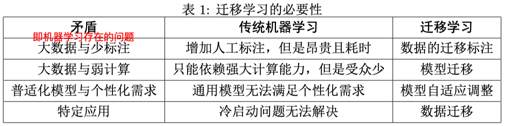

3. 负迁移：

   > 定义：在源域上学习到的知识，对于目标域上的学习产生负面作用。

   > 迁移学习指的是，利用数据和领域之间存在的相似性关系，把之前学习到的知识，应用于新的未知领域。迁移学习的核心问题是，找到两个领域的相似性。找到了这个相似性，就可以合理地利用，从而很好地完成迁移学习任务。
   >
   > 如果这个相似性找的不合理，也就是说，两个领域之间不存在相似性，或者基本不相似，那么，就会大大损害迁移学习的效果。

   > 目前较新的对负迁移的解决方法：
   >
   > 传递迁移学习：传统迁移学习只有两个领域足够相似才可以完成，而当两个领域不相似时，传递迁移学习却可以利用处于这两个领域之间的若干领域，将知识传递式的完成迁移。

4. 一些概念

   - 终身学习：终身学习可以认为是序列化的多任务学习，在已经学习好若干个任务之后，面对新的任 务可以继续学习而不遗忘之前学习的任务。（参考：https://blog.csdn.net/qrlhl/article/details/49364173）
   - 自我学习：自我学习指的是模型不断地从自身处进行更新。（参考：https://www.jianshu.com/p/d0c96b87c47b）
   - 领域自适应：领域自适应问题是迁移学习的研究内容之一，它侧重于解决特征空间一致、类别空间一 致，仅特征分布不一致的问题。
   - 协方差漂移：协方差漂移指数据的边缘概率分布发生变化。领域自适应研究问题解决的就是协方差 漂移现象。

### ch02：迁移学习的分类

1. 按目标域标签分

   - 监督迁移学习
   - 半监督迁移学习
   - 无监督迁移学习

2. 按学习方法分

   - 基于样本的迁移学习方法：通过权重重用，对源域和目标域的样例进行迁移。就是 说直接对不同的样本赋予不同权重，比如说相似的样本，就给它高权重。
   - 基于特征的迁移学习方法：更进一步对特征进行变换。意思是说，假设源域和目标域的特征原来不在一个空间，或者说它们在原来那个空间上不相似，那我们就想办法把它们变换到一 个空间里面，使这些特征相似。
   - 基于模型的迁移学习方法：构建参数共享的模型。比如说神经网络最经典的 finetune 就是模 型参数迁移的很好的体现。
   - 基于关系的迁移学习方法：挖掘和利用关系进行类比迁移。

   【目前最热的就是基于特征、基于模型的迁移，然后基于实例的迁移方法和他们结合起来使用。】

3. 按特征分

   - 同构迁移学习：特征语义和维度都相同，比如图片到图片的迁移
   - 异构迁移学习：特征语义和维度不同，比如图片到文本的迁移

4. 按离线与在线形式分

   - 离线迁移学习：目前绝大多数的迁移学习方法都采用了离线方式。即源域和目标域均是给定的， 迁移一次即可。
   - 在线迁移学习：随着数据的动态加入，迁移学习算法也可以不断地更新。

### ch04：基础知识

1. 问题形式化

   - 领域：进行学习的主体。领域主要由两部分构成：数据和生成这些数据的概率分布。

   - 任务：学习的目标。任务主要由两部分组成：标签和标签对应的函数。

   - 迁移学习

     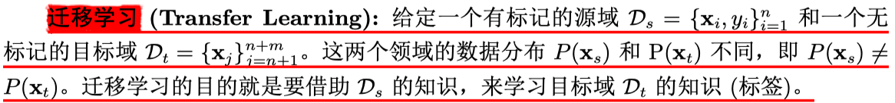

   - 领域自适应：

     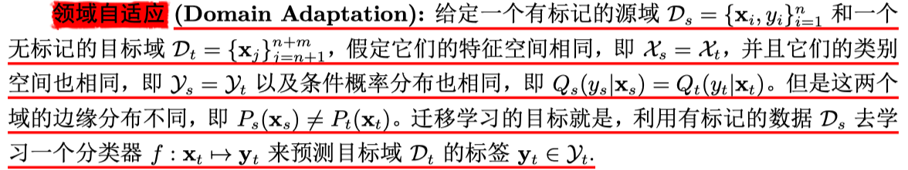

2. 度量准则

   度量工作的目标有两点：一是很好地度量两个领域的相似性，不仅定性地告诉我们它们是否相似，更定量地给 出相似程度。二是以度量为准则，通过我们所要采用的学习手段，增大两个领域之间的相似性，从而完成迁移学习。

   - 距离

     - 欧式距离

       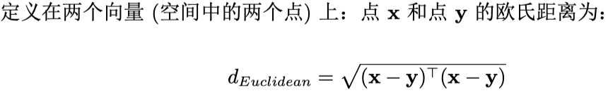

     - 闵可夫斯基距离

       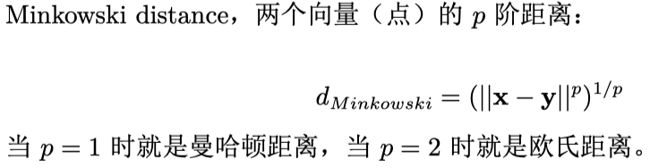

     - 马氏距离

       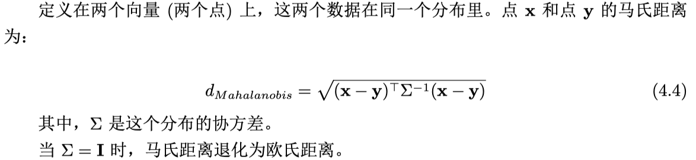

   - 相似度

     - 余弦相似度：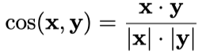

     - 互信息：

       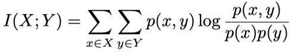

     - 皮尔逊相关系数：

       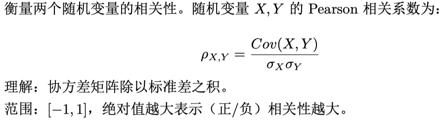

   - **KL散度与JS距离**

     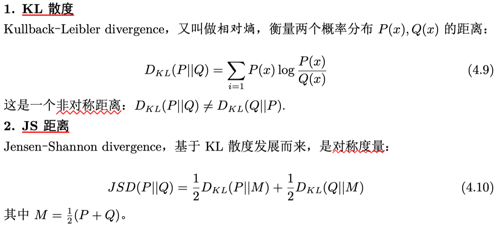

   - **最大均值差异**

     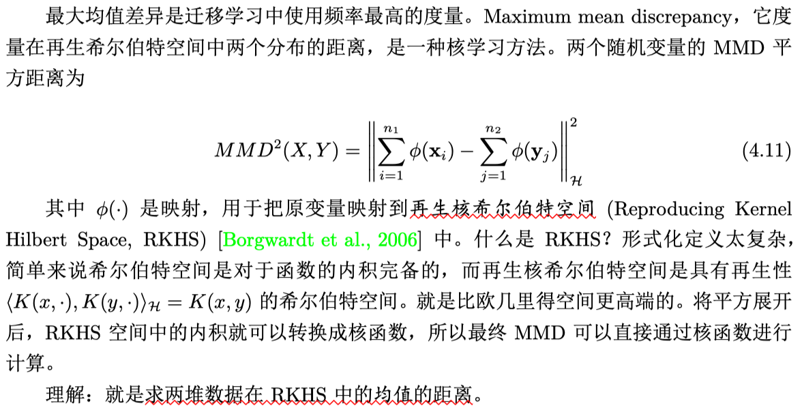

   - **Principal Angle**

     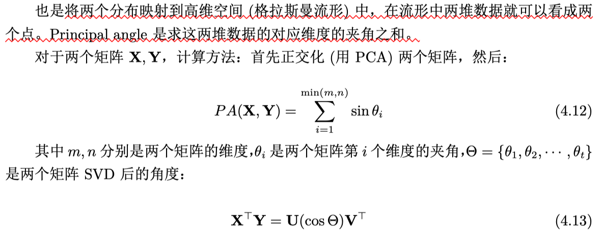

   - **A-distance**

     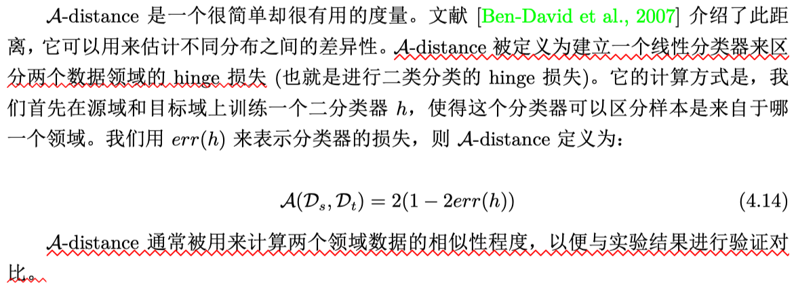

   - **Hilbert-Schmidt Independence Criterion（希尔伯特-施密特独立性稀疏）**

     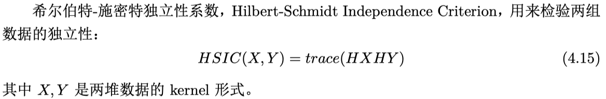

   - **Wasserstein Distance**

     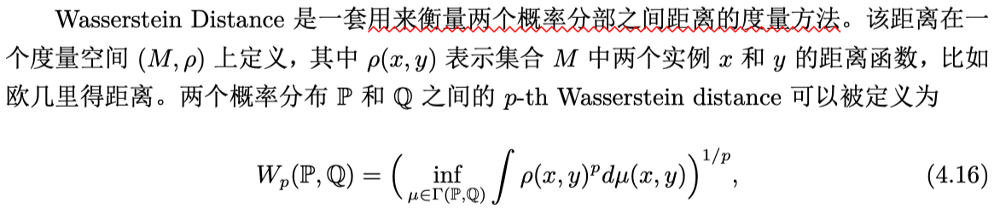

### ch05：迁移学习的基本方法

- **基于样本的迁移**

  > 基于样本的迁移学习方法 (Instance based Transfer Learning) 根据一定的权重生成规则，对数据样本进行重用，来进行迁移学习。（比如重复源域中和目标域样本类别相同的部分样本）
  >
  > 虽然实例权重法具有较好的理论支撑、容易推导泛化误差上界，但这类方法通常只在领 域间分布差异较小时有效，因此对自然语言处理、计算机视觉等任务效果并不理想。

- **基于特征的迁移**

  > 基于特征的迁移方法 (Feature based Transfer Learning) 是指将通过特征变换的方式互相迁移，来减少源域和目标域之间的差距；或者将源域和目标域的数据特征变换到统一特征空间中，然后利用传统的机器学习方法进行分类识别。
  >
  > 根据特征的同构和异构性，又可以分为同构和异构迁移学习。

- **基于模型的迁移**

  > 基于模型的迁移方法 (Parameter/Model based Transfer Learning) 是指从源域和目标域中找到他们之间共享的参数信息， 以实现迁移的方法。
  >
  >  这种迁移方式要求的假设条件是：源域中的数据与目标域中的数据可以共享一些模型的参数。

- **基于关系的迁移**

  > 基于关系的迁移学习方法 (Relation Based Transfer Learning) 比较关注源域和目标域的样本之间的关系。

### ch06：第一类方法：数据分布自适应

数据分布自适应 (Distribution Adaptation) 是一类最常用的迁移学习方法。这种方法 的基本思想是，由于源域和目标域的数据概率分布不同，那么最直接的方式就是通过一些变 换，将不同的数据分布的距离拉近。

> **边缘分布自适应**：边缘分布自适应方法 (Marginal Distribution Adaptation) 的目标是减小源域和目标域 的边缘概率分布的距离，从而完成迁移学习。
>
> 典型方法：TCA方法（Transfer Component Analysis）

> 条件分布自适应：条件分布自适应方法 (Conditional Distribution Adaptation) 的目标是减小源域和目标域的条件概率分布的距离，从而完成迁移学习。
>
> 典型方法：STL方法（Stratified Transfer Learning）

> 联合分布自适应：联合分布自适应方法 (Joint Distribution Adaptation) 的目标是减小源域和目标域的联 合概率分布的距离，从而完成迁移学习。
>
> 典型方法：JDA方法（Joint Distribution Adaptation）

> 动态分布自适应
>
> - 平衡分布自适应（BDA方法，Balanced Distribution Adaptation）
> - 动态分布自适应（DDA方法，Dynamic Distribution Adaptation）

### ch07：第二类方法：特征选择 （基于特征迁移）

> 基本假设是：源域和目标域中均含有一部分公共的特征，在这部分公共的 特征上，源领域和目标领域的数据分布是一致的。因此，此类方法的目标就是，通过机器学 习方法，选择出这部分共享的特征，即可依据这些特征构建模型。

> 典型方法：SCL方法（Structural Correspondence Learning）

### ch08：第三类方法：子空间学习 （基于特征迁移）

> 基本假设：源域和目标域数据在变换后的子空间中会有着相似的分布。
>
> 按照特征变换的形式，将子空间学习法分为两种：
>
> - 基于统计特征变换的统计特征对齐方 法
> - 以及基于流形变换的流形学习方法。

> **统计特征对齐**：统计特征对齐方法主要将数据的统计特征进行变换对齐。对齐后的数据，可以利用传 统机器学习方法构建分类器进行学习。
>
> 典型方法：
>
> - SA方法（Subspace Alignment）
> - SDA方法（Subspace Distribution Alignment）
> - CORAL方法（CORrelation ALignment）
> - DeepCORAL方法

> **流形学习**：基本假设是现有的数据是从一个高维空间中采样出来的，所以它具有高维空间中的低维流形结构。因此我们 首先将原始空间下的特征变换到流形空间中。
>
> 典型方法：
>
> - SGF方法
> - GFK方法

### Ch09：深度迁移学习 （基于模型迁移）

- 模型的迁移
- finetune
- 深度网络自适应（加额外的自适应度量loss）
- 与对抗网络相结合

### 参考文献

1. 迁移学习最权威的综述文章是香港科技大学杨强教授团队的 A survey on transfer learning

   Pan, S. J. and Yang, Q. (2010). A survey on transfer learning. IEEE TKDE

